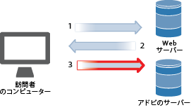
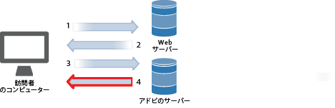
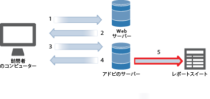
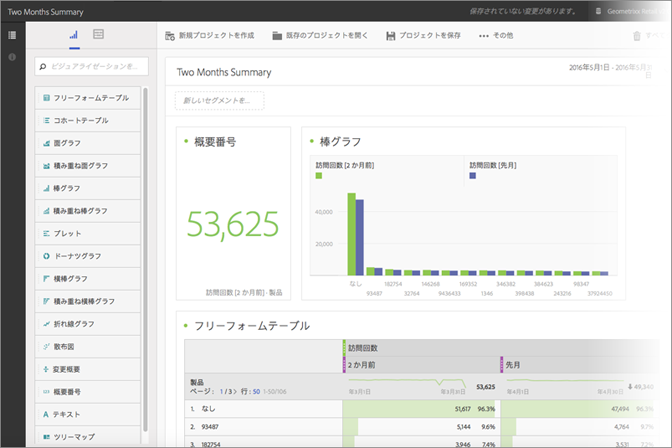

# データ収集

どのようにして Web サイトへの訪問が Adobe Analytics のレポートになるかを説明します。

Analytics データ収集は、Adobe データ収集サーバーに特別なイメージリクエストを行うことで実現します。ほとんどの実装では、トラッキング対象の Web ページに JavaScript コードが配置されます。タグ付き Web ページが訪問者のブラウザーに読み込まれると、ブラウザーはアドビの JavaScript コードを実行し、訪問者情報を取得してタグを正しく追加するロジックを実行します。JavaScript 処理の最後のステップは、送信されたデータを収集し、訪問者のブラウザーに小さい透明画像を返す、Analytics データ収集サーバーへのイメージリクエストです。

ブラウザー処理の通常のボトルネックは Web サーバーからのページエレメント（画像など）のダウンロードにかかる時間なので、ブラウザーが JavaScript コードを実行するのに必要な時間は無視できます。ただし、訪問者のブラウザーが Adobe データ収集サーバーから画像をリクエストする最後のステップは、合計ページダウンロード時間に追加されます。ページダウンロード時間に対する全体的な影響は、Adobe データ収集サーバーまでの Web サイト訪問者の距離（通常、地理的な距離ではなく、インターネットホップ数）によって異なります。

アドビでは、Analytics にデータを送信する複数の方法を用意しています。これらの方法では、次のソースからのリアルタイムのトラッキング情報も処理されます。

* インターネットにアクセスできるアプリケーション
* キャンペーン
* クライアントサーバーアプリケーション
* 電子メール
* モバイルデバイス
* Web ベースのキオスク
* Web サイト

<!-- 

Need to reconcile with Data Collection topics in the user guide, in this guide, and in reference. 

 -->

1. 訪問者がサイトに訪問すると、Web サーバーへのリクエストが作成されます。

   

1. サイトの Web サーバーは、ページコード情報を送信し、ページがブラウザーに表示されます。

   

1. ページが読み込まれ、Analytics JavaScript コードが実行されます。

   

   JavaScript コードは、Adobe サーバーにイメージリクエストを送信し、実装で定義した変数、指標およびページデータを渡します。

   **サンプル JavaScript コード：** JavaScript コードは、Web ページの body タグ内に配置されます。

   

   **サンプルイメージリクエスト：**&#x200B;ページ名を含むイメージリクエストのスニペットを示します。

   

   >[!NOTE]
   >
   >各イメージリクエストには乱数文字列が含まれ、ブラウザーのキャッシュを防ぎ、以降のイメージリクエストがブラウザーによって行われるようにします。

1. Adobe は、透明なピクセルイメージを返します。

   

   コードは追加の詳細（オペレーティングシステム、ブラウザーのタイプ、ブラウザーの高さと幅、IP アドレス、ブラウザーの言語など）を自動的に収集します。

1. アドビのサーバーは、Web分析データを *`report suites`* （お客様のデータリポジトリ）に保存します。

   

   [レポートスイート](https://marketing.adobe.com/resources/help/en_US/reference/report_suites_admin.html)では、選択した Web サイト、Web サイト群、または Web ページのサブセットに関する完全な独立レポートが定義されます。

1. レポートスイートデータは、Web ブラウザーでアクセスできるレポートに入力されます。

   

   **サンプルレポート：**

   

   JavaScript コードの実行は迅速におこなわれ、ページ読み込み時間には影響しません。この方法では、ページがキャッシュから取得された場合でも JavaScript コードが実行されるので、訪問者が「**[!UICONTROL リロード]**」または「**戻る]」をクリックして表示されたページをカウントできます。[!UICONTROL **

詳しくは、以下を参照してください。

* [データ収集](../../implement/js-implementation/data-collection/query-parameters.md)
* [データ要素の作成](../../implement/c-implement-with-dtm/t-data-element.md#task_962EF08CE2AE49B3B739295F6E4792C2)
* [Data Warehouse](https://marketing.adobe.com/resources/help/en_US/reference/data_warehouse.html)
* [Ad Hoc Analysis](https://marketing.adobe.com/resources/help/en_US/dsc/c_getting_started.html)
* [データソース](https://marketing.adobe.com/resources/help/en_US/whitepapers/ftp/ftp_datasources.html)
* [Data Connectors](https://marketing.adobe.com/resources/help/en_US/whitepapers/ftp/ftp_genesis.html)
* [Analytics データフィード](/help/export/analytics-data-feed/c-getstarted/data-feed-overview.md)

>[!MORE_LIKE_THIS]
>       
>* [Experience Cloud デバッガー](/help/implement/impl-testing/debugger.md)

