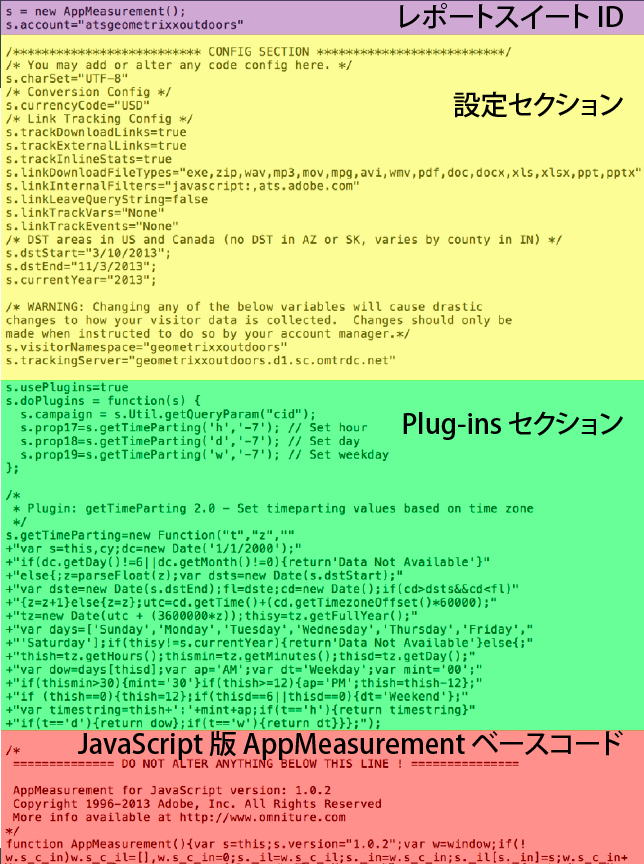

# Analyticsコード

データはレポートスイートに送信され、レポートに表示されます。Analytics にデータを送信する最も簡単で一般的な方法は、DTM による実装です。JavaScript による実装でコードを入力することもできます。

[!UICONTROL Dynamic Tag Management] を使用してヘッダーおよびフッターコードを作成する方法について詳しくは、ヘッダーおよびフッターコード [の追加を](../../implement/c-implement-with-dtm/c-headers-footers/t-header-footer-code.md#task_43C8DD699A514638B0620775C06423E5)参照してください。

Here is an example of [!DNL AppMeasurement] JavaScript file, showing the code parts:

