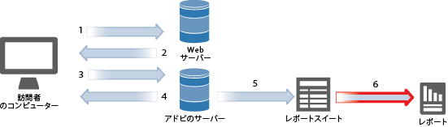

# レポートおよびレポートスイート

レポートスイートでは、選択した Web サイト、Web サイト群、または Web ページのサブセットに関する完全な独立レポートが定義されます。通常、レポートスイートは 1 つの Web サイトですが、複数サイトの数値を組み合わせて合計を示すグローバルセグメントとなる場合もあります。マーケティングレポート、Ad hoc analysis および Report builder にログインしたら、使用するレポートスイートを 1 つ選択します（レポートスイートを組み合わせたロールアップを使用する場合を除く）。

レポートには、Analytics によって収集された、特定のパラメーターに基づく情報が表示されます。

Adobe Analytics の導入後、Analytics レポート&#x200B;**&#x200B;を実行できます。レポートは、従来型の Web ベースのチャネルと、モバイルやビデオ、ソーシャルネットワークのような発展を続けるチャネルの両方に洞察を提供します。マーケティングレポートの例を以下に示します。

* サイトの訪問者数
* そのうちの個別訪問者数（1 回のみカウント）
* サイトへの来訪経路（リンクをたどって来訪したか、直接来訪したかなど）
* サイトのコンテンツを検索するために使用したキーワード
* 特定のページまたは全サイトでの滞在時間
* 訪問者がクリックしたリンク、およびサイトを離れた日時
* 売上高またはコンバージョンイベントを最も効果的に生み出しているマーケティングチャネル
* ビデオの視聴に費やした時間
* サイトの訪問に使用したブラウザーとデバイス

高レベルのレポートタイプを次に示します。

* [トラフィック](https://marketing.adobe.com/resources/help/en_US/reference/reports_traffic.html)：訪問者の Web サイトとの関わり方に関する詳細な分析とカスタマイズされたトラフィック統計情報を提供します。
* [コンバージョン](https://marketing.adobe.com/resources/help/en_US/reference/reports_conversion.html)：ユーザーが定義した成功指標についての情報が表示されます。
* [パス](https://marketing.adobe.com/resources/help/en_US/reference/reports_paths.html)：訪問者のブラウズパス全体をトラッキングおよび記録できます。

[Analysis Workspace](https://marketing.adobe.com/resources/help/en_US/analytics/analysis-workspace/) を使用すると、単一の Analytics レポートの一般的な制限を解除できます。堅牢かつ柔軟なキャンバスでカスタム分析プロジェクトを作成できます。任意の数のデータテーブル、ビジュアライゼーション、コンポーネント（ディメンション、指標、セグメントおよび時間の精度）をプロジェクトにドラッグ＆ドロップします。すばやく、分類およびセグメントの作成、分析用のコホートの作成、アラートの作成、セグメントの作成をおこない、レポートをキュレーションして会社の任意のユーザーと共有します。

 <b>関連トピック</b> 

* [Analysis Workspace ヘルプ](/help/analyze/analysis-workspace/analysis-workspace-features.md)
* [Reports &amp; Analytics](/help/analyze/reports-analytics/overview/report-overview.md)
* [リアルタイムレポート](https://marketing.adobe.com/resources/help/en_US/reference/realtime.html)
* [Adobe Report Builder](https://marketing.adobe.com/resources/help/en_US/arb/) ヘルプ
* [データ抽出](https://marketing.adobe.com/resources/help/en_US/sc/user/data_extract.html)
* [Activity Map](https://marketing.adobe.com/resources/help/en_US/analytics/activitymap/)
* [Report Suite Manager](https://marketing.adobe.com/resources/help/en_US/reference/report_suites_admin.html)
* [Analytics の製品比較と必要システム構成](https://marketing.adobe.com/resources/help/en_US/reference/analytics-product-comparison.html)
* [レポートの説明](https://marketing.adobe.com/resources/help/en_US/reference/reports_descriptions.html)
* [ダッシュボードおよびレポートレット](https://marketing.adobe.com/resources/help/en_US/sc/user/dashboard.html)
* [ブックマーク](/help/analyze/reports-analytics/bookmarks.md)
* [仮想レポートスイート](/help/components/vrs/vrs-about.md)
* [異常値検出](/help/analyze/analysis-workspace/virtual-analyst/c-anomaly-detection/anomaly-detection.md)
* [貢献度分析](/help/analyze/analysis-workspace/virtual-analyst/contribution-analysis/ca-tokens.md)

