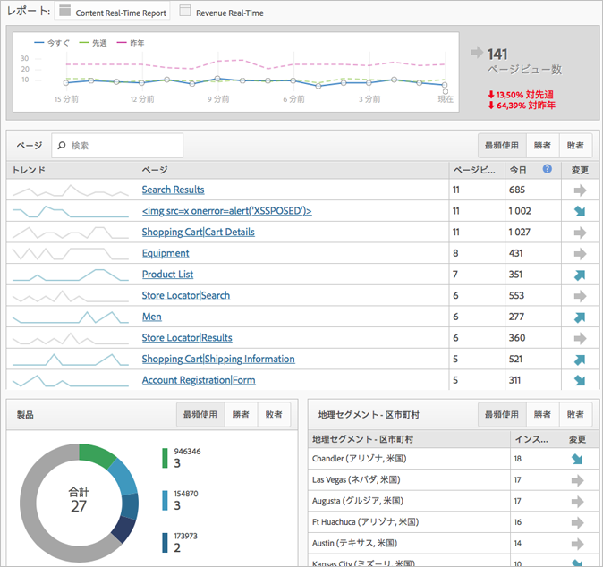

# シンプル化された実装モーダル

Adobe Analytics 実装を初めて実装する場合について説明します。

<!-- 

https://activation.adobedtm.com/index.php?redirected=1 

 -->

New users can quickly create your first [!DNL Analytics] report suite (data repository) using this *`Getting Started with Adobe Analytics`* setup modal. Then, you can deploy [!DNL Analytics] code using [!DNL Dynamic Tag Management].

[!DNL Dynamic Tag Management] では、毎回サイトを変更することなく、Adobe Analytics 実装を管理できます。モバイルアプリを実装している場合、アプリから価値あるデータを収集し始めるために必要な SDK を入手できます。

ここでは以下の処理をおこなえます。

* 最初の[レポートスイート](https://marketing.adobe.com/resources/help/en_US/analytics/getting-started/report-suites.html)をすばやく作成する。
* Deploy [!DNL Analytics] and the [Identity Service](https://marketing.adobe.com/resources/help/en_US/mcvid/).

* 基本ページレベルのデータでレポートを実行する。

>[!NOTE]
>
>Before you begin, verify that Analytics is [enabled in the Adobe Experience Cloud](https://marketing.adobe.com/resources/help/en_US/mcloud/core_services.html) (the solution provisioning process). Enterprise Dashboard の Analytics にログインするための招待メールを受け取った場合は、この前提条件を完了しています。

**シンプル化された実装モーダルを実行するには**

1. [!DNL Adobe Experience Cloud] （ [experiencecloud.adobe.com](https://experiencecloud.adobe.com)）にログインします。

   [!DNL Analytics] にアクセスする際に、レポートスイートがあるかどうかをシステムが識別します。ない場合、[!UICONTROL Adobe Analytics 使用の手引き]ページが表示されます。

   

   Alternatively, you can run this setup in [!DNL Analytics] by clicking **[!UICONTROL Help]** &gt; **[!UICONTROL Welcome to Adobe Analytics]**.

1. ビジネスに関する次の基本情報を指定します。

   <table id="table_1741878A1B284CB78D297D531DC703D6"> 
     <thead> 
      <tr> 
       <th colname="col1" class="entry"> 要素 </th> 
       <th colname="col2" class="entry"> 説明 </th> 
      </tr> 
     </thead>
     <tbody> 
      <tr> 
       <td colname="col1"> 
プロパティタイプ 
 </td> 
       <td colname="col2"> 
実装は Web 用ですか、それともモバイル用または両方ですか？ 
 </td> 
      </tr> 
      <tr> 
       <td colname="col1"> 
業種 
 </td> 
       <td colname="col2"> 
会社が収入を得る方法を指定します（製品、カスタマーサービス、リード、ブランド認知度、広告）。 
 </td> 
      </tr> 
      <tr> 
       <td colname="col1"> 
データ層 
 </td> 
       <td colname="col2"> 
（推奨）情報を保存するために使用される JavaScript 配列。Dynamic Tag Management を使用して自動セットアップを実行する場合、データ層を使用します。 
 
For a blog on data layers, see <a href="https://blogs.adobe.com/digitalmarketing/analytics/data-layers-buzzword-best-practice/" format="http" scope="external"> Data Layer: From Buzzword to Best Practice</a>. 
 </td> 
      </tr> 
      <tr> 
       <td colname="col1"> 
データリポジトリ（レポートスイート） 
 </td> 
       <td colname="col2"> 
 <a href="https://marketing.adobe.com/resources/help/en_US/analytics/getting-started/report-suites.html" format="html" scope="external">レポートスイート</a>は、通常、単一のプロパティ（サイトまたはアプリ）またはブランドに対応する、個別のデータセットです各レポートスイートには、レポートおよび指標の独自のセットがあります。 
 </td> 
      </tr> 
      <tr> 
       <td colname="col1"> 
タイムゾーン 
 </td> 
       <td colname="col2"> 
ローカルタイムゾーンです（自動的に検出されます）。 
 </td> 
      </tr> 
      <tr> 
       <td colname="col1"> 
予想ページビュー数 
 </td> 
       <td colname="col2"> 
サイトが 1 日に受け取るおよそのページビュー数。 
 </td> 
      </tr> 
      <tr> 
       <td colname="col1"> 
基準通貨 
 </td> 
       <td colname="col2"> 
ビジネスに使用する通貨。 
 </td> 
      </tr> 
     </tbody> 
    </table>

1. Click **[!UICONTROL Next]**.

   システムによってレポートスイートが作成されます。

1. To begin deployment, click **[!UICONTROL Next]**, then click one of the following options:

   <table id="table_71C7F7B9677346CD8D5130519D32464B"> 
     <thead> 
      <tr> 
       <th colname="col1" class="entry"> 要素 </th> 
       <th colname="col2" class="entry"> 説明 </th> 
      </tr> 
     </thead>
     <tbody> 
      <tr> 
       <td colname="col1"> 
デプロイ 
 </td> 
       <td colname="col2"> 
 Analytics にログインおよびデプロイできる Dynamic Tag Management を起動します。This process automatically implements the  AppMeasurement.js file and the Identity Service ( VisitorAPI.js). 
 
 
重要：ブラウザーの新しいタブに、Dynamic Tag Management による Adobe Analytics の導入手順が記載されたヘルプページが表示されます。 
 
 </td> 
      </tr> 
      <tr> 
       <td colname="col1"> 
ダウンロード 
 </td> 
       <td colname="col2"> 
 INSTALL-ME &lt;report suite name&gt;.js という名前のインストールファイルをダウンロードします。このオプションは、<a href="https://marketing.adobe.com/resources/help/en_US/sc/implement/js_implementation.html" format="html" scope="external">JavaScript 実装</a>を理解している経験豊富なユーザー向けです。 
 
 
重要：コードのダウンロードは、Analytics のデプロイの構成要素ではありません。これは、サイトのページ上でユーザーが実行する、またはアドビのコンサルティングサービスを通じておこなう手動のデプロイです。 
 
 </td> 
      </tr> 
     </tbody> 
    </table>

1. レポートの実行.

   Analytics ツールをデプロイしたら、Reports &amp; Analytics でレポートを実行して、データがサイトに関連していることを確認します（Analytics のインターフェイスについて詳しくは、[サインインとナビゲーション](https://marketing.adobe.com/resources/help/en_US/analytics/getting-started/analytics-navigation.html)を参照してください）。

   For example, a **[!UICONTROL Site Metrics]** &gt; **[!UICONTROL Real-Time]** lets you see immediate data.

   >[!NOTE]
   >
   >[!UICONTROL リアルタイム] レポートには、実行前にいくつかの設定が必要です。[リアルタイムレポートの設定](https://marketing.adobe.com/resources/help/en_US/reference/t_realtime_admin.html)を参照してください。

**リアルタイムレポートの例**

