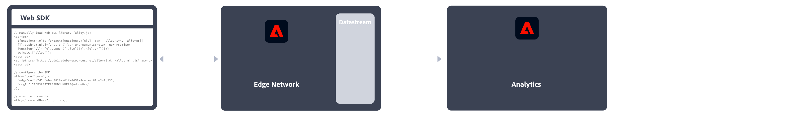
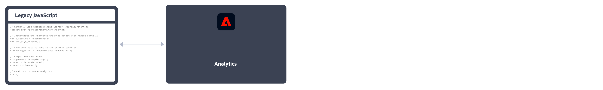

# Adobe Analytics の実装

Adobe Analytics では、データ収集サーバーにデータを送信するために、Web サイト、モバイルアプリケーションまたはその他のアプリケーション内のコードが必要です。 プラットフォームや組織のニーズに応じて、このコードを実装する方法がいくつかあります。

## Web サイトの実装方法

**Web サイト**&#x200B;では、次の実装方法を使用できます。

### クライアントサイド

* **Web SDK 拡張機能**：新規顧客向けに Adobe Analytics を実装するための標準化されたお勧めの方法です。 **Adobe Experience Platform Web SDK 拡張機能**&#x200B;を Adobe Experience Platform データ収集&#x200B;**タグ**&#x200B;に追加し、各ページにローダータグを配置します。 タグは、データを Adobe Experience Platform **Edge Network** に送信し、そのデータを Adobe Analytics に転送します。
  
[Adobe Experience Platform Web SDK拡張機能を使用してAdobe Analyticsを実装する方法を参照してください。](./aep-edge/overview.md) を参照してください。

* **Web SDK**：Adobe Experience Platform データ収集を使用しない場合は、Web SDK ライブラリを手動でサイトに読み込むことができます。 各ページで Web SDK ライブラリ（`alloy.js`）を参照し、必要なトラッキングコールを組織にとって便利な形式で Adobe Experience Platform **Edge Network** に送信します。 Edge Network は、そのデータを Adobe Analytics に転送します。
  
詳しくは、[Adobe Experience Platform Web SDKを使用したAdobe Analyticsの実装方法](./aep-edge/overview.md)を参照してください。

* **Analytics 拡張機能**：**Adobe Analytics 拡張機能**&#x200B;を Adobe Experience Platform データ収集&#x200B;**タグ**に追加し、各ページにローダータグを配置します。 タグは、データを Adobe Analytics に直接送信します。 タグの便利さを望むが、Edge Network インフラストラクチャを使用しない場合は、この実装方法を使用します。
  
詳しくは、[Analytics拡張機能を使用してAdobe Analyticsを実装する方法](launch/overview.md)を参照してください。

* **従来の JavaScript**：これまで使用されてきた、手動で Adobe Analytics を実装する方法です。 各ページで AppMeasurement ライブラリ（`AppMeasurement.js`）を参照し、JavaScript で変数と設定を設定します。
  
この実装方法は、カスタムコードを使用する実装に役立ち、[AMP ページ ](other/amp.md)など、他の場所では提供されていない実装タイプに適しています。

次の決定フローは、クライアントサイドの実装方法の選択に役立つ可能性があります。

>[!TIP]
>
>現在の状況に基づいて実装を選択する際のアドバイスとベストプラクティスについては、アドビのアカウントチームにお問い合わせください。

### サーバーサイド

Adobe Analytics サーバーサイドを実装するには、次のオプションがあります。

* **Edge Network API**：Adobe Experience Platform Edge Network API を使用して、データストリームを介して Adobe Analytics と通信するコードをサーバーに実装します。
  
詳しくは、[Adobe Experience Platform Edge Network APIを使用したAdobe Analyticsの実装](/help/implement/aep-edge/api/overview.md)を参照してください。

* **（一括）データ挿入 API**：Adobe Analytics（一括）データ挿入 API を使用して、サーバーサイドのデータを Adobe Analytics に直接収集します。
  
詳しくは、[Data Insertion API](../import/c-data-insertion-api/c-data-insertion-api.md)を参照してください。

## モバイルアプリの実装方法

**モバイルアプリ**&#x200B;では、次の実装方法を使用できます。

* **Mobile SDK 拡張機能**：モバイルアプリに Adobe Analytics を実装するための標準化されたお勧めの方法です。 専用ライブラリを使用して、モバイルアプリ内からアドビにデータを簡単に送信できます。 **Adobe Experience Platform Mobile SDK 拡張機能**&#x200B;を Adobe Experience Platform データ収集&#x200B;**タグ**&#x200B;に追加し、アプリに Mobile SDK ライブラリを実装します。 SDK を使用して、ライブラリの読み込み、拡張機能の登録、タグ設定の読み込みを行うことができます。 データを Adobe Experience Platform **Edge Network** に送信します。その後、Edge は、そのデータを Adobe Analytics に転送します。
  

  詳しくは、[Adobe Experience Platform Mobile SDK を使用した Adobe Analytics の実装](../implement/aep-edge/mobile-sdk/overview.md)を参照してください。

* **Analytics 拡張機能**：**Adobe Analytics 拡張機能**&#x200B;を Adobe Experience Platform データ収集&#x200B;**タグ**に追加し、アプリに Mobile SDK ライブラリを実装します。 SDK を使用して、ライブラリの読み込み、拡張機能の登録、タグ設定の読み込みを行うことができます。 この実装方法では、データを Adobe Analytics に直接送信します。 Adobe Experience Platform データ収集の便利さを望むが、アドビの Experience Platform Edge Network インフラストラクチャを使用しない場合にお勧めします。
  

  詳しくは、[Analytics 拡張機能を使用した Adobe Analytics の実装](../implement/aep-edge/mobile-sdk/overview.md)を参照してください。

>[!CAUTION]
>
>アドビのモバイル SDK の古いバージョンのサポートについては、[SDK のサポート終了に関するお知らせ](https://developer.adobe.com/client-sdks/resources/sdks-end-of-support/)を参照してください。

## 主な Analytics 実装関連の記事

* [既存の Adobe Analytics の実装を担当する](/help/implement/prepare/existing-implementation.md)
* [Adobe Debugger](validate/debugger.md)
* [Experience Platform でのタグプロパティの作成](launch/create-analytics-property.md)
* [AppMeasurement のアップデート](appmeasurement-updates.md)
* [Platform Web SDKを使用したAdobe Analyticsの設定チュートリアル](https://experienceleague.adobe.com/docs/platform-learn/implement-web-sdk/applications-setup/setup-analytics.html?lang=ja)
* [モバイルアプリでのAdobe CX Enterpriseの実装チュートリアル](https://experienceleague.adobe.com/docs/platform-learn/implement-mobile-sdk/overview.html?lang=ja)

## 主な Analytics リソース

* [カスタマーケアへのお問い合わせ](https://experienceleague.adobe.com/?support-solution=Analytics#support)
* [Experience Leagueに関するAdobe Analytics コミュニティ](https://experienceleaguecommunities.adobe.com/t5/adobe-analytics/ct-p/adobe-analytics-community?profile.language=ja)
* [Adobe Analyticsの業界トレンド](https://experienceleaguecommunities.adobe.com/t5/adobe-analytics-discussions/adobe-analytics-resources/m-p/276666?profile.language=ja)
* [最新のリリースノート](../release-notes/latest.md)
