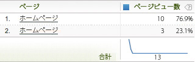

# 変数値の空白の使用

HTML には、空白を作成するための文字が複数あります。

これらには、スペース、タブ、およびキャリッジリターン（またはラインフィード）が含まれます。次の例をご覧ください。

```js
<head> 
 <title> 
   Home Page 
 </title> 
</head> 
<body> 
<script language="javascript"> 
 s.pageName=document.title 
</script> 
```

この場合、document.title が [!UICONTROL s.pageName] に設定されているので、s.pageName は「Home Page」の値を受け取ります。「Home Page」の前のスペースに注意してください。すべてのブラウザーがこの空白を同じように解釈するわけではありません。結果は、次の 2 つの例のどちらかになります。

```js
s.pageName="Home Page"
```

```js
s.pageName="        Home Page"
```

最初の例では値が正しく表示されていますが、2 つ目の例ではテキストの前に空白が表示されています。[!DNL Analytics] では、これらの値を [!UICONTROL s.pageName] 変数の異なる値として扱います。[!DNL Analytics] インターフェイスでは、2 つ目の例の値から先頭の空白が除去されます。結果は、次のようにレポートに表示されます。



この導入時のエラーは、変数値を複数行の項目に断片化させる原因になります。[!DNL SAINT] では、キー値の先頭の空白が許可されません。つまり、サイトで先頭の空白が使用されている場合の回避策として、先頭の空白を含むキー値を使用して複数行の項目をグループ化することはできません。この問題を解決する唯一の方法は、目的の変数値（この場合、document.title プロパティ）を事前に処理して先頭（または末尾）の空白を削除することです。

前述の例では、document.title プロパティを含む [!UICONTROL s.pageName] 変数が使用されています。アドビでは、document.title をページ名として使用することを推奨しません。また、この問題は [!UICONTROL s.pageName] 変数にのみ影響するわけではありません。値の先頭または末尾に空白のあるすべての変数で、影響がある可能性があります。
