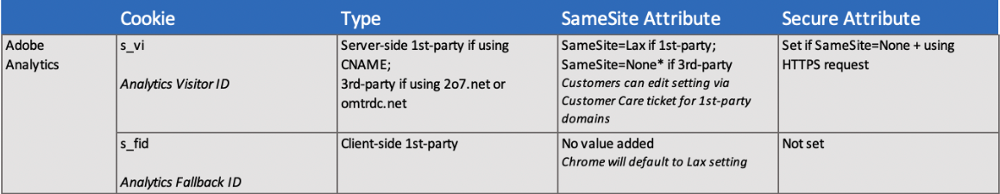

# ブラウザーとAnalyticsのcookieに関するFAQ

プロパティやソリューション間での永続的なユーザー識別をサポートするために、Adobe Analyticsは、ブラウザーでのcookieの処理方法の変更に応答します。 次のFAQは、ブラウザーのcookieの変更に伴って訪問者の永続的な識別が保持される方法に関する情報を示しています。

## ブラウザーはcookieの処理方法をどのように変更していますか。

一般に、ほとんどのブラウザーでは、サードパーティcookieの保持方法に対する制限が厳しくなっています。 これは、ブラウザーがcookieを削除または拒否した場合の追跡に影響を与える可能性があります。 Safariブラウザーでは、一部のファーストパーティcookieに関してもいくつかの制限が設定されています。

次のリストに、ブラウザーに応じた最新の変更を示します。

* クロム：Chrome 80以降では、サードパーテ `SameSite` ィCookieやクロスサイトリクエストを管理するために、属性の処理方法が変わりました。 最終的に、Chrome開発者はサードパーティcookieを完全に非推奨 [にする方法を探し求めています](https://blog.chromium.org/2020/01/building-more-private-web-path-towards.html?m=1) 。

* FirefoxとEdge:製品のお知らせによると、連続するバージョンのブラウザーは、Chrome 80で行われたのと同じ変更に従うことになります。

* Safari: With [Safari 12.1](https://webkit.org/blog/category/privacy/), first party persistent cookies set through the document.cookie API, often known as “client-side” cookies, have their expiration capped at seven days.

## サードパーティcookieとファーストパーティcookieの違いは何ですか。

### ファーストパーティ cookie

ファーストパーティcookieは、顧客Webサイト（ドメイン固有）によって作成され、ユーザーが顧客Webサイトを訪問するとクライアントブラウザーに保存されます。 一般に、すべてのブラウザーはファーストパーティcookieを受け入れます。 ファーストパーティcookie Analyticsの導入では、ホスト名が [CNAMEを使用してドメインと調整されると、訪問者ID cookieがAdobeノードで作成されます](https://docs.adobe.com/content/help/en/id-service/using/reference/analytics-reference/cname.html)。 その後、cookieはファーストパーティのコンテキストでブラウザーによって受け入れられます。 詳しくは、ファーストパーテ [ィcookieについてを参照してください](https://docs.adobe.com/content/help/en/core-services/interface/ec-cookies/cookies-first-party.html)。

### サードパーティcookie

サードパーティcookieは、ユーザーが訪問するWebサイトによって作成されるものではありません。 現在、ブラウザーはすべてのサードパーティcookieを同じように処理し、それに従って保存しますが、サードパーティcookie自体は異なる重要な動作をする場合があります。 お客様のAnalyticsサードパーティcookieの実装では、クライアントはアドビに対してのみ呼び出しを行い、不明または疑わしいサードパーティドメインには呼び出しを行いません。 これは、安全な(HTTPS)と、永続的な識別子を使用した信頼性の高い追跡を実現するAnalyticsの実装方法です。 このメソッドは、AppMeasurement.jsファイルを設定することで実装されます。 詳しくは、cookieとExperience Platform IDサ [ービスを参照してください](https://docs.adobe.com/content/help/en/id-service/using/intro/cookies.html)。

## 現在、ブラウザーはAnalytics cookieをどのように保存および管理していますか。

実装に応じて、Analyticsのcookieは次のように保存されます。

### サードパーティcookieの実装

現在、ブラウザーはAdobe [demdex.net](https://docs.adobe.com/content/help/en/audience-manager/user-guide/reference/demdex-calls.html) IDをサードパーティcookieとして保存します。 このcookieはドメイン間で永続的な識別子を提供し、安全な(https)コンテンツを提供します。

### ファーストパーティcookieの実装

CNAMEを設定すると、ユーザーはブラウザーのファーストパーティcookieコンテキストでAdobe cookieを受け取ることができます。 サードパーティcookieの実装がユーザーにとって最適でない場合は、これが実行可能なオプションである可能性があります。

## SameSite cookie属性とは何ですか。また、Analyticsに与える影響は何ですか。

Chrome 80ブラウザーのリリース（以降のバージョンのFirefox、Edgeブラウザー）では、SameSite cookie属性により、クロスサイトリクエストの動作を制御するための次の3つの異なる値が指定されます。

* `None`:この設定により、クロスサイトアクセスが可能になり、cookieをサードパーティコンテキストで渡すことができます。 この属性を指定するには、も指定する必要があります。また、すべてのブ `Secure` ラウザーリクエストはHTTPSに従う必要があります。 例えば、cookieを設定する場合、次のように属性の値をペアにします。 `Set-Cookie: example_session=test12; SameSite=None; Secure`. 適切にラベル付けされない場合、新しいブラウザーでcookieを使用できなくなり、拒否されます。

* `Lax`:安全な *(読み取り専用など* ) HTTPメソッドを使用するトップレベルナビゲーションに対してのみ、同じサイトのcookieを使用してクロスサイトリクエストを送信で `GET`きます。

* `Strict`:サードパーティWebサイトのリクエストに対しては、同じサイトのCookieは送信されません。 cookieは、そのcookieのサイトがURLバーのサイトと一致する場合にのみ送信されます。

これらのブラウザーバージョンのデフォルトの動作では、指定された属性を持たないcookieがと同じよ `SameSite` うに処理されま `SameSite=Lax`す。

## Adobe Analyticsはこれらの変更に対してどのように対応しますか。

アドビのCookieの更新はすべてアドビのサーバーを介して処理され、アドビは適切なCookie属性を設定するためにエッジサーバーを更新しました。 アドビは、サードパーティcookieに適切な属性を設定するためのサーバー側アップデートをリリースしました。 サイトに対してJavaScriptの更新は必要ありません。

Adobeエッジサーバーによるこのアップグレードは、cookieが使用されているWebサイトにユーザーがアクセスすると自動的に行われます。 ほとんどのアドビ製品では、Chrome 80のリリース時にcookieに適切なフラグが付きます。 例外は、サードパーティのデータ収集を使用し、Experience Cloud Identity Service(ECID)を使用しないAdobe Analyticsの実装です。 これらの顧客は、新規訪問者の数が少なく一時的に増加し、そうでなければ再訪問者としてタグ付けされる場合があります。

をに設定した場合、Googleがcookieの処理を誤っていると識別し `SameSite` たブラウザーの場 `None`合、は設 `SameSite` 定されていないままになります。

次の表に、Analyticsのcookieについてまとめます。

## Chrome、Firefox、Edgeの変更に備えてサイトを準備する最善の方法は何ですか。

Analyticsのお客様は、JavaScript設定でアドビのサービスへの呼び出しにHTTPSが使用されていることを確認する必要があります。 ECIDは、サードパーティのHTTP呼び出しをHTTPSエンドポイントにリダイレクトします。これにより、待ち時間が長くなる可能性がありますが、設定を変更する必要がなくなります。

サイトのすべてのページがHTTPSで提供されることをお勧めします。

### 複数のドメインに対して1つのCNAME

Webサイトと同じドメインに設定されたCNAME実装がある場合、これはファーストパーティcookieコンテキストとなり、変更を加える必要はありません。

ただし、複数のドメインを所有し、すべてのドメインで同じCNAMEをデータ収集に使用する場合、それらの他のドメインではサードパーティcookieとして扱われます。 Chrome 80では、他のドメインでは表示されなくなります。 すべてのブラウザーで動作をより似たものにするため、Analyticsでは、このcookieの値をに `SameSite` 明示的に設定していま `Lax`す。 このcookieをわかりやすいサードパーティコンテキストで使用する場合は、cookieに値を設定する必要があります。つまり、常にHTTPSを使用する `SameSite=None` 必要があります。 セキュアなCNAMEに対してSameSiteの値を変更する場合は、アドビカスタマーケアにお問い合わせください。 ただし、ECIDを使用するAnalyticsのお客様は、この操作は必要ありません。

## AnalyticsのSafariの変更(ITP 2.1)の影響を教えてください。

Safari 12.1では変更が加えられても、Adobe Experience cloudのcookieからのデータセットは引き続き収集されます。 cookieの上限は7日ですが、その間に貴社のプロパティに戻った訪問者はcookieを更新し、その後7日間有効期限が切れないようにします。 Adobeのアップデートが利用可能になるまで、Safariトラフィックの再訪時間と再来訪者数が減少する場合があります。

有効期限が7日間に短縮されたため、顧客は個別訪問者数が増える可能性があります。 訪問回数とページビュー数は影響を受けません。 税金サービスや休日小売など、季節的なトラフィックを持つプロパティがある場合、この訪問者が季節間を結び付けないので、より大きな影響が生じる可能性があります。

CNAMEを使用する場合、訪問者IDサービスはECIDをサーバー側のファーストパーティcookieに保存します。 これにより、Cookieがその期間全体にわたって保持されます。

**注意：ITP 2.1は、モバイルアプリに埋め込まれたブラウザーには適用されません。**

### 影響を受けるファーストパーティcookie

を使用して作成されたファーストパーティcookie `document.cookie` が影響を受けます。 HTTP応答（サーバー側）またはCNAME証明書を使用してこれらのcookieのいずれかを設定する場合、ITP 2.1の変更の影響を受けません。次のファーストパーティcookieおよび関連するAdobe javaScriptライブラリが影響を受けます。

* ECID(Experience Cloud ID)サービスライブラリによって設定されるAMCV cookie
* Analyticsの従来のフォールバックcookie `s_fid`

2o7.netまたはomtrdc.netの収集ターゲットを含む、サードパーティcookieとしてのAnalyticsの従来のcookieは、以前のバージョンのITPに基づいて引き続きブロックされます。 `s_vi`

要約するには：

* CNAMEを持ち、訪問者IDサービスを使用する場合 — 実装は影響を受けません。

* ファーストパーティのコンテキストでファーストパーティのCNAMEを使用し、訪問者IDサービスを使用しない場合 — 実装は影響を受けません。

* ファーストパーティcookieドメインをサードパーティコンテキストで使用する場合、または標準のサードパーティドメイン名（2o7.net、omtrdc.netなど）を使用する場合、Safariは引き続きそのドメインをブロックします。

* カスタム訪問者IDを使用する場合 — これは、ストアの訪問者IDの形式によって異なります。 IDをファーストパーティの「クライアント側」Cookieに保存する場合、7日間の有効期限が適用されます。 カスタムIDを保存する他の方法を使用する場合は、影響を受ける場合は評価が必要です。

### 影響の最も小さいデータセット

頻繁に再訪するアクティブな訪問者を持つデータセットは、変更の影響を最も受けません。 サイトのコンテンツが顧客が毎日または少なくとも週に2回再訪するような場合は、アクティブなユーザーのcookieが期限切れになる前に更新されます。 ソーシャルネットワーク、ニュース、その他のメディアサイトは、頻繁に再訪する多くのユーザコミュニティを持つ可能性が最も高い。

プライマリ訪問者ID `s_vi` として使用し、CNAMEを使用してファーストパーティのデータ収集を設定した顧客は、ITP 2.1の影響を受けません。設定できない場合は、フォールバ `s_vi` ックcookieが使用され、7 `s_fid` 日間の有効期限が設定される可能性があります。

また、訪問者IDサービスを使用し、ファーストパーティドメインを持つデータセットは、最も影響を受けません。

## Safariの変更は私のビジネスに影響を与えますか？

データ収集に変更を加える前に、お客様が自社内の影響を測定することを推奨します。 これは、この節で後述する方法で行うことができます。

レポートやテストへの影響を測定するには、実装した訪問者とcookieの追跡のタイプ、およびSafariを使用するユーザーからのトラフィック量を把握することが重要です。 個々のビジネスに与える影響を測定する際は、以下の点を考慮してください。

* アドビライブラリが設定しているCookieのタイプを確認します。

* 最新のSafariブラウザーで開発者コンソールを開きます。 ファーストパーティドメインに上記のCookieが設定されている場合は、これらの変更の影響を受ける可能性があります。

* cookieが表示されるが、 `s_vi` CNAMEのコンテキストに設定されていない場合は、訪問者の識別に `AMCV` CNAMEを使用しており、Analyticsの使用はこれらの変更の影響を受けません。 CNAMEのコンテキストに `s_vi` Cookieと `AMCV` Cookieの両方が設定されている場合は、最近または現在猶予期間を使用しているので、Analyticsトラフィックの一部に影響が出る可能性があります。

* Analyticsを使用して、7日以内に再訪しない訪問者の割合を測定します。 訪問者が7日以内に繰り返し再訪した場合、トラフィックに大きな影響を与えない可能性があります。 Analtyicsを使用してこの情報を確認する方法については、 [Safari ITP 2.1 Impact on Adobe Experience cloudおよびExperience Platform Customersを参照してください](https://medium.com/adobetech/safari-itp-2-1-impact-on-adobe-experience-cloud-customers-9439cecb55ac)。

* Safariブラウザーからトラフィックの割合を測定し、変更が十分に保証されているかどうかを判断します。 Analyticsを使用してサイトへのSafariトラフィックの割合を調べる方法については、 [Safari ITP 2.1 Impact on Adobe Experience Cloud and Experience Platform Customersを参照してください](https://medium.com/adobetech/safari-itp-2-1-impact-on-adobe-experience-cloud-customers-9439cecb55ac)。

## 訪問者が最も多く使用しているブラウザはどれか。

訪問者が使用するブラウザーの詳細を知りたい場合は、Analyticsブラウザーディメンションを使用して  、サイトで最も使用されるブラウザーを特定できます。 また、Analyticsディメンションを使用して、地理的な地域に応じてどのブラウザーが最も使用されているかを確認することもできます。 For more information, see [GeoSegmentation](https://docs.adobe.com/content/help/en/analytics/components/variables/dimensions-reports/reports-geosegmentation.html).

Statcounterによる [と](https://gs.statcounter.com/browser-market-share/all)、2019年末には、各ブラウザの世界市場シェアは以下の通りであった。

* クロム：～64%
* Safari:～17%
* Firefox:～4%
* エッジ：～2%

市場シェアの変化に伴い、そのような統計を参照し [て](https://gs.statcounter.com/browser-market-share/all) 、導入戦略を確認できます。

## SafariでのITP 2.1の変更を短期間で最適に利用する方法を教えてください。

アドビのCNAMEおよび管理された証明書プログラムは、ITPの変更を処理するために使用されています。 Adobe Managed Certificate Program を利用すると、ファーストパーティ cookie 用の新しいファーストパーティ 証明書を追加費用なしで実装できます。現在、アドビはソリューション別に複数のCNAMEサービスを提供しており、Analytics認定プログラムを短期で活用したいと考えています。

CNAME設定を使用し、訪問者の識別にExperience Cloud IDサービスも使用しているAnalyticsの現在のお客様は、今後のECIDライブラリの更新を利用できます。 この変更により、CNAME認定のトラッキングサーバーでECIDを維持し、訪問者の識別の参照として使用できるようになります。 ECIDライブラリの今後のリリースで詳しく説明しています。

ECIDライブラリのお客様の中では、CNAMESまたはAnalyticsを使用しない人もいるので注意してください。 すべてのECIDのお客様には、同じ機能を利用するためのCNAMEの設定が提供されます。

現在、導入にCNAMEを活用していない場合は、カスタマーケアと相談してプロセスを開始できます。

## 永続的な訪問者の識別に関するアドビの将来の計画は何ですか。

新しい機能と実装には、次のものが含まれます。

* CNAME認定のセルフサービスオプションは、すべてのアドビソリューションに適用

* 柔軟な訪問者ID収集方法、BYOI（独自のIDを持ち込む）、APIファーストのデータ収集

* Adobe Experience PlatformのIDグラフ

* アドビのデータ収集に対する統合されたアプローチ

アドビは、パーソナライズされたエクスペリエンスを必要とする顧客に対して、より正確なパーソナライゼーションを実現することに取り組んでいます。 アドビは、顧客のプライバシー選択に合わせて顧客を支援するオンラインID機能の提供に取り組んでいます。

## 詳細情報

詳しくは、次を参照してください。

* [Adobe Experience Cloud:Google ChromeのCookieの更新](https://medium.com/adobetech/adobe-experience-cloud-cookie-updates-for-google-chrome-19ad67cf1598)

* [Safari ITP 2.1がAdobe Experience cloudおよびExperience Platformのお客様に与える影響](https://medium.com/adobetech/safari-itp-2-1-impact-on-adobe-experience-cloud-customers-9439cecb55ac)

