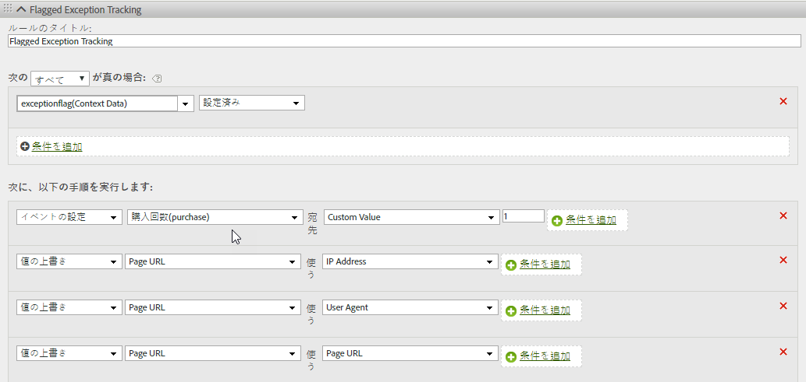

# hitGovernor

s.hitGovernor プラグインは、事前定義された期間内に送信された Analytics のイメージリクエストの総数を追跡し、その総数が一定のしきい値を超えた場合に、必要に応じて追加のロジックを実行できます。

## hitGovernor {#topic_56B636A42A624B38A0A446C607ACD700}

s.hitGovernor プラグインは、事前定義された期間内に送信された Analytics のイメージリクエストの総数を追跡し、その総数が一定のしきい値を超えた場合に、必要に応じて追加のロジックを実行できます。

ボット、スパイダー、特定のユーザーエージェントまたは特定の IP アドレスのリストからのトラフィックは、ボットトラフィックとして識別したり、レポートから除外したりできますが、レポートスイートに、本来ならカウントされるべきではないトラフィックのデータが含まれることもあります。例えば、不自然な間隔（約 1 秒ごとにリクエストが 1 回など）でクリックやページビューが大量に発生している場合は、不正なトラフィックの可能性があります。

このプラグインを利用すると、該当の訪問者の以降のトラフィックを自動的にブロックできます。そうしたトラフィックをレポート内で動的に識別することもできます。

## hitGovernor プラグインの仕組み {#section_541BC639E31442D09B1C85A2FFCDC02C}

このプラグインは、イメージリクエストがトラッキングサーバーに送信されるたびに Cookie の値を増分し、一定の期間にわたってそれを追跡します。デフォルトの期間は 1 分ですが、変更できます（以下の[導入](../../../implement/js-implementation/plugins/hitgovernor.md#task_D4BDB524AA294C139AFCAE2B61FEA3F2)を参照）。If the total number of hits during that time frame exceeds the default hit threshold (60), a final custom link image request is sent to set the *`exceptionFlag`* context data variable. デフォルトのヒット数のしきい値も変更できます。

必要に応じて、その時点からデフォルトの 60 日間が経過するまでは、該当の訪問者のトラフィックデータの収集をブロックできます。トラフィックをブロックするためには、以下に示すように、doPlugins 関数にコードを追加する必要があります。期間も変更できます。The logic allows time to either include that visitor's IP address, User Agent, or [!DNL Experience Cloud] Visitor ID in the proper permanent exception logic, or to reset the timeout period after the sixty days have elapsed. 60 日後にプラグインによってこのトラフィックが不正と見なされた場合は、再度例外としてマークされ、さらに 60 日間データの収集がブロックされます。

## レポート {#section_E742F19B528041808454744DB2C7007C}

設定する必要があるデフォルトの変数およびイベントはありませんが、処理ルールのロジックをセットアップし、適切な変数やイベントを設定することを強くお勧めします。そうしたカスタムの変数やイベントの例は次のとおりです。

* [!DNL Experience Cloud] 訪問者 ID
* IP アドレス
* ユーザーエージェント
* マークされた例外イベント

これらの変数のセグメントを作成すると、セグメントと仮想レポートスイートを作成し、これらの不明瞭なヒットのサイトへの全体的な影響を確認できます。

レポートで収集された値を参考に、ボットのルール、DB VISTA ルールまたは会社の IP 除外設定を更新することをお勧めします。

## 実装 {#task_D4BDB524AA294C139AFCAE2B61FEA3F2}

hitGovernor プラグインを導入する手順は次のとおりです。

1. AppMeasurement ライブラリに変更を加えます。

   このプラグインを初期化するためには、以下のコード行（太字）を AppMeasurement ライブラリコードの `registerPostTrackCallback` 関数内に追加します。

   >[!NOTE]
   >
   >Although the `registerPostTrackCallback` functionality is included in AppMeasurement libraries 1.8.0+, it is not included in any custom code configuration by default. doPlugins 関数の後および&#x200B;*外*&#x200B;に追加します。

   ```
    s.registerPostTrackCallback(function(){ 
   
<b> s. greogo（）;</b>}）;
```
Below the doPlugins section of your AppMeasurement file, include the plugin code contained in [Plugin Source Code](../../../implement/js-implementation/plugins/hitgovernor.md#reference_76423C81A7A342B2AC4BE41490B27DE0), below.

The hit limit threshold, hit timing threshold, and traffic exclusion time frames can all be overridden by setting these variables, outside of the plugin itself and preferably with your other configuration variables:

<table id="table_9959A40F5F0B40B39DB86E21D03E25FD"> 
<thead> 
<tr> 
<th colname="col1" class="entry"> Variable </th> 
<th colname="col2" class="entry"> Syntax </th> 
<th colname="col3" class="entry"> Description </th> 
</tr> 
</thead>
<tbody> 
<tr> 
<td colname="col1"> <p>Hit Limit Threshold </p> </td> 
<td colname="col2"> <p> <code> s.hl = 60; </code> </p> </td> 
<td colname="col3"> <p>The total number of hits that should not be exceeded during a given timeframe. </p> </td> 
</tr> 
<tr> 
<td colname="col1"> <p>Hit Time Threshold </p> </td> 
<td colname="col2"> <p> <code> s.ht = 10; </code> </p> </td> 
<td colname="col3"> <p>The window, in seconds, for when hits are recorded. This number is divided by six to determine the rolling timing windows. </p> </td> 
</tr> 
<tr> 
<td colname="col1"> <p>Exclusion Threshold </p> </td> 
<td colname="col2"> <p> <code> s.he = 60; </code> </p> </td> 
<td colname="col3"> <p>Number of days that the exclusion cookie is set for that visitor. </p> </td> 
</tr> 
</tbody> 
</table>

>[!NOTE]
>
>Your implementation might use a different object name than the default analytics "s" object. If so, please update the object name accordingly.

1. Configure processing rules.

This plugin records flagged exceptions as context data in a link tracking image request. As such, processing rules must be configured to assign track those flagged exceptions into appropriate variables like those below.



1. (Optional) Include the traffic-blocking code in doPlugins.

After traffic has been identified as an exception, any subsequent hits from that visitor can be blocked entirely by including this code within the `doPlugins` function:
```
//Check（s. Util. cookieRead（'s_ hg'）==9） s. abort= true;
```
If this code is not included, traffic from that visitor will be flagged but not blocked. 

## Plugin Source Code {#reference_76423C81A7A342B2AC4BE41490B27DE0}

This code should be added below the doPlugins section of your AppMeasurement library.
```
//HitGestor（バージョン0.1ベータ版，11-13-17）
s. grogot= new Function（»，»+if（typeof s. hl=='undefined'）{s. hl=60;} if（typeof s. ht=='u"+"ndefined"）{s.
ht=60;} if（typeof s. he=='undefined'）{s. he=60;} if（s. Util"+".
cookieRead（'s_ hg'））=8）{var i= new Date（）， y= i. getFullYear（）， m= i. getM"+"
onth（）， d= i. getDate（）， i= new Date（y， m， d+ s. he）;s. Util. cookieWrite（'s_ h"+"g'，9，
i）;return;} var f= s. Util. cookieRead（'s_ mc'）， g= Number（s. Ur'cho"+"kiRead（'s_
ht'））， h= Math. floor（（new Date（））. getTime（））， ha= f!=''?f.sp"
+"lit('|').map(Number):[0,0,0,0,0],i=ha.reduce(function(ha,b){return "
+"ha+b;},0),j=g==0?0:Math.floor(((h-g)/(s.ht/6))/1000);if(g==0)s.Util"
+".cookieWrite('s_ht',h);if(i&lt;s.hl){if(j&gt;=1){if(j&gt;=6){ha=[0,0,0,0,0];"
+"}else{for(var k=0;k&lt;j;k++){ha.unshift(0);ha.pop();}}s.Util.cookieWr"
+"ite('s_ht',h);}}else{s.Util.cookieWrite('s_hg',8);s.linkTrackVars+="
+"',contextData.exceptionFlag';s.contextData['exceptionFlag']='true';"
+"s.tl(this,'o','exceptionFlag');}ha[0]++;s.Util.cookieWrite('s_hc',h"
+"a.join('|'));");

```


