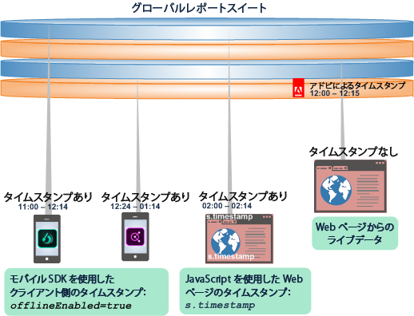
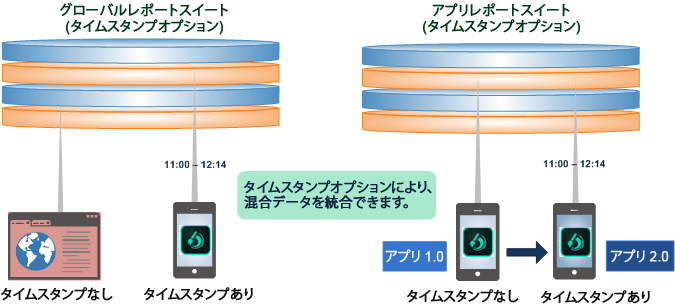
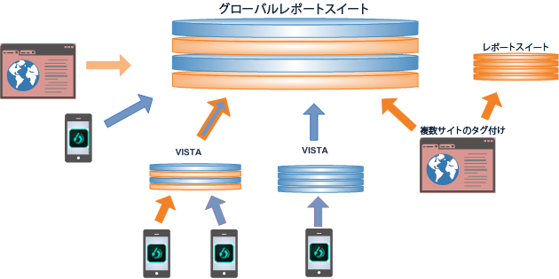
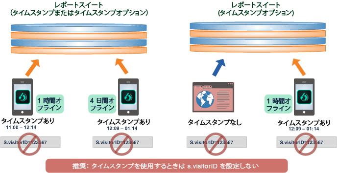
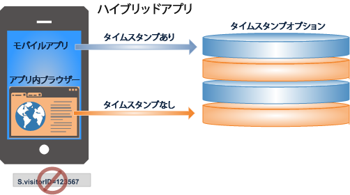

# タイムスタンプオプションの使用

タイムスタンプオプション設定を使用することのメリットと制約について説明します。

タイムスタンプオプションは、すべての新しいレポートスイートのデフォルト設定です。

* タイムスタンプのデータが存在するイメージリクエストと存在しないイメージリクエストを 1 つのグローバルレポートスイートで計測できます。
* モバイルアプリから Web 用のレポートスイートにタイムスタンプ付きのデータを送信できます。
* 公開済みアプリをアップデートし、途中からタイムスタンプを採用する場合でも、既存のレポートスイートを引き続き利用できます。

>[!NOTE]
>
>タイムスタンプオプションは、今後テンプレートから作成されるすべての新しいレポートスイートのデフォルト設定になります。既存のレポートスイートからコピーした新しいレポートスイートは、元のものから設定を継承します。

その他の設定情報について詳しくは、[タイムスタンプオプション](https://marketing.adobe.com/resources/help/en_US/reference/timestamp-optional.html)を参照してください。

## タイムスタンプオプション：タイムスタンプのあるデータとないデータの統合 {#section_BF17CB593044462B993FD0D28EA56518}

タイムスタンプオプション機能を使用すると、データを損失することなく、タイムスタンプのないデータをタイムスタンプのあるデータと組み合わせることができます。モバイルデバイスで生成されたタイムスタンプのあるオフラインデータは、Web ページからのライブのタイムスタンプのないデータと組み合わせたり、クライアント側のタイムスタンプ呼び出しを使用した任意のプラットフォームからのデータと統合したりできます。

* **タイムスタンプデータ**。Client-side timestamp data is captured and sent directly with the device data using client-side timestamp variables: Javascript on a web page, or using a Mobile SDK call ( [!DNL offlineEnabled=true]) in a mobile app.
* **タイムスタンプのないデータ**。アドビは、データが収集サーバーをヒットした場合、レポートスイートのタイムスタンプのないデータにタイムスタンプを設定します。

レポートスイートは、次のいずれかのタイムスタンプ設定を持つ可能性があります。

* タイムスタンプを使用できない（訪問者 ID の設定はサポートされている）
* タイムスタンプが必要（訪問者 ID の設定はサポートされていない）
* タイムスタンプオプション（訪問者 ID の設定はサポートされてるが、タイムスタンプ付きのヒットではサポートされない）

## タイムスタンプオプション機能について {#section_63B2FA9A2AB24B3993E84D2C2B4BF2CE}

タイムスタンプオプションを使用すると、クライアント側のタイムスタンプが含まれていてもいなくても、複数のレポートスイートにわたって統合およびレポートできます。タイムスタンプオプションがあれば、以前のアプリからのタイムスタンプのないデータを使用しながら、タイムスタンプを使用するようにアプリをアップデートできます。

| 以前のリリースでは... | それに加えて... |
|--- |--- |
| タイムスタンプデータは、タイムスタンプのないグローバルレポートスイートには送信できませんでした。その結果、オフラインデバイスから送信されたヒットデータは、タイムスタンプのないレポートスイートに追加する際に削除されていました。  その結果、オフラインデータから送信されたヒットデータは、タイムスタンプのないレポートスイートに追加する際に削除されていました。 | タイムスタンプを収集および使用するようにアプリを更新する場合、新しいレポートスイートを採用する必要がありました。 タイムスタンプを使用するためにアプリを更新する際に、既存のレポートスイートに保存したり、既存のデータを統合することはできませんでした。 |

**タイムスタンプオプションを使用すると**、ライブWebサイトのタイムスタンプのないデータをモバイルデバイスのオフラインデータと統合したり、タイムスタンプのないアプリをタイムスタンプのあるアプリに更新したりできます。 

## データのグローバルレポートスイートへの統合 {#section_5BE3BDF56007402BB1F5C3144D5FE1E0}

データのグローバルレポートスイートへの統合は、複数スイートのタグ付け、VISTA ルール、オフラインソースから読み込んだバッチファイルなど、複数の方法で実行できます。

>[!IMPORTANT]
>
>各コンポーネントデータセットのデザインは慎重に計画し、組み合わせがグローバルレポートスイートで意味を持つようにします。

## タイムスタンプを採用する際のベストプラクティス {#section_9436394E5D7E4F8A8B369B6D11BB2B2B}

次に、タイムスタンプのあるデータとないデータを統合する際に注意すべきベストプラクティスといくつかの要件および制限を示します。

* 一般に、所定の訪問者または訪問のタイムスタンプは、厳密な時系列で Adobe に到着する必要があります。

   順番が正しくないデータには、オフラインデータ収集からの到着が遅れたデータおよび到着が遅れたヒット、またはオフラインモバイルデバイスの同期していないクロックが含まれている可能性があります。順番が正しくないデータは、時間の計算（滞在時間値など）、属性（eVar の持続性）、訪問回数／訪問のカウントおよびパスレポートに悪影響を与える可能性があります。

   

* [s.visitorID](https://marketing.adobe.com/resources/help/en_US/sc/implement/visid_custom.html) が設定されている場合のタイムスタンプの使用は、推奨されません。データの順番がばらばらになる可能性があります。

* アプリ（タイムスタンプ対応、オフラインデータ）から成るハイブリッドアプリで Web ブラウザー（タイムスタンプ非対応、ライブデータ）を開く場合、タイムスタンプを使用しないでください。セッションのレポーティングが不正確になります。

   

   さらに、ハイブリッドアプリには、訪問者 ID を設定しないでください。
