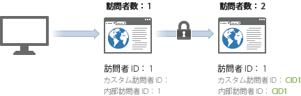
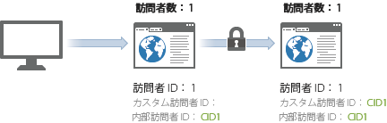

# 訪問者数

>[!IMPORTANT]
>
>デバイス間で訪問者を識別する方法は推奨されなくなりました。[Adobe Experience Cloud Device Co- opのドキュメント](https://marketing.adobe.com/resources/help/en_US/mcdc/)を参照してください。

Analytics は、一意の有効な各訪問者 IDを一意の訪問者としてカウントします。

If you look at the [previous table](../../../implement/js-implementation/xdevice-visid/visit-example.md#concept_E3B32B8E539F4FDC8E3FA872328B87BA), this occurred 3 times: at hits 1, 9, and 10. サーバーコールで有効な[!UICONTROL 訪問者 ID] が同じ場合、追加の訪問者はカウントされません。また、この訪問の間隔が数時間あったり、異なるデバイスからの訪問であっても、訪問者 ID が同じなので、訪問者は増えません。

このような場合、クロスデバイス訪問者の識別を有効にすると、一意の訪問者の数が増加することがあります。訪問者が、同じ訪問で 2 回カウントされる可能性があるためです。初回訪問で 1 回カウントされ、ユーザーが認証された後でもう 1 回カウントされます。

新しい訪問者がサイトを表示すると、`s_vi` cookie が設定および保存されます。データ収集サーバーでは、新しい訪問者プロファイルがこの訪問者 ID に対して作成され、cookie に設定された訪問者 ID が有効な[!UICONTROL 訪問者 ID] として設定されます。

デバイス間の訪問者の識別を有効にすると、（例えば認証後などに）後続のヒットで[!UICONTROL 訪問者 ID] 変数が提供された場合、その ID が有効な[!UICONTROL 訪問者 ID] になります。これにより、有効な[!UICONTROL 訪問者 ID] が認証の直後に変更されるので、訪問者が複数回カウントされることになります。

初回の関連付けの後は、訪問者は[!UICONTROL 訪問者 ID] cookie によって関連付けられるので、訪問数は増加しません。訪問者が後でサイトを表示し認証した場合も、有効な[!UICONTROL 訪問者 ID] は認証後に変更されないので、訪問者数は水増しされません。

