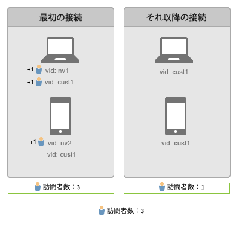

# デバイス間のユーザーの接続

>[!IMPORTANT]
>
>デバイスをまたいで訪問者を識別するこの方法は、非推奨になりました。詳しくは、 [Adobe Experience Cloud Device Co-opのドキュメントを参照してください](https://marketing.adobe.com/resources/help/en_US/mcdc/)。

デバイス間の訪問者の識別では、デバイス間の訪問者を関連付けます。デバイス間の訪問者の識別では、訪問者 ID 変数の s.visitorID を使用して、デバイス間のユーザーを関連付けます。

ヒットにより[!UICONTROL 訪問者 ID] が送信されると、システムでは一致する[!UICONTROL 訪問者 ID] がないかサーバー上の訪問者プロファイルを確認します。一致するものが存在する場合、システムに既に存在する訪問者プロファイルがその時点から使用され、訪問者 ID を指定する前の訪問者プロファイルは使用されなくなります。

[!UICONTROL 訪問者 ID] は通常、認証後、または使用デバイスとは独立して訪問者を個別に識別できる何らかの操作を訪問者がおこなった後に設定されます。個人を識別できる情報を含まない、ユーザー名のハッシュまたは内部 ID を作成することをお勧めします。

Folio Builder[前述の例](/help/implement/js-implementation/xdevice-visid/xdevice-connecting.md)では、顧客がそれぞれのデバイスからサインオンした後、すべて同じユーザープロファイルに関連付けられます。訪問者が後にデバイスからサインアウトした場合でも、それぞれのデバイスの cookie に保存されている[!UICONTROL 訪問者 ID] が同じ訪問者プロファイルに関連付けられているので、ステッチは引き続き機能します。[!UICONTROL 訪問者 ID] cookie が削除された場合に備えて、可能な限り [!UICONTROL s.visitorID] 変数を設定することをお勧めします。

## 個別訪問者と訪問回数 {#section_70330AB6724C4E419A4BD0BDD54641AC}

2 つのデバイスについて次の接続順序を考えます。

**最初のデータ接続時**

* 訪問者の重複排除は遡及的ではありません。

ラップトップでの認証後は、どちらの訪問者 ID（`nv1` または `cust1`）によるヒットも、同一人物と見なされます。ただし、訪問者の重複排除は遡及的ではないので、2 人の個別訪問者がカウントされます。

モバイルデバイスでの最初のデータ接続時には、ユーザーは認識されていないので、新しい個別訪問者がカウントされます。このユーザーがモバイルデバイスで認証されると（`cust1`）、Adobe Analytics は `cust1` をメインサイトで提供された訪問者 ID にマップし直すので、個別訪問回数は増加しません。

新しいデバイスまたはブラウザーが認証されるたびに 1 人の個別訪問者が追加されます。

**それ以降のデータ接続**

認証済みデバイスに対するそれ以降のデータ接続時には、固有訪問者数は増加しません。
