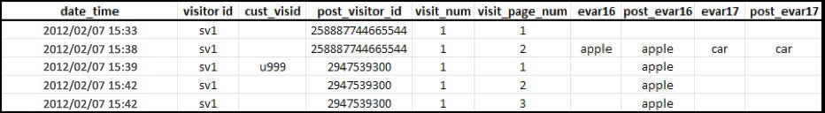
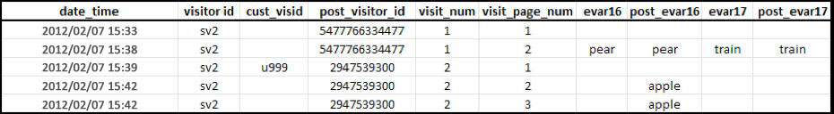

# アトリビューションと持続性

>[!IMPORTANT]
>
>デバイスをまたいで訪問者を識別するこの方法は、非推奨になりました。『コンポーネントユーザガイド』の「[クロスデバイス分析](/help/components/cda/overview.md)」を参照してください。

複数の訪問者プロファイルが同じ訪問者 ID 変数と関連付けられた後に統合された場合、過去データのアトリビューション（配分方法）は変更されません。

* 変数 `s.visitorID` が設定され、ヒット時に送信されると、アドビは、一致する訪問者 ID を持つ訪問者プロファイルが他にもないかどうかを確認します。
* 一致するプロファイルが存在する場合、システムに既に存在する訪問者プロファイルがその時点から使用され、以前の訪問者プロファイルは使用されなくなります。
* 一致する訪問者 ID が見つからない場合は、新しいプロファイルが作成されます。

非認証ユーザーが初めてサイトに訪問したときには、そのユーザーに対して、Adobe Analytics によって訪問者プロファイルが割り当てられます。新しいプロファイルが作成されると、1 つの訪問は終了し、別の訪問が開始します。

## 例 1

次の例に、ユーザーが最初のデバイスで初めて認証されるときに Adobe Analytics にデータがどのような方法で送信されるかを示します。

* `eVar16` は 1 日で有効期限切れに、`evar17` は訪問時に有効期限切れになります。
* `post_visitor_id` 列は、Adobe Analytics サーバーによって保持されるプロファイルを表します。投稿列は通常、データフィードで表示されます。『エクスポートユーザガイド』の「[データフィード](/help/export/analytics-data-feed/data-feed-overview.md)」を参照してください。
* `post_evar16` および `post_evar17` 列は、eVar の持続性を示します。
* `cust_visid` は、`s.visitorID` に設定される値を表します。
* 1 つの行が 1 つの「ヒット」、つまり Adobe Analytics データ収集サーバーに送信される単一の要求です。

まだ認識されていない新しい `s.visitorID` 値（上記の `u999`）を含む最初のデータ接続時に、新しいプロファイルが作成されます。前のプロファイルからの持続性値は、新しいプロファイルに転送されます。

* 訪問時に有効期限切れになるように設定された eVar は、認証済みのプロファイルにはコピーされません。上記の値 `car` は持続的でないことに注意してください。
* ヒットや訪問よりも長い期間で有効期限切れになるように設定された eVar は、認証済みのプロファイルにコピーされます。値 `apple` は持続的であることに注意してください。
* 持続的な eVar の場合、インスタンス指標は記録されません。つまり、デバイス間の訪問者の識別を使用する場合は、eVar 値の個別訪問回数指標がインスタンス指標よりも大きくなることがあります。

>[!NOTE]
>
>そのユーザーがサイトにとっての新規ユーザー（これまでにそのデバイスで訪問したことが一度もない）で、かつそのユーザーが訪問後の約 3 分以内に認証された場合、値は認証済みプロファイルに持続されません。

## 例 2

次の例に、以前に別のデバイスで認証されたことのあるユーザーが、その後さらに別の新しいデバイスで認証されるときに Adobe Analytics にデータがどのような方法で送信されるかを示します。

顧客の認証時に、以前の「認証済み」プロファイル（`2947539300`）に一致します。この訪問の開始時に使用されたプロファイル（`5477766334477`）はこれ以降使用されず、ファイルのデータは持続しません。

* 地域特性データは、訪問者の初回ヒットに基づいて記録されます。このデータは、1 回の訪問中は不変となります（使用するデバイスは関係ありません）。つまり、新しいデバイスを使用したそれ以降のデータ接続では、地域特性データは一般的には含まれません。
* ブラウザー、オペレーティングシステム、色設定などのテクノロジー列は、訪問の最初のヒット時に記録されます。地域特性値のように、これらはステッチプロファイルにコピーされません。
* マーケティングチャネルは、そのデバイスの最初の認証を含む後続のデータ接続で他のチャネルを上書きします。
