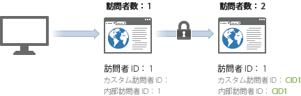
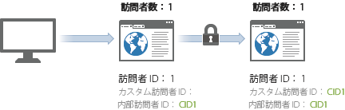

# クロスデバイス訪問者特定の例

>[!IMPORTANT]
>
>デバイスをまたいで訪問者を識別するこの方法は、非推奨になりました。『コンポーネントユーザーガイド』の [クロスデバイス分析](/help/components/cda/overview.md)を参照してください。

次の例は、一般的な顧客インタラクションで送信されるサーバーコールのサンプルを使用して、クロスデバイス訪問者特定がどのように機能するかを示しています。

| サーバーコール | アクション | 訪問者 ID Cookie | 訪問者 ID 変数 | 有効な訪問者 ID | 訪問ページ番号 | 訪問数 |
|--- |--- |--- |--- |--- |--- |--- |
| 1 | 訪問者がマーケティング用の電子メールにあるリンクをクリックして、家のコンピューターからサイトを訪問します。この訪問者は過去 7 回このサイトを訪問しています。 | 3 | - | 3 | 1 | 8 |
| 2～8 | サイトの別の 7 つのページに訪問します。 | 3 | - | 1 | 2～8 | 8 |
| 9 | 家のコンピューターを認証します。 | 3 | CID1 | CID1 | 9  （これは CID1 の初回ヒットです。そのため、訪問者 ID 1 の訪問者プロファイルを引き継ぎ、継続します。） | 8 |
| 10 | 別の 1 つのページを訪問します。 | 1 | CID1 | CID1 | 10 | 8 |
| 11 | オフィスのノートブックパソコンからサイトを開きます。この訪問者は過去にこのデバイスを使用してこのサイトを訪問したことがありません。 | 2 | - | 2 | 1 | 3 |
| 12 | ノートブックパソコンを認証します。 | 2 | CID1 | CID1 | 3 | 9 |
| 13 | 別の 1 つのページを表示します。 | 2 | CID1 | CID1 | 2 | 9 |

## 訪問のカウント

Analytics は訪問ページ番号が 1 であるヒットが検知されるたびに訪問をカウントします。

上の表を使用して、新しい訪問が 4 回（ヒット 1、9、11、12）カウントされました。

## 訪問者数のカウント

Analytics は、一意の有効な各訪問者 ID を一意の訪問者としてカウントします。

上記の表を使用して、新しい訪問者が 3 回（ヒット 1、9、10）カウントされました。

クロスデバイス訪問者特定を使用すると、表示されるユニーク訪問者数が増える可能性があります。訪問者が、同じ訪問で 2 回カウントされる可能性があるためです。初回訪問で 1 回カウントされ、ユーザーが認証された後でもう 1 回カウントされます。

初回の関連付けの後はブラウザー Cookie によって関連付けられるので、訪問数は増加しません。訪問者が後でサイトを表示し認証した場合も、有効な訪問者 ID は認証後に変更されないので、訪問者数は水増しされません。

ユニーク訪問者を識別する際は、できる限り一貫性があることを確認します。例えば、ユーザーが認証されるときは常に `visitorID` 変数を使用します。
