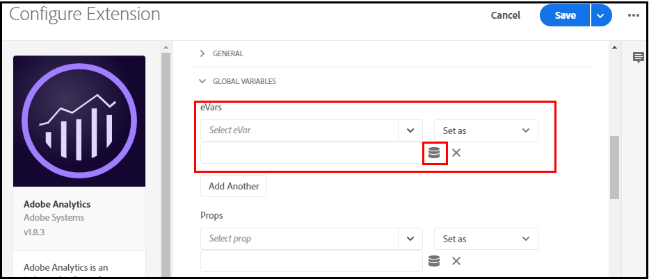

# 起動データ要素のAnalytics変数へのマッピング

データ [レイヤーオブジェクトをLaunchデータ要素にマッピングした後](https://docs.adobe.com/content/help/en/analytics/implementation/layer-to-elements.md)、データ要素を [Analytics変数にマッピングできます](https://docs.adobe.com/content/help/en/analytics/implementation/vars/overview.html)。

起動データ要素をAnalytics変数にマップするには：

1. 該当する場合は、データ要素をグローバル変数に割り当てます。 ページ名などの一部のデータ要 *素は* 、プロパティのすべてのページに適用されます。 このような場合は、次の手順を実行して、変数をグローバルに設定できます。

2. 「起動」で、下にスクロールし、「拡張機能カタログ」 **をクリックしま**&#x200B;す。

   

3. 「解析」の **下の** 「設定」をクリックします。

   

4. 「グロ **ーバル変数****のeVar**」で、変数に関連付けるように設定した  eVarを選択します。 「 **Set as**」を選択し、右端のフィールドで樽型アイコンをクリックして、データ要素を指定します。

   

5. 「データ **要素の選択** 」ポップアップウィンドウで、変数に適用するデータ要素を選択します。

6. 「**保存**」をクリックします。

また、データ要素がグローバル変数に関連付けられていない場合は、データ要素をprop [やeVarに割り当てる](https://docs.adobe.com/content/help/en/analytics/admin/admin-tools/processing-rules/processing-rules.html) 、ルールを作成するだけで済みます。
