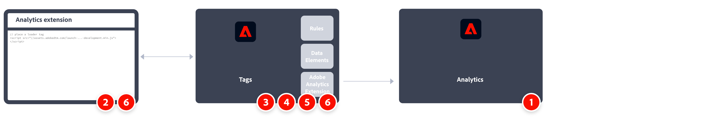

# Analytics 拡張機能を使用したAdobe Analyticsの実装

Adobe Analytics が発表されて以来、アドビでは、データ収集用にサイトにコードを実装する様々な方法を提供してきました。Adobeの現在の推奨方法は、Adobe Experience Platformのタグを使用する方法です。

Adobe Experience Platform のタグは、他のタグ要件と共に Analytics コードを導入できるタグ管理ソリューションです。アドビは他のソリューションや製品との統合を提供し、カスタムコードの導入に対応します。これらのタスクはすべて、組織の開発チームに依存せずに実行できるので、自らサイト上のコードを更新できます。

有効な Adobe Experience Cloud 契約を締結しているすべてのお客様は、タグを使用できます。Launch にアクセスできるかどうかがわからない場合は、組織の Experience Cloud システム管理者にお問い合わせください。

実装タスクの概要です。

| |タスク |詳細情報 | |-| —|—| | 1 |以下をお持ちであることを確認してください： **レポートスイートの定義**. | [Report Suite Manager](../../admin/admin/c-manage-report-suites/report-suites-admin.md) | | 2 | **データレイヤーの作成** を使用して、web サイト上のデータのトラッキングを管理します。 | [データレイヤーの作成](../prepare/data-layer.md) | | 3 | **タグプロパティの作成**. プロパティは、タグ管理データを参照するために使用される包括的なコンテナです。| [Adobe Analyticsタグプロパティの作成](../launch/create-analytics-property.md) | | 4 | **Analytics 拡張機能のインストール** タグプロパティ内で使用されます。 Analytics 拡張機能を設定して、Adobe Analyticsにデータを送信します。 | [Adobe Analytics拡張機能の概要](https://experienceleague.adobe.com/docs/experience-platform/tags/extensions/client/analytics/overview.html?lang=en) | | 5 | **開発環境へのデプロイ**. タグの開発を繰り返し実行できる環境を構築する。 | [開発環境への Analytics 実装のデプロイ](./deploy-dev.md) | | 6 | **検証して実稼動環境に公開**. タグプロパティを Web サイトに追加します。 その後、データ要素やルールなどを使用して、実装をカスタマイズします。| [開発実装の検証と実稼動環境への公開](./validate-publish-prod.md) |

## その他のリソース

タグは高度にカスタマイズできます。実装に適切なデータを含めることで Adobe Analytics を最大限に活用する方法について説明します。

- [タグドキュメント](https://experienceleague.adobe.com/docs/experience-platform/tags/home.html?lang=ja#)：インターフェイスの仕組みと使用可能な拡張機能について説明します。

- [実装変数](../vars/overview.md)：データ収集サーバーに送信する変数を決定します。
