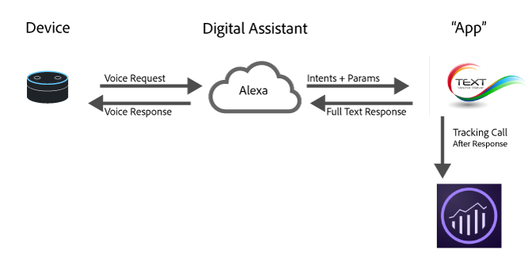

# デジタルアシスタント向け Analytics

最近のクラウドコンピューティング、機械学習、自然言語処理の進化に伴い、デジタルアシスタントは日常生活の一部となっています。消費者は自分のデバイスと会話し始め、デバイスが人間のような方法で理解し、対応することを期待しています。こうしたプラットフォームが普及したことで、ブランドは、これと同様の生身の人間のような応対でサービスを消費者に提示できるようになりました。例えば消費者は、次のような質問を投げかけることができます。

* 「Alexa、車のオイル交換が必要な時期を調べて」
* 「Cortana、当座預金口座の残高は？」
* 「Siri、昨夜のディナー代として、ジョンにバンキングアプリから 20 ドル送金して」

このページでは、Adobe Analytics を活用して、この種のエクスペリエンスの効果を測定および最適化する方法について説明します。

## デジタルエクスペリエンスのアーキテクチャの概要



現代のデジタルアシスタントのほとんどでは、大まかなアーキテクチャは同様です。

1. **デバイス：**&#x200B;マイク搭載のデバイス（Amazon Echo や携帯電話）によって、ユーザーが質問を投げかけることができます。
1. **デジタルアシスタント**：そのデバイスが、デジタルアシスタントの基盤のサービスと通信します。音声が機械で認識できる目的に変換され、要求の詳細が解析されます。ユーザーの目的が認識されたら、デジタルアシスタントがその目的と要求の詳細をアプリに渡し、アプリがその要求を処理します。
1. 「**アプリ」：**&#x200B;携帯電話のアプリまたは音声アプリです。このアプリが要求に対処し、デジタルアシスタントに返答してから、デジタルアシスタントがユーザーに答えを伝えます。

## Analytics を導入する場所

Analytics を導入する場所として特に効果的なのはアプリです。アプリはデジタルアシスタントから目的と詳細を受け取り、応答方法を決定します。

リクエストの実行中に Adobe Analytics へのデータの送信が役立つ場合があるのは以下の 2 回です。

1. アプリに要求が送信されたとき。
1. アプリから応答が送られたとき。

今後の最適化のために、顧客の状況についての記録のみが必要な場合は、応答が返された後に Adobe Analytics にリクエストを送信します。どのようなリクエストがあり、システムがどのように返答したのかについての詳細なコンテキストを取得できます。

## 新規インストール

一部のデジタルアシスタントでは、特に認証に関わる場合に、誰かがスキルをインストールすると通知を受け取ります。「`a.InstallEvent=1`」コンテキストデータ変数を設定して Install イベントを送信することをお勧めします。この機能を利用できないデジタルアシスタントもありますが、可能な場合はリテンションを確認するのに便利です。次のコードのサンプルを使用すると、Install イベント、インストールの日、および AppID の値をコンテキストデータ変数に送信できます。

```text
GET
/b/ss/examplersid/1?vid=[UserID]&c.a.InstallEvent=1&c.a.InstallDate=2017-04-24&c.a.AppID=Spoofify1.0&c.OSType=Alexa&pageName=install
HTTP/1.1
Host:
<xref href="https://example.data.adobedc.net">
  example.data.adobedc.net
 Cache-Control: no-cache
</xref href="https:>
```

## 複数のアシスタントまたは複数のアプリ

組織が複数のプラットフォーム用のアプリを必要としている可能性があります。各リクエストにアプリ ID を含めることをお勧めします。これは `a.AppID` コンテキストデータ変数で設定できます。形式は `[AppName] [BundleVersion]` です（例：BigMac for Alexa 1.2）。:

```text
GET /b/ss/examplersid/1?vid=[UserID]&c.a.AppID=Spoofify1.0&c.a.Launches=1&c.Product=AmazonEcho&c.OSType=Alexa&pageName=install  HTTP/1.1
Host: example.data.adobedc.net
Cache-Control: no-cache
```

```text
GET /b/ss/examplersid/1?vid=[UserID]&c.a.AppID=Spoofify2.0&c.a.Launches=1&c.Product=GoogleHome&c.OSType=Android&pageName=install  HTTP/1.1
Host: example.data.adobedc.net
Cache-Control: no-cache
```

## ユーザー／訪問者の識別

Adobe Analytics は、[Adobe Experience Cloud Identity Service](https://docs.adobe.com/content/help/ja-JP/id-service/using/home.html) を使用して、同じ人物と時間の経過に応じてインタラクションを結び付けます。ほとんどのデジタルアシスタントは、様々なユーザーのアクティビティを保持するために使用できる `userID` を返します。ほとんどの場合、この値を一意の ID として渡すことができます。一部のプラットフォームでは、100 文字を超える識別子を返すことができます。このような場合、固有の識別子を固定長値にハッシュするには、標準のハッシュアルゴリズム（MD5 や Sha1 など）を使用することをお勧めします。

様々なデバイス（例えば、Web アシスタントとデジタルアシスタント）で ECID をマッピングする場合、ID サービスを使用すると最も大きな価値が得られます。モバイルアプリの場合は、Experience Platform SDK をそのまま使用し、`setCustomerID` メソッドを使用してユーザー ID を送信します。ただし、アプリがサービスの場合、ECID としてサービスで提供されるユーザー ID を使用し、`setCustomerID` で設定します。

```text
GET /b/ss/examplersid/1?vid=[UserID]&pageName=[intent]  HTTP/1.1
Host: example.data.adobedc.net
Cache-Control: no-cache
```

## Sessions

デジタルアシスタントは会話型なので、多くの場合はセッションの概念が採り入れられています。次に例を示します。

**消費者：**「オーケー Google、タクシーを呼んで」

**Google：**:「わかりました。何時に来てもらいますか？」

**消費者：** 「午後 8 時半」

**Google**：「了解しました。午後 8 時半までに運転手が到着します」

セッションは、状況を把握し、デジタルアシスタントをより自然にするために、より詳細な情報を収集するのに役立ちます。会話に Analytics を導入する場合は、新規セッションを開始する際にやることが 2 つあります。

1. **Audience Manager にアクセスする**：返答をカスタマイズするために、ユーザーが属する適切なセグメントを取得します（このユーザーは現在、マルチチャネルの割り引きの利用条件を満たしているなど）。
2. **新規セッションまたは開始イベントを送信する**：最初の応答を Analytics に送信する際に、開始イベントを含めます。一般的には、`a.LaunchEvent=1` のコンテキストデータを設定することで、このイベントを送信できます。

```text
GET /b/ss/examplersid/1?vid=[UserID]&c.a.LaunchEvent=1&c.Intent=[intent]&pageName=[intent]  HTTP/1.1
Host: example.data.adobedc.net
Cache-Control: no-cache
```

## 目的

デジタルアシスタントには、目的を検知してから、対処方法を導き出すためにその目的を「アプリ」に渡すためのアルゴリズムがあります。こうした目的は、要求を簡潔に表現するもので、

例えばユーザーが「Siri、昨夜のディナー代として、ジョンにバンキングアプリから 20 ドル送金して」と言った場合は、その目的は&#x200B;*sendMoney* などになります。

これらの各要求を eVar として送信することで、会話アプリの各目的に関するパスレポートを作成できます。目的がなくてもアプリがリクエストを処理できることを確認します。変数を省略するのではなく、インテントコンテキストデータ変数に「No Intent Specified（インテントが指定されていません）」を渡すことをお勧めします。

```text
GET /b/ss/examplersid/1?vid=[UserID]&c.a.AppID=Penmo1.0&c.a.LaunchEvent=1&c.Intent=SendPayment&pageName=[intent]  HTTP/1.1
Host: example.sc.adobedc.net
Cache-Control: no-cache
```

 または

```text
GET /b/ss/examplersid/1?vid=[UserID]&c.a.AppID=Penmo1.0&c.a.LaunchEvent=1&c.Intent=No_Intent_Specified&pageName=[intent]  HTTP/1.1
Host: example.data.adobedc.net
Cache-Control: no-cache
```

## パラメーター／スロット／エンティティ

デジタルアシスタントは多くの場合、目的だけでなく、目的の詳細を示すキー／値ペアのセットも保持します。これらはスロット、エンティティまたはパラメーターと呼ばれます。以下に例を示します。「Siri、昨夜のディナー代として、ジョンにバンキングアプリから 20 ドル送金して」のパラメーターは次のようになります。

* 誰 = ジョン
* 金額 = 20
* 理由 = ディナー

アプリのこうしたパラメーターの数には、限りがあるのが一般的です。Analytics でこうした値を追跡するためには、コンテキストデータ変数に送信してから、各パラメーターを eVar にマッピングします。

```text
GET /b/ss/examplersid/1?vid=[UserID]&c.a.AppID=Penmo1.0=1&c.a.LaunchEvent=1&c.Intent=SendPayment&c.Amount=20.00&c.Reason=Dinner&c.ReceivingPerson=John&c.Intent=SendPayment&pageName=[intent]  HTTP/1.1
Host: example.data.adobedc.net
Cache-Control: no-cache
```

## エラー状態

デジタルアシスタントが、対処方法がわからない入力情報をアプリに送ることもあります。以下に例を示します。「Siri、昨夜のディナー代として、ジョンにバンキングアプリから石炭 20 袋を送っておいて」

この状況が発生した場合は、アプリに明確な説明を求めるように指示します。さらに、発生したエラーのタイプを示す eVar と共に、アプリにエラー状態があることを示すデータをアドビに送信します。入力情報に間違いがある場合のエラーと、アプリに問題が生じた場合のエラーを必ず含めます。

```text
GET /b/ss/examplersid/1?vid=[UserID]&c.a.AppID=Penmo1.0&c.Error=1&c.ErrorName=InvalidCurrency&pageName=[intent]  HTTP/1.1
Host: example.data.adobedc.net
Cache-Control: no-cache
```

## デバイスの機能

ほとんどのプラットフォームは、ユーザーが対話したデバイスを公開しませんが、デバイスの機能を公開します（例：オーディオ、画面、ビデオ）。この情報は、ユーザーとの対話の中で使用できるコンテンツのタイプを定義するので有用です。デバイスの機能を測定する際は、それらをアルファベット順で連結する方法が最も効果的です。

例：`":Audio:Camera:Screen:Video:"`

セグメントを作成する際に、先頭と末尾のコロンが役立ちます。例えば、`:Audio:` 機能を持つすべてのヒットを表示します。

* Amazon Alexa を使用する [Amazon 機能](https://developer.amazon.com/public/solutions/alexa/alexa-skills-kit/docs/alexa-skills-kit-interface-reference)
* Google でのアクションを使用する[ Google 機能](https://developers.google.com/actions/assistant/surface-capabilities)

## 例

| ユーザー | デバイスの応答 | アクション／目的 | GET 要求 |
|---|---|---|---|
| Spoofify をインストールして | レスポンスがない | Install | `GET /b/ss/examplersid/1?vid=[UserID]&c.a.InstallEvent=1&c.a.InstallDate=[currentDate]&c.a.AppID=Spoofify1.0&c.OSType=Alexa&c.Intent=Install&pageName=Install  HTTP/1.1`<br>`Host: example.data.adobedc.net`<br>`Cache-Control: no-cache` |
| Spoofify を起動して | 「了解、Spoofify を起動します」 | Play | `GET /b/ss/examplersid/1?vid=[UserID]&c.a.AppID=Spoofify1.0&c.a.LaunchEvent=1&c.Intent=Play&pageName=PlayApp  HTTP/1.1`<br>`Host: example.data.adobedc.net`<br>`Cache-Control: no-cache` |
| 楽曲を変更して | 「了解、どの楽曲にしますか？」 | ChangeSong | `GET /b/ss/examplersid/1?vid=[UserID]&c.a.AppID=Spoofify1.0&c.Intent=ChangeSong&pageName= Ask%20For%20Song  HTTP/1.1`<br>`Host: example.data.adobedc.net`<br>`Cache-Control: no-cache` |
| 「ベイビーシャーク」を再生して | 「了解、PinkFong の『ベイビーシャーク』を再生しています」 | ChangeSong | `GET /b/ss/examplersid/1?vid=[UserID]&c.a.AppID=Spoofify1.0&c.Intent=ChangeSong&pageName=Action%20Play%20Song&c.SongID=[012345]  HTTP/1.1`<br>`Host: example.data.adobedc.net`<br>`Cache-Control: no-cache` |
| 再生リストを変更して | 「了解、どの再生リストにしますか？」 | ChangePlaylist | `GET /b/ss/examplersid/1?vid=[UserID]&c.a.AppID=Spoofify1.0&c.Intent=ChangePlaylist&pageName=Ask%20For%20Playlist  HTTP/1.1`<br>`Host: example.data.adobedc.net`<br>`Cache-Control: no-cache` |
| お気に入りの曲の再生リストを再生して | 「了解、お気に入りの曲のプレイリストを再生中です」 | ChangePlaylist | `GET /b/ss/examplersid/1?vid=[UserID]&c.a.AppID=Spoofify1.0&c.Intent=ChangePlaylist&pageName=Action%20Play%20Playlist&c.Playlist=My%20Favorite%20Songs  HTTP/1.1`<br>`Host: example.data.adobedc.net`<br>`Cache-Control: no-cache` |
| 音楽を切って | 応答なし、音楽がオフ | Off | `GET /b/ss/examplersid/1?vid=[UserID]&c.a.AppID=Spoofify1.0&c.Intent=Off&pageName=Music%20Off  HTTP/1.1`<br>`Host: example.data.adobedc.net`<br>`Cache-Control: no-cache` |
