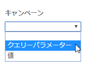

# リファラーとキャンペーン

Adobe [!DNL Analytics] に [!UICONTROL Dynamic Tag Management ]をデプロイする際の、リファラーおよびキャンペーンオプション用の [!UICONTROL Dynamic Tag Management] フィールドの説明です。

**[!UICONTROL *`Property`*]**／**[!UICONTROL &#x200B;ツールを編集&#x200B;]**／**[!UICONTROL &#x200B;リファラーとキャンペーン&#x200B;]**

<table id="table_09AE3BFF0F12442F9C19CD96451F93E4">
 <thead>
  <tr>
   <th colname="col1" class="entry"> 要素 </th>
   <th colname="col2" class="entry"> 説明 </th>
  </tr>
 </thead>
 <tbody>
  <tr>
   <td colname="col1"> リファラーの上書き </td>
   <td colname="col2"> 
ブラウザーに設定されたリファラーではなく、 s.referrer 変数にセットされた値をリファラーとして使用します。 
 
<a href="../../../vars/page-vars/referrer.md">リファラー</a>を参照してください。 
 </td>
  </tr>
  <tr>
   <td colname="col1"> キャンペーン </td>
   <td colname="col2"> 
訪問者をサイトに誘導するために使用されるマーケティングキャンペーンを識別する変数です。通常、キャンペーンの値は、クエリー文字列パラメーターから取得します。 
 
<a href="../../../vars/page-vars/campaign.md">キャンペーン</a>を参照してください。 
 </td>
  </tr>
 </tbody>
</table>

DTM インターフェイスで、「クエリー文字列」と「値」（データ要素から取得できるもの）のどちらを使用するかを選択します。

インターフェイスにクエリー文字列を直接入力するか、キャンペーンをトラッキングする別の手段がある場合は別のデータ要素を参照することができます。
