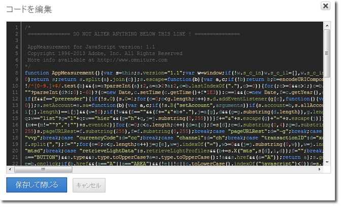

# コアの AppMeasurement コードの挿入

Dynamic Tag Management を Adobe Analytics に手動で導入する場合に AppMeasurement コードを挿入します。

1. [!DNL Adobe Analytics] ツールページで、「**[!UICONTROL 一般]**」セクションを展開し、「**[!UICONTROL エディターを開く]**」をクリックします。
1. 「[!DNL AppMeasurement_JavaScript*.zip]Adobe Analytics の導入」 [でダウンロードした](/help/implement/other/dtm/t-analytics-deploy.md) ファイルを解凍します。

   カスタムライブラリを使用する場合は、このウィンドウを開くと、最新バージョンのコードがあらかじめ取得されています。Admin Console で ZIP ファイルをダウンロードする必要はありません。
1. テキストエディターで [!DNL AppMeasurement.js] を開きます。
1. 内容をコピーして&#x200B;**[!UICONTROL コードを編集]**&#x200B;ウィンドウに貼り付けます。

   

1. アドビでは、次のコードを *`Do Not Alter Anything Below This Line`* の上に追加することをお勧めします。

   ```
   var s_account="INSERT-RSID-HERE"
   var s=s_gi(s_account)
   ```

   >[!IMPORTANT]
   >
   >このコードを追加する場合は、ライブラリ全体の設定で、「**[!UICONTROL 次のカスタムコードを使用してレポートスイートを設定]**」チェックボックスをオンにしておくことをお勧めします。

1. 「**[!UICONTROL 保存して閉じる]**」をクリックします。

   メディアモジュール、Integrate Module、または実装プラグインを使用している場合、それらをコードセクションに含めることもできます。Dynamic Tag Management のマネージコードは、通常の実装の JavaScript ファイルと同じように記述できます。

