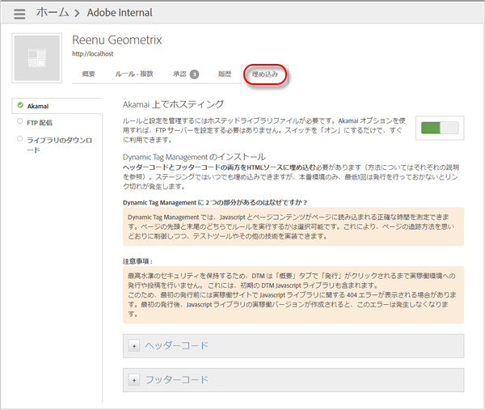

# ヘッダーおよびフッターコードの追加

サイトへの JavaScript およびページコンテンツの読み込みを判断するヘッダーとフッターを、Dynamic Tag Management を使用して追加します。使用するホスティングオプションにかかわらず、サイトのすべてのページにヘッダーとフッターの両方のコードをインストールする必要があります。

Dynamic Tag Management にはヘッダーとフッターの両方のコードのスニペットが含まれるので、ページの最初または最後にルールを実行できます。この機能により、ページのトラッキングの制御を維持したまま、テスティングツールおよびその他のテクノロジーを導入できます。

Dynamic Tag Management には、ステージングおよび実稼動用の埋め込みコードを作成する機能があります。そのコードは、変更内容を実稼動環境へと反映する前にステージング環境でテストするために使用できます。

>[!IMPORTANT]
>
>導入を成功させるためには、Adobe ヘルプの指示に従うことが重要です。特に、ヘッダーのコードは、ドキュメントテンプレートの `<head>` セクションに配置する必要があります。また、フッターのコードは、`</body>` 終了タグの直前に配置する必要があります。どちらかの埋め込みコードをマークアップの別の場所に配置したり、非同期的な方法で埋め込みコードを追加したり、何らかの方法で埋め込みコードをラッピングしたりする使用方法は、Dynamic Tag Management の導入方法として&#x200B;*サポートされていません*。提供された埋め込みコードは、必ず無変更で実装してください。
>
>サポートされていない導入方法を使用すると、予期しない結果が生じ、カスタマーケアやエンジニアリング担当者が導入の支援をおこなう際に障害となります。

1. Dynamic Tag Management インターフェイスで、「[!UICONTROL 埋め込み]」タブを開き、ホスティングオプション（Akamai など）を選択し、スイッチを「オン」に切り替えます。

   手順の結果 1Dynamic Tag Management の「埋め込み」タブで提供される実稼動用のヘッダーコードをコピーし、サイトの HTML の [!DNL HEAD] セクション内に配置します。

   

   コードを `<head>` の近くに配置します。 タグの近くに配置します。このコードスニペットは、実稼動サイトのすべてのページに配置する必要があります。

   >[!NOTE]
   >
   >実稼動埋め込みコードは、その[プロパティ](/help/implement/other/dtm/t-create-web-property.md)ないの公開済みアイテムのみを反映します。ただし、ステージングの埋め込みコードは、発行済みまたは未発行の状態にかかわらず、関連するプロパティのすべてのアイテムを反映します。実稼動環境の未発行アイテムをテストするには、[Akamai ホスティング用の未発行のルールのテスト](/help/implement/other/dtm/c-rules/t-test-rules-akamai.md)の手順に従って、コンソールでステージングをローカルで有効にします。

1. 実稼動サイト用のフッターコードをコピーして、サイトの HTML の [!DNL BODY] セクションに配置します。

   コードを `</body>` の近くに配置します。 タグの近くに配置します。
1. ステージングのヘッダーおよびフッターコードをコピーして、ステージングサイトで上記の手順を繰り返します。

   >[!NOTE]
   >
   >実稼動とステージングのコードスニペットの違いは、ステージングバージョンにはファイル名に [!DNL -staging] が追加されていることです。フッターコードは、ステージングと実稼動で同じです。
