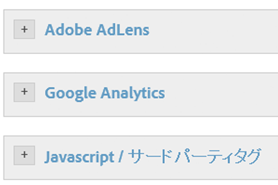
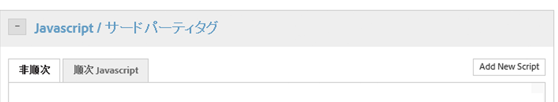
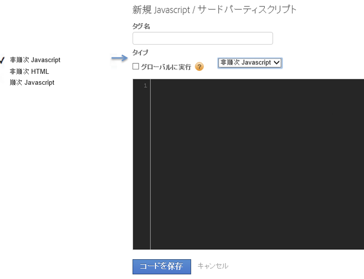
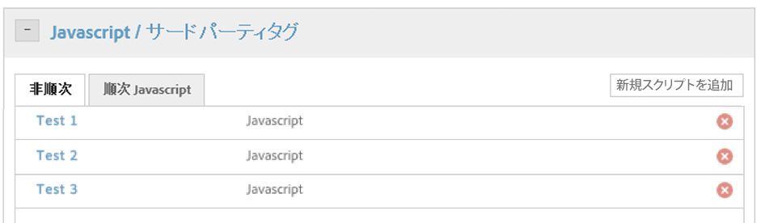

# トリガー条件のアクションの設定

トリガー条件のアクションを設定します。

条件を設定したら、トリガーの条件にするアクションを設定する必要があります。このアクションには、[!DNL Analytics] イベント、サードパーティタグおよびカスタムスクリプトを含めることができます。この例では、スクリプトまたはサードパーティタグを設定する方法を説明します。

[!DNL Adobe Analytics] や Google Analytics などの統合ツールだけでなく、Dynamic Tag Management は、あらゆる種類の JavaScript をトリガーしたり、サイト、選択したページまたは特定のシナリオに HTML を挿入したりできます。

各ルールは、スクリプトや HTML 挿入をいくつでもトリガーできます。

>[!NOTE]
>
>ページ内にカスタムコードを挿入できる DTM の機能によってクロスサイトスクリプティング（XSS）脆弱性が入り込まないよう、十分注意してください（詳しくは、[OWASP のガイド資料](https://www.owasp.org/index.php/Cross-site_Scripting_(XSS))を参照してください）。特に、スクリプトの中でデータ要素を使用する場合は警戒が必要です。データ要素には、信頼できない提供元から得られた値が含まれている可能性が常にあることを意識してください。

**トリガー条件のアクションを設定するには**

1. 「**[!UICONTROL Javascript／サードパーティタグ]**」をクリックして、新しいスクリプトをルールに追加します。

   

1. 「**[!UICONTROL 新規スクリプトを追加]**」をクリックします。

   

1. スクリプトに名前を付けます。
1. スクリプトのトリガー方法を指定して、目的のコンテンツをテキスト領域に貼り付けます。

1. 「**[!UICONTROL コードを保存]**」をクリックすると、スクリプトがルールのキューに追加されます。

