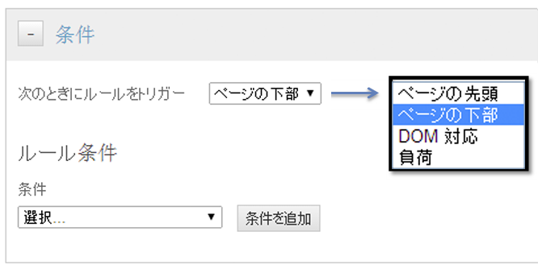
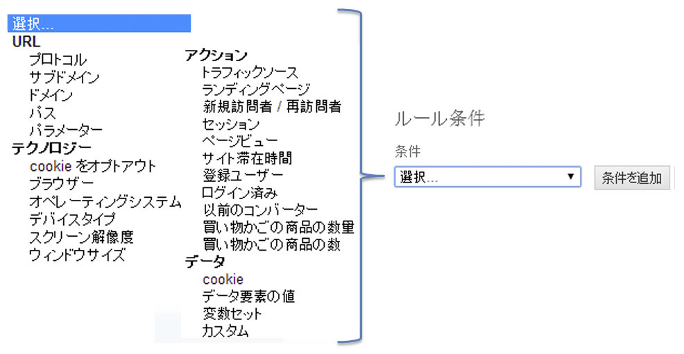

# ページ型ルールの条件の作成

ルールがトリガーされるページを決定するルールを作成します。

1. ルールをトリガーさせたいページ上の位置を指定します。

   ページ上でルールが実行されるタイミングは、ルール内のページコンテンツと依存関係がある場合に、より重要になります。

   

1. ルールを実行する条件を指定します。

   例えば、ルールを実行するページを識別するために、「**[!UICONTROL パス]**」を指定できます。

   

