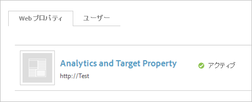
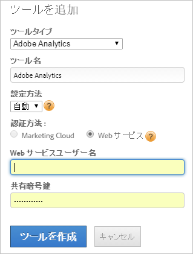

# Adobe Analytics の手動実装（レガシー）

[!UICONTROL Dynamic Tag Management ]を使用した導入のために Adobe Analytics ツールを作成します。ここでは、手動（レガシー）導入について説明します。

自動導入の管理については、[Adobe Analytics ツールの追加](/help/implement/other/dtm/c-aa-tool/analytics-dtm.md)を参照してください。

手動設定を自動設定に変更する場合は、ツールを編集し、「**[!UICONTROL 自動設定を有効にする]**」をクリックします。

1. Analytics 測定コードをダウンロードします：
   1. Analytics で、**[!UICONTROL 管理者]**／**[!UICONTROL Code Manager]** をクリックします。
   1. 「**[!UICONTROL JavaScript（新規）]**」をクリックして、コードをローカルにダウンロードします。
1. [!UICONTROL Dynamic Tag Management] で、[web プロパティを作成](/help/implement/other/dtm/t-create-web-property.md)します。

   

   Web プロパティを作成したら、[!UICONTROL ダッシュボード]の「[!UICONTROL Web プロパティ]」タブで編集できます。Web プロパティのアクティブ化は必要ありません。を参照してください。

1. プロパティに Analytics ツールを追加します：
   1. 「**[!UICONTROL Web プロパティ]**」タブで、対象プロパティをクリックします。
   1. 「**[!UICONTROL 概要]**」タブで、「**[!UICONTROL ツールを追加]**」をクリックします。
   1. **[!UICONTROL ツールタイプ]**&#x200B;メニューで、「**[!UICONTROL Adobe Analytics]**」を選択します。

      

   1. 次のフィールドを設定します。

      | 要素 | 説明 |
      |---|---|
      | ツールタイプ | Analytics、Target、Social などの Experience Cloud ソリューション。 |
      | ツール名 | このツールの名前。この名前は、[!UICONTROL インストールされているツール]の「[!UICONTROL 概要]」タブに表示されます。 |
      | 実稼動アカウント ID | 実稼動サイトのデータを計測するアカウントの数。Dynamic Tag Management は、実稼動およびステージング環境に適したアカウントを自動的にインストールします。 |
      | ステージングアカウント ID | 開発またはテスト環境で使用されます。ステージングアカウントには、実稼動用データとは別個のテストデータが保持されます。 |

1. 「**[!UICONTROL ツールを作成]**」をクリックします。

   インストールされたツールが「[!UICONTROL 概要]」タブに表示されます。

1. コードを設定するには、「**[!UICONTROL 設定]**」（）をクリックします。

   少なくとも、「**[!UICONTROL Cookie]**」をクリックしてトラッキングサーバーおよび SSL トラッキングサーバーを設定します。

1. **[!UICONTROL 一般]**／[コアの AppMeasurement コードの挿入](/help/implement/other/dtm/c-aa-tool/t-appmeasurement-code.md)をクリックします。
1. [!DNL Analytics] データを収集する[ページ型ルール](/help/implement/other/dtm/c-rules/t-rules-create.md)を定義します。

   これで、解析データを収集するためのルールを定義する準備ができました。最初にいくつかのデータ要素を定義するとよいでしょう。データ要素を使用すると、ページから抽出したデータをルールの設定に使用できます。最初はまず、各ページの [!DNL Analytics] データを収集するための条件を持たないページ型ルールを定義するとよいでしょう。
1. [「埋め込み」タブのヘッダーおよびフッターコードを各ページに追加](/help/implement/other/dtm/c-headers-footers/t-header-footer-code.md)します。

   ステージングでは、デフォルト設定のままでもよいでしょう。必要に応じて、実稼動サイトへ発行する前までに変更してください。
1. （オプション）「オプション」タブの「**[!UICONTROL 設定]**」（）をクリックして、Adobe Analytics コードを設定します。

   >[!NOTE]
   >
   >[!UICONTROL Adobe Analytics] ページの設定（「一般」、「Cookies」など）は、`s_code` の設定より優先されます。`s_code` にこれらの設定が存在する場合、ここで繰り返す必要はありません。

