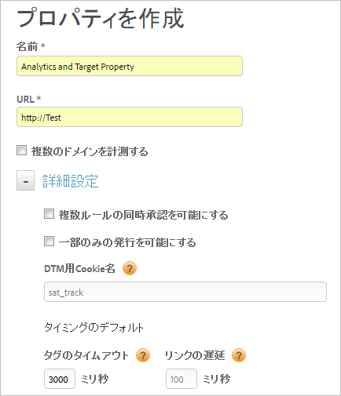

# Web プロパティの作成

Web プロパティは、1 つ以上のドメインおよびサブドメインの集合と複数のルールで構成され、1 つの埋め込みコードに組み込まれます。

>[!NOTE]
>
>プロパティを作成できるのは管理者権限を持つユーザーのみです。ロールについて詳しくは、『Dynamic Tag Management 製品ドキュメント』の [DTM のグループの作成と管理](https://docs.adobe.com/content/help/ja-JP/dtm/using/admin/groups.html)を参照してください。

それらのアセットを DTM で管理および追跡できます。例えば、1 つのテンプレートに基づく複数の Web サイトがあり、それらすべての Web サイトに関する共通のアセットを追跡する場合などに役立ちます。1 つの Web プロパティを複数のドメインに適用することもできます。

Web プロパティの概要とベストプラクティスについては、Dynamic Tag Management 製品ドキュメントの [Web プロパティ](https://docs.adobe.com/content/help/ja-JP/dtm/using/admin/web-property.html)を参照してください。

1. 会社ページに移動して、「**[!UICONTROL プロパティの追加]**」をクリックします。

   

1. 以下のフィールドを設定します。

   <table id="table_376D72251C4D4C4CA878D10C18D2532C"> 
    <thead> 
    <tr> 
    <th colname="col1" class="entry"> 要素 </th> 
    <th colname="col2" class="entry"> 説明 </th> 
    </tr> 
    </thead>
    <tbody> 
    <tr> 
    <td colname="col1"> 名前 </td> 
    <td colname="col2"> 
プロパティの名前。 
 </td> 
    </tr> 
    <tr> 
    <td colname="col1">  URL </td> 
    <td colname="col2"> 
プロパティのベース URL。 
 </td> 
    </tr> 
    <tr> 
    <td colname="col1"> 複数のドメインを計測する </td> 
    <td colname="col2"> 
複数のドメインを視野に入れた訪問者データ永続化をおこなう場合、ドメインを追加することや削除することができます。このオプションを選択した場合、サブドメイン全体で訪問データが永続化されます。 
 
この設定を使用すると、関連するサブドメインやドメインの間で移動するトラフィックをトラッキングする方法を指定できます。サブドメインへのリンクは、外部リンクとして扱われます。サブドメインへの訪問は、個別にトラッキングされます。 
 </td> 
    </tr> 
    </tbody> 
    </table>

1. （オプション）[!UICONTROL 詳細設定]を設定します。

   <table id="table_6E687FBE6ACC4301BCCD837F4DCBB9C9"> 
    <thead> 
    <tr> 
    <th colname="col1" class="entry"> 要素 </th> 
    <th colname="col2" class="entry"> 説明 </th> 
    </tr> 
    </thead>
    <tbody> 
    <tr> 
    <td colname="col1">  複数ルールの同時承認を可能にする </td> 
    <td colname="col2"> 
このプロパティの複数のルールを 1 度に承認することを許可しますデフォルトでは、1 つのルールの承認のみ可能です。 
 </td> 
    </tr> 
    <tr> 
    <td colname="col1">  一部のみの発行を可能にする </td> 
    <td colname="col2"> 
発行する承認済みのルールをユーザーが選択できるようにするかどうかを指定します。これがデフォルトのオプションです。 
 </td> 
    </tr> 
    <tr> 
    <td colname="col1"> Cookie 名のトラッキング </td> 
    <td colname="col2"> 
デフォルトのトラッキング Cookie 名より優先されます。Dynamic Tag Management が別の Cookie の受信のオプトアウトステータスをトラッキングするために使用する名前をカスタマイズできます。 
 </td> 
    </tr> 
    <tr> 
    <td colname="col1">  タグのタイムアウト </td> 
    <td colname="col2"> 
タイムアウトし、タグリクエストをキャンセルするまでに Dynamic Tag Management がタグの起動を待つ時間を指定します。 
 
 Dynamic Tag Management の仕組み上、この数値を大きくしても問題ありません。DTM には、タグの処理速度が低下してもユーザーエクスペリエンスが影響を受けないよう効果的な対策が施されています。 
 </td> 
    </tr> 
    <tr> 
    <td colname="col1">  リンクの遅延 </td> 
    <td colname="col2"> 
リンクがクリックされてから次のページに移動するまでの間に Dynamic Tag Management がタグの起動を待つ時間を指定します。デフォルト値は 100 ミリ秒です。 
 
この時間を長くするとトラッキングの精度が向上します。アドビでは、ユーザーに遅延を意識させないよう 500 ミリ秒以下の設定値を推奨しています。 
 
この値は Dynamic Tag Management が待機する時間の上限値であり、ビーコンが早く起動した場合には遅延が短くなります（つまり、ユーザーの待ち時間は必ずしもこの設定値ほど長くはなりません）。 
 </td> 
    </tr> 
    </tbody> 
    </table>

1. 「**[!UICONTROL プロパティを作成]**」をクリックします。
