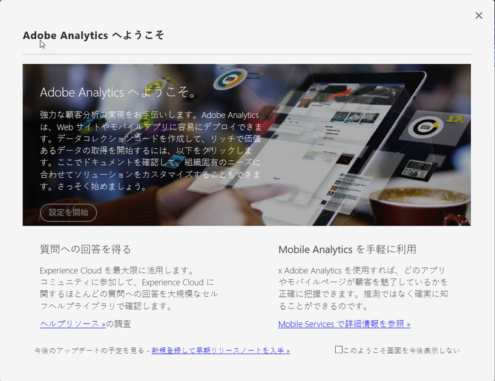

# 実装モーダル

<!-- https://activation.adobedtm.com/index.php?redirected=1 -->

「Adobe Analytics へようこそ」モーダルウィンドウでのレポートスイートを作成するためのワークフローはシンプルです。組織でさらに多くのレポートスイートが必要な場合は、このワークフローを使用することをお勧めします。

## 前提条件

Adobe ID は、Adobe Analytics と Adobe Experience Platform Launch の両方にアクセスできる必要があります。Launch へのアクセス権がないと、資格情報確認するように繰り返し要求される場合があります。組織のシステム管理者に問い合わせて、Launch へのアクセス権を取得してください。

## モーダルへのアクセス

次の手順を使用して、モーダルにアクセスし、レポートスイートを作成します。

1. Adobe ID の資格情報を使用して [experiencecloud.adobe.com](https://experiencecloud.adobe.com) にログインします。
2. 上部の 9 グリッドアイコンをクリックし、「[!UICONTROL Adobe Analytics]」をクリックします。
3. まだレポートスイートを作成していない場合は、モーダルが自動的に表示されます。このログイン会社用のレポートスイートが存在する場合は、右上のヘルプアイコンをクリックし、「[!UICONTROL Adobe Analytics へようこそ]」をクリックします。

> [!NOTE] 「[!UICONTROL Adobe Analytics へようこそ]」オプションは、Adobe Experience Cloud 経由でログインした場合にのみ表示されます。既存のドメインを使用してログインした場合、モーダルは使用できません。

## レポートスイートの作成

「[!UICONTROL セットアップの開始]」ボタンをクリックして、レポートスイート作成ワークフローを開始します。

### プロパティタイプ

プロパティタイプは、Analytics を実装する予定の場所に基づいて、アドビが一部のバックエンド設定を判断するのに役立ちます。

* **Web サイト**：Adobe Analytics を Web サイト用のみに実装する場合。
* **ネイティブモバイルアプリケーション**：Adobe Analytics をモバイルアプリケーション用のみに実装する場合。
* **両方**：このレポートスイートに Web サイトとモバイルアプリケーションの両方のデータが含まれる場合。

### 業種

主なビジネスモデルを指定します。この設定は、主なビジネスモデルに基づいて、一部の変数の名前と設定を事前設定する際に役立ちます。

### データレイヤー

[データレイヤー](data-layer.md)は、実装で使用されるすべての変数を 1 つの役立つ場所にまとめた JavaScript オブジェクトです。詳しくは、[データレイヤー](data-layer.md)を参照してください。

### データリポジトリー

レポートスイートにわかりやすい名前を付けます。レポートスイート ID（RSID）は、わかりやすい名前とログイン会社名に基づいて自動的に生成されます。

### タイムゾーン

アドビがレポートスイートの正しいタイムゾーンを検出したことを確認します。

### 予想日別ページビュー数

Web サイトやアプリケーションが 1 日に受けるトラフィック量を予測します。この情報により、アドビは適切な量の処理リソースをレポートスイートに割り当てることができます。

### 基準通貨

レポートスイートが金額を保存する通貨を決定します。

> [!IMPORTANT] 特に売上高に関するレポート要件がある場合は、正しい通貨を入力してください。データ収集の開始後に基準通貨を変更するのは困難です。

## 実装リソース

レポートスイートの作成後、実装を続行するには、次の 2 つのオプションのいずれかを選択します。

* **Adobe Experience Platform Launch に移動**：実装を設定し、デプロイコードをダウンロードするために、[launch.adobe.com](https://launch.adobe.com) にリンクします。[Launch による実装](../launch/overview.md)を参照してください。ほとんどの場合、Launch を使用することをお勧めします。
* **実装コードのダウンロード**：手動で JavaScript を実装する場合に、JavaScript ファイルをダウンロードするための直接リンクを提供します。[JavaScript 版 AppMeasurement](../js/overview.md) を参照してください。
