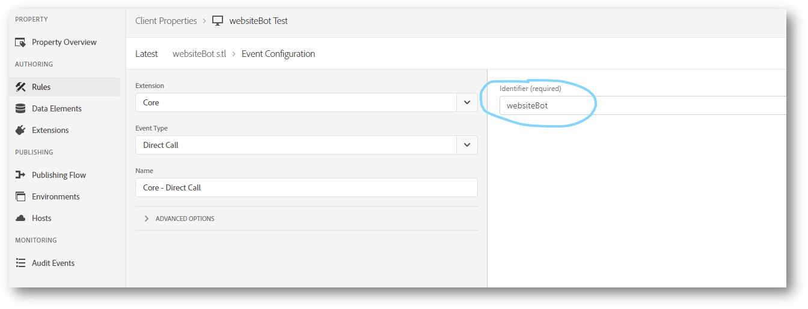

# Adobe プラグイン：websiteBot

>[!IMPORTANT]
>
> このプラグインはアドビコンサルティングによって提供されており、Adobe Analytics からより多くの価値を引き出すのに役立ちます。アドビカスタマーケアは、インストールやトラブルシューティングを含め、このプラグインに対するサポートをおこないません。このプラグインに関するヘルプが必要な場合は、貴社のアカウントマネージャーにお問い合わせになって、担当コンサルタントとのミーティングを手配してもらってください。

`websiteBot` プラグインを使用すると、デスクトップ訪問者がボットかどうかを動的に識別できます。 このデータを使用すると、あらゆる種類のレポートの精度を高め、合法なサイトトラフィックの測定を改善することができます。

このプラグインでは、次の 2 つのチェックを実行します。

* まず、`navigator.UserAgent` 変数を使用して、デバイスがデスクトップかモバイルデバイスかを判断します。 モバイルデバイスは無視されます。
* デスクトップデバイスの場合は、マウスの動きに対するイベントリスナーを追加します。

ユーザーエージェントがデスクトップ上にあり、マウスの動きが検出されない場合、プラグインは `websiteBot` 変数を `true` に設定します。 ユーザーエージェントがモバイルデバイスの場合、またはマウスの動きが検出された場合、プラグインは `websiteBot` 変数を `false` に設定します。

## 前提条件

アドビでは、このプラグインを使用する前に次の点を推奨します。

* **eVar 設定の指定**：レポートスイート設定の「 [コンバージョン 変数](/help/admin/admin/conversion-var-admin/conversion-var-admin.md)」で eVar を設定します。有効期限を&#x200B;**なし**&#x200B;に設定し、割り当てを&#x200B;**&quot;元の値（最初）&quot;**&#x200B;に設定します。
* **別の変数でのユーザーエージェントの収集**：別の変数にユーザーエージェント文字列を収集して、このプラグインの有効性を監視します。このデータを収集するには、すべてのヒットで eVar を `navigator.UserAgent` に設定します。

## Launch カスタムコードエディターを使用したプラグインのインストール

1. 新しい`websiteBot`ルールを追加します。
1. **Mouse Move Listener**&#x200B;イベントを`websiteBot`ルールに追加します。このルールには、次のカスタムコードが含まれます。

   ```
   trigger(document.addEventListener('mousemove', function detectMouseMove() {   
    document.removeEventListener('mousemove', detectMouseMove, false);   
    if (!
      /(android|bb\d+|meego).+mobile|avantgo|bada\/|blackberry|blazer|compal|elaine|fennec|hiptop|iemobile|ip(hone|od)|ipad|iris|kindle|Android|Silk|lge |maemo|midp|mmp|netfront|opera m(ob|in)i|palm( os)?|phone|p(ixi|re)\/|plucker|pocket|psp|series(4|6)0|symbian|treo|up\.(browser|link)|vodafone|wap|windows (ce|phone)|xda|xiino/i
         .test(navigator.userAgent) ||
      /1207|6310|6590|3gso|4thp|50[1-6]i|770s|802s|a wa|abac|ac(er|oo|s\-)|ai(ko|rn)|al(av|ca|co)|amoi|an(ex|ny|yw)|aptu|ar(ch|go)|as(te|us)|attw|au(di|\-m|r |s )|avan|be(ck|ll|nq)|bi(lb|rd)|bl(ac|az)|br(e|v)w|bumb|bw\-(n|u)|c55\/|capi|ccwa|cdm\-|cell|chtm|cldc|cmd\-|co(mp|nd)|craw|da(it|ll|ng)|dbte|dc\-s|devi|dica|dmob|do(c|p)o|ds(12|\-d)|el(49|ai)|em(l2|ul)|er(ic|k0)|esl8|ez([4-7]0|os|wa|ze)|fetc|fly(\-|_)|g1 u|g560|gene|gf\-5|g\-mo|go(\.w|od)|gr(ad|un)|haie|hcit|hd\-(m|p|t)|hei\-|hi(pt|ta)|hp( i|ip)|hs\-c|ht(c(\-| |_|a|g|p|s|t)|tp)|hu(aw|tc)|i\-(20|go|ma)|i230|iac( |\-|\/)|ibro|idea|ig01|ikom|im1k|inno|ipaq|iris|ja(t|v)a|jbro|jemu|jigs|kddi|keji|kgt( |\/)|klon|kpt |kwc\-|kyo(c|k)|le(no|xi)|lg( g|\/(k|l|u)|50|54|\-[a-w])|libw|lynx|m1\-w|m3ga|m50\/|ma(te|ui|xo)|mc(01|21|ca)|m\-cr|me(rc|ri)|mi(o8|oa|ts)|mmef|mo(01|02|bi|de|do|t(\-| |o|v)|zz)|mt(50|p1|v )|mwbp|mywa|n10[0-2]|n20[2-3]|n30(0|2)|n50(0|2|5)|n7(0(0|1)|10)|ne((c|m)\-|on|tf|wf|wg|wt)|nok(6|i)|nzph|o2im|op(ti|wv)|oran|owg1|p800|pan(a|d|t)|pdxg|pg(13|\-([1-8]|c))|phil|pire|pl(ay|uc)|pn\-2|po(ck|rt|se)|prox|psio|pt\-g|qa\-a|qc(07|12|21|32|60|\-[2-7]|i\-)|qtek|r380|r600|raks|rim9|ro(ve|zo)|s55\/|sa(ge|ma|mm|ms|ny|va)|sc(01|h\-|oo|p\-)|sdk\/|se(c(\-|0|1)|47|mc|nd|ri)|sgh\-|shar|sie(\-|m)|sk\-0|sl(45|id)|sm(al|ar|b3|it|t5)|so(ft|ny)|sp(01|h\-|v\-|v )|sy(01|mb)|t2(18|50)|t6(00|10|18)|ta(gt|lk)|tcl\-|tdg\-|tel(i|m)|tim\-|t\-mo|to(pl|sh)|ts(70|m\-|m3|m5)|tx\-9|up(\.b|g1|si)|utst|v400|v750|veri|vi(rg|te)|vk(40|5[0-3]|\-v)|vm40|voda|vulc|vx(52|53|60|61|70|80|81|83|85|98)|w3c(\-| )|webc|whit|wi(g |nc|nw)|wmlb|wonu|x700|yas\-|your|zeto|zte\-/i
      .test(navigator.userAgent.substr(0, 4))) {       
      _satellite.track('websiteBot')
         }
      }))
   ```

1. 識別子として`websiteBot`を使用してAnalyticsビーコンを実行するダイレクト型ルールを追加します。 この例では、`s.tl`呼び出しを使用します。

   

1. 「Direct Call」ルールで「Adobe Analytics - Set Variables &amp; Adobe Analytics - Send Beacon」アクションを実行します。  これをおこなう方法の1つを次の例に示します。

   


## AppMeasurement を使用したプラグインのインストール

Analytics トラッキングオブジェクトをインスタンス化（[`s_gi`](../functions/s-gi.md) を使用）した後、AppMeasurement ファイルの任意の場所に次のコードをコピーして貼り付けます。実装時のコードのコメントとバージョン番号を記録しておくと、アドビが潜在的な問題のトラブルシューティングをおこなう際に役立ちます。

```js
/******************************************* BEGIN CODE TO DEPLOY *******************************************/
/* Adobe Consulting Plugin: websiteBot BETA v0.11 */
/(android|bb\d+|meego).+mobile|avantgo|bada\/|blackberry|blazer|compal|elaine|fennec|hiptop|iemobile|ip(hone|od)|ipad|iris|kindle|Android|Silk|lge |maemo|midp|mmp|netfront|opera m(ob|in)i|palm( os)?|phone|p(ixi|re)\/|plucker|pocket|psp|series(4|6)0|symbian|treo|up\.(browser|link)|vodafone|wap|windows (ce|phone)|xda|xiino/i.test(navigator.userAgent)&&!/1207|6310|6590|3gso|4thp|50[1-6]i|770s|802s|a wa|abac|ac(er|oo|s\-)|ai(ko|rn)|al(av|ca|co)|amoi|an(ex|ny|yw)|aptu|ar(ch|go)|as(te|us)|attw|au(di|\-m|r |s )|avan|be(ck|ll|nq)|bi(lb|rd)|bl(ac|az)|br(e|v)w|bumb|bw\-(n|u)|c55\/|capi|ccwa|cdm\-|cell|chtm|cldc|cmd\-|co(mp|nd)|craw|da(it|ll|ng)|dbte|dc\-s|devi|dica|dmob|do(c|p)o|ds(12|\-d)|el(49|ai)|em(l2|ul)|er(ic|k0)|esl8|ez([4-7]0|os|wa|ze)|fetc|fly(\-|_)|g1 u|g560|gene|gf\-5|g\-mo|go(\.w|od)|gr(ad|un)|haie|hcit|hd\-(m|p|t)|hei\-|hi(pt|ta)|hp( i|ip)|hs\-c|ht(c(\-| |_|a|g|p|s|t)|tp)|hu(aw|tc)|i\-(20|go|ma)|i230|iac( |\-|\/)|ibro|idea|ig01|ikom|im1k|inno|ipaq|iris|ja(t|v)a|jbro|jemu|jigs|kddi|keji|kgt( |\/)|klon|kpt |kwc\-|kyo(c|k)|le(no|xi)|lg( g|\/(k|l|u)|50|54|\-[a-w])|libw|lynx|m1\-w|m3ga|m50\/|ma(te|ui|xo)|mc(01|21|ca)|m\-cr|me(rc|ri)|mi(o8|oa|ts)|mmef|mo(01|02|bi|de|do|t(\-| |o|v)|zz)|mt(50|p1|v )|mwbp|mywa|n10[0-2]|n20[2-3]|n30(0|2)|n50(0|2|5)|n7(0(0|1)|10)|ne((c|m)\-|on|tf|wf|wg|wt)|nok(6|i)|nzph|o2im|op(ti|wv)|oran|owg1|p800|pan(a|d|t)|pdxg|pg(13|\-([1-8]|c))|phil|pire|pl(ay|uc)|pn\-2|po(ck|rt|se)|prox|psio|pt\-g|qa\-a|qc(07|12|21|32|60|\-[2-7]|i\-)|qtek|r380|r600|raks|rim9|ro(ve|zo)|s55\/|sa(ge|ma|mm|ms|ny|va)|sc(01|h\-|oo|p\-)|sdk\/|se(c(\-|0|1)|47|mc|nd|ri)|sgh\-|shar|sie(\-|m)|sk\-0|sl(45|id)|sm(al|ar|b3|it|t5)|so(ft|ny)|sp(01|h\-|v\-|v )|sy(01|mb)|t2(18|50)|t6(00|10|18)|ta(gt|lk)|tcl\-|tdg\-|tel(i|m)|tim\-|t\-mo|to(pl|sh)|ts(70|m\-|m3|m5)|tx\-9|up(\.b|g1|si)|utst|v400|v750|veri|vi(rg|te)|vk(40|5[0-3]|\-v)|vm40|voda|vulc|vx(52|53|60|61|70|80|81|83|85|98)|w3c(\-| )|webc|whit|wi(g |nc|nw)|wmlb|wonu|x700|yas\-|your|zeto|zte\-/i.test(navigator.userAgent.substr(0,4))||document.addEventListener("mousemove",function e(){document.removeEventListener("mousemove",e,!1),s.tl(!0,"o","Not a bot")});
/******************************************** END CODE TO DEPLOY ********************************************/
```

## プラグインの使用

`websiteBot`プラグインは、ボット以外のトラフィックが検出されると、`s.tl`呼び出しを実行します。

## 例

```js
// Set eVar1 to detect bots. Dimension items in reporting are "true" or "false"
s.eVar1 = websiteBot;

// Use a ternary operator to set eVar values
s.eVar1 = websiteBot ? "Bot detected" : "Not a bot";
```

## バージョン履歴

### 0.1（2021 年 1 月 19 日（PT））

* ベータリリース

### 0.11（2021年6月4日）

* AppMeasurementプラグインコードの更新
* Launchの節を更新し、説明を拡張しました。
* 「プラグインの使用」節を更新しました。
