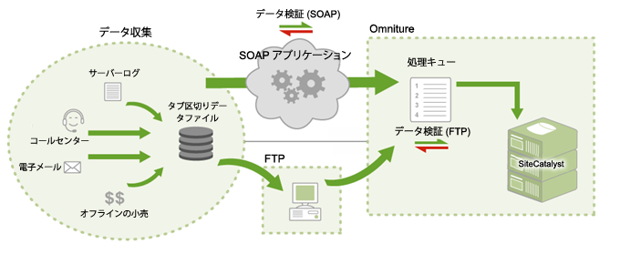

# データソースの仕組み

アドビがどのようにしてデータソースへのアクセスを実現しているかに関する情報です。

>[!NOTE]
>
>データソースから送信されると、インポートされたデータは、他のメソッド（JavaScriptビーコン、ActionSource、Data Insertion APIなど）を使用して収集されたレポートデータと区別できません。インポートされたデータは、削除できません。

データの送信には、次の 2 つの方法が使えます。

* [FTP](../../import/c-data-sources/datasrc-how-data-sources-works.md#section_0E70022648F94061AF5B4AD6C7145243)
* [API](../../import/c-data-sources/datasrc-how-data-sources-works.md#section_65DACC9CE00C437BBFDD02D19C25A4BD)

## FTP {#section_0E70022648F94061AF5B4AD6C7145243}

マーケティングレポートを介して FTP ベースのデータソースの作成および管理ができます。この場合、FTP ファイル転送を利用してデータファイルをデータソースにインポートします。データソースを作成すると、アドビから FTP の場所が提供されます。この場所を使用して、データソースファイルをアップロードできます。アップロードされたデータはデータソースで自動的に検出され、処理されます。処理されたデータは、マーケティングレポートで利用できます。

## API {#section_65DACC9CE00C437BBFDD02D19C25A4BD}

アドビから提供されるデータソース API を利用すると、ご使用のアプリケーションをプログラムによってデータソースと連携させることができます。これにより、中間に FTP サーバーを置く必要がなくなり、HTTP、SOAP、REST 経由でデータを転送できます。

[データソース API チュートリアル](https://marketing.adobe.com/developer/documentation/data-sources/c-data-sources-api)を参照してください。
