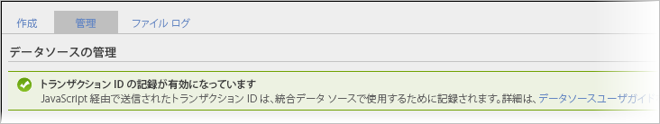

# トランザクションと顧客の統合

データソースには、オフラインで発生するイベントをオンラインデータに統合するための2つの方法があります。

* [トランザクション ID の記録の有効化](../../import/c-data-sources/datasrc-integrating-offline-data.md#section_30D6D47AEC0F4A36B87EBFE4C858F20C)
* [トランザクションの統合](../../import/c-data-sources/datasrc-integrating-offline-data.md#section_B3F281CEFF9B47E9A07F9851D61D415D)
* [顧客の統合](../../import/c-data-sources/datasrc-integrating-offline-data.md#section_9F4AAD710D2543BDA834090A98115FBF)

これらの統合によって、オフラインデータが特定のオンライントランザクションやオンライン訪問者と関連付けられます。

## トランザクション ID の記録の有効化 {#section_30D6D47AEC0F4A36B87EBFE4C858F20C}

トランザクション ID は、ClientCare にお問い合わせいただかなくても、UI で次の手順を実行して有効／無効にできます。

**[!UICONTROL 管理]** 者/ **[!UICONTROL レポートスイート]** / **[!UIACROL[レポートスイート]を選択/** 設定 **[!UICONTROL を編集]** / **[!UICONTROL 一般]** / **[!UICONTROL 一般的なアカウント設定]**

<!-- 

When contacting Customer Care, be prepared to provide the following information: 
 
<ul id="ul_C425C7A074484650AFCCF0425E8E3F47"> 
 <li id="li_7640C0C4DF0C49749A3C37E5461DC22F">Report Suite ID of the data source for which you need transaction ID recording enabled. 
In Data Sources, the report suite ID is the first part of the login appended by a random number that identifies the specific data source that was set up. For example, <code> RSID-drmossdev5 Login-drmossdev5_0001343430</code>. 
 </li> 
 <li id="li_4FB0E3EC7BE94A2DBEE9063365A71C9C">The Transaction ID expiration window (described in <a href="../../import/c-data-sources/datasrc-tid-visitor-profile.md#concept_0AF92491E8274BF69E66DB36E5F54A0F" format="dita" scope="local"> Transaction ID and Visitor Profiles</a>). By default this is 90 days, but it can be extended to up to 2 years. </li> 
</ul>

 -->

To see if Transaction ID Recording is enabled, navigate to **[!UICONTROL Analytics]** &gt; **[!UICONTROL Admin]** &gt; **[!UICONTROL Data Sources]**.

「[!UICONTROL 管理]」タブにトランザクション ID の記録の状態が表示されます。

## 顧客の統合 {#section_9F4AAD710D2543BDA834090A98115FBF}

顧客 ID を使用すると、顧客のオフラインアクティビティを指定し、このアクティビティをオンラインアクティビティに関連付けることができます。この ID は次のような場合に使用します。

* 顧客 ID が&#x200B;*`visitorID`* 変数を使用します。
* 顧客のアクティビティがオフラインに移行する（リードの送信、購入など）明確な時点が存在しない。

このタイプのデータソースを設定するには、次を参照してください。 [Visitor ID](../../import/c-data-sources/c-datasrc-types/datasrc-visitorid.md#concept_1CFAA61D57A84B22A41F7A8E0DFCAAB5)

## トランザクションの統合 {#section_B3F281CEFF9B47E9A07F9851D61D415D}

トランザクション ID を使用して、ある時点での訪問者の状態を記録することができます。この ID は、顧客が通常エクスペリエンスをオンラインからオフラインに移動する時点がある場合に使用します。例えば次のような場合があります。

* 販売員が顧客と連絡を取れるようにリードを送信する。
* 購入後に店頭での返品が可能なオンライン購入を行う。
* 後でサポートへの問い合わせが発生する可能性がある製品を購入する。

オンラインからオフラインに移行する際、顧客は匿名であることが少なくありません。

トランザクション ID イベントは、（マーケティングレポートに表示される）訪問パーティシペーション指標には含まれませんが、（ad hoc analysis でのみ参照できる）訪問者パーティシペーション指標には含まれます。

これは、トランザクション ID データが訪問とは関連付けられておらず（通常、オフラインイベントはオンラインイベントに含まれないため）、訪問者と関連付けられているからです。

参照： [トランザクション ID](../../import/c-data-sources/c-datasrc-types/datasrc-transactionid.md#concept_A97302E9EC45468A8F30285FACE8C776).
