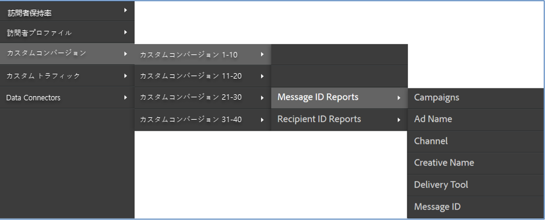

# 統合のデプロイ{#deploying-the-integration}

この統合の展開は、以下の操作を必要とする簡単なプロセスです。

## Adobe統合ウィザードの完了{#completing-the-adobe-integration-wizard}

Data Connectorsインターフェイスで統合ウィザードを完了する手順です。

1. Adobe Experience cloud内のData Connectors（旧称Genesis）領域に移動します。
1. ContactLab統合ウィザードを起動します。
1. 目的のレポートスイートを選択し、統合の名前を指定します。
1. 次の項目を設定します。

   | 項目 | 説明 |
   |---|---|
   | 電子メールアドレス | 主連絡先の電子メールアドレス |
   | 説明 | （オプション）この統合設定の説明 |

1. 次の「 **[!UICONTROL Variable Mappings]** 」項目を設定します。

   | 項目 | 説明 |
   |---|---|
   | リンク ID | リンクIDをリアルタイムで収集するeVarを選択します。 |
   | メッセージID | メッセージIDをリアルタイムで収集するeVarを選択します。 |
   | Recipient ID | 受信者IDをリアルタイムで収集するeVarを選択します。 |
   | バウンス | ContactLabから日別のバウンスを受け取る数値イベントを選択します。 |
   | 送信済み | ContactLabから毎日の送信を受信する数値イベントを選択します。 |
   | クリック済み | ContactLabから日別合計クリック数を受け取る数値イベントを選択します。 |
   | 開封済み | ContactLabから毎日の合計開封数を受け取る数値イベントを選択します。 |
   | 登録解除 | ContactLabから毎日購読解除を受け取る数値イベントを選択します。 |

1. データアクセスを有効にし、データ収集を設定します。
   1. 必要に応じて分類の名前を変更します。
   1. **[!UICONTROL パートナーセグメント]** は、統合に含まれる標準のリマーケティングセグメントです。
   1. 「セ **[!UICONTROL グメント]**」で、この統合に含めるカスタムセグメントを選択します。 管理パネルで、追加のカスタムセグメントを作成できます。
   1. 「アクセ **[!UICONTROL ス要求」で]**、製品情報を毎日の再マーケティングセグメントでContactLabにエクスポートできるようにするチェックボックスをオンにします。
   1. 必要に応じて計算指標の名前を変更します。
   1. IDを収集するかどうかは、Analyticsコレクションコードを手動で更新するか、自動化ソリューションを使用して設定します。 「 **[!UICONTROL Automated Solution」を選択する場合]**、IDを渡すための電子メールリンクで使用するパラメーターを含める必要があります。
1. すべての設定項目を確認し、「今すぐアクティブ化」 **[!UICONTROL をクリックしま]**&#x200B;す。

## 統合の検証{#verifying-the-integration}

Adobe Experience cloud内でContactLab統合設定を表示します。

1. 統合アクティビティログを表示します。

   1. Adobe Experience cloudで、サポート/統合アクティビティ **[!UICONTROL ログ]** に **[!UICONTROL 移動します]**。

      

   1. 「分類データが正常にインポートさ **[!UICONTROL れた」、「指標データが正常にインポートされ]**」、「指標デ **[!UICONTROL ータが正常にエクスポートされた]**」などのエントリを探します ****。 これらのエントリは、導入が成功した1日以内に表示されます。
1. Adobe Analytics内でレポートデータを表示します。

   1. カスタムコンバ **[!UICONTROL ージョン]** /カスタムコ **[!UICONTROL ンバージョン1 ～ 10]** /メッセージ **[!UICONTROL IDレポートに移動します]**。

      

   1. ContactLabレポートを探します。 このデータは、導入が成功してから24 ～ 48時間以内に表示されます。