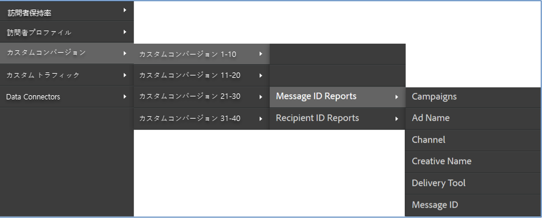

# 統合の確認{#verifying-the-integration}

Adobe Experience cloud内でContactLab統合設定を表示します。

1. 統合アクティビティログを表示します。
   1. Adobe Experience cloudで、サポート/統合アクティビティ **[!UICONTROL ログ]** に **[!UICONTROL 移動します]**。

      

   1. 「分類データが正常にインポートさ **[!UICONTROL れた」、「指標データが正常にインポートされ]**」、「指標デ **[!UICONTROL ータが正常にエクスポートされた]**」などのエントリを探します ****。 これらのエントリは、導入が成功した1日以内に表示されます。
1. Adobe Analytics内でレポートデータを表示します。
   1. カスタムコンバ **[!UICONTROL ージョン]** /カスタムコ **[!UICONTROL ンバージョン1 ～ 10]** /メッセージ **[!UICONTROL IDレポートに移動します]**。

      

   1. ContactLabレポートを探します。 このデータは、導入が成功してから24 ～ 48時間以内に表示されます。
