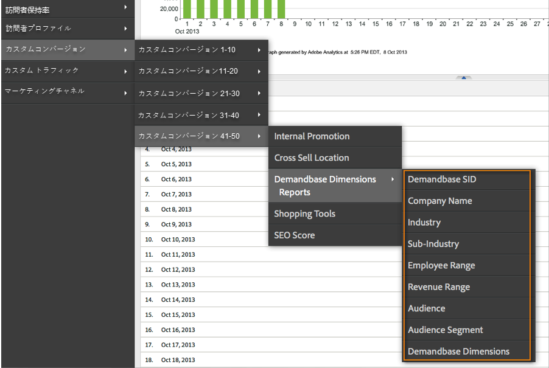

# 統合のデプロイ{#deploying-the-integration}

この統合の展開は、以下の操作を必要とする簡単なプロセスです。

## Adobe統合ウィザードの完了{#completing-the-adobe-integration-wizard}

統合をアクティブ化するには、Data Connectorsインターフェイス内の設定ウィザードを完了する必要があります。

1. Adobe Experience cloud内のData Connectors（旧称Genesis）領域に移動します。
1. Demandbase 2.0統合ウィザードを起動します。
1. 目的のレポートスイートを選択し、統合の名前を指定します。
1. 次の項目を設定します。

<table id="table_8D60DC7C48C144DC9934749E7F9F65FF"> 
 <thead> 
  <tr> 
   <th colname="col1" class="entry"> 項目 </th> 
   <th colname="col2" class="entry"> 説明 </th> 
  </tr>
 </thead>
 <tbody> 
  <tr> 
   <td colname="col1"> 電子メールアドレス </td> 
   <td colname="col2"> 主連絡先の電子メールアドレス。 </td> 
  </tr> 
  <tr> 
   <td colname="col1"> 説明 </td> 
   <td colname="col2"> （オプション）この統合設定の説明。 </td> 
  </tr> 
  <tr> 
   <td colname="col1"> Demandbase APIキー </td> 
   <td colname="col2"> これは、Demandbaseの担当者から入手できます。 </td> 
  </tr> 
  <tr> 
   <td colname="col1"> カスタムDemandbaseディメンション#N </td> 
   <td colname="col2"> これらは、8つのオプションディメンションのIDです。 詳細は、「Demandbaseカスタムディメンション」を参照してください。 </td> 
  </tr> 
  <tr> 
   <td colname="col1"> Adobe targetに送信 </td> 
   <td colname="col2">「true」の場合、Demandbaseディメンションは、非表示のmboxを使用してAdobe targetにも送信されます。 <p>注意： ディメンションを収集するには、設定済みのmbox.jsファイルをWebページに実装する必要があります。 </p> </td> 
  </tr> 
 </tbody> 
</table>

1. 次の「変数マッピング」項目を設定します。

   | 項目 | 説明 |
   |---|---|
   | Demandbaseディメンション | 使用可能なeVar変数をレポートスイートから選択します。 |
   | Demandbaseカスタムディメンション（オプション） | 使用可能なeVar変数をレポートスイートから選択します。 |

1. カスタムディメンションの名前を設定します（該当する場合）。

   1. 手順4でカスタムディメンションを含め、手順5でオプションのeVarをマッピングした場合は、これらのディメンションにわかりやすい名前を付ける必要があります。 例えば、「stock_ticker」をカスタムディメンション1として入力する場合は、「ディメンション1」を含むボックスを「Stock Ticker」に変更する必要があります。
   1. 標 **準** 8のディメンションの名前（Demandbase SID、会社名、業種など）は変更しないでください。

1. Demandbase統合ダッシュボードを自動的に作成する場合は、このチェックボックスをオンにします（推奨）。
1. すべての設定項目を確認し、「今すぐアクティブ化」 **[!UICONTROL をクリックしま]**&#x200B;す。

## 統合コードのデプロイ{#deploying-the-integration-code}

統合ウィザードを完了したら、統合コードをAdobe Analytics導入コード(s_code)に導入する必要があります。

>[!NOTE]
>
>Adobe tagManagerまたはDynamic Tag Managementを使用してAdobe Analyticsを導入した場合は、これらのツールのいずれかを使用して統合コードを簡単に追加できます。

1. 「サポート」タブ **[!UICONTROL に移動し]** 、統合の「リソース」 `integration code v2_0_1` 領域からリソースをダウンロードして保存します。

1. 必要に応じて、コードに必要な変更を加えます。 詳しくは、「統合コードの変更」（このページ）を参照してください。
1. 統合モジュールがAdobe Analytics導入コードにまだ存在しない場合は、このモジュールを含めます。
1. 次のいずれかの方法を使用してコードをデプロイします。

   * Adobe tagManagerまたはDynamic Tag Managementを使用してコードを追加します。
   * または、Adobe Analytics導入コードの更新を担当する組織のリソースにコードを配信します。

>[!IMPORTANT]
>
>この統合を実稼働環境にデプロイする前に、開発/ステージング環境でこの統合のデプロイメントをテストしてください。

## 統合コードの変更{#modifying-the-integration-code}

ほとんどの場合、Data Connectorウィザードで生成される統合コードを変更する必要はありません。

ただし、調整が必要な場合は、以下にコード設定の一部を示します。

<table id="table_5405A73CEFD44466B3C39559F4A037C9"> 
 <thead> 
  <tr> 
   <th colname="col1" class="entry"> コード設定 </th> 
   <th colname="col2" class="entry"> 説明 </th> 
  </tr>
 </thead>
 <tbody> 
  <tr> 
   <td colname="col1"> s.maxDelay </td> 
   <td colname="col2">Adobe Analyticsイメージリクエストが、Analytics収集サーバーに対して実行される前にDemandbaseデータを待機する時間（ミリ秒）の最大値です。 <p>注意： この設定は、統合モジュールを使用して実行されているすべての統合に適用されます。 </p> </td> 
  </tr> 
  <tr> 
   <td colname="col1"> _db_key </td> 
   <td colname="col2"> Demandbase APIキー。 </td> 
  </tr> 
  <tr> 
   <td colname="col1"> _db_apiURL </td> 
   <td colname="col2"> Demandbase APIのURLテンプレート。 </td> 
  </tr> 
  <tr> 
   <td colname="col1"> _db_delim </td> 
   <td colname="col2"> Adobe Analyticsに送信されるDemandbaseディメンション値を区切るために使用される区切り文字です。 この設定を変更すると、デフォルトの分類ルールが正しく機能しない場合があります。 </td> 
  </tr> 
  <tr> 
   <td colname="col1"> _db_setTnt </td> 
   <td colname="col2">trueの場合、統合コードは、非表示のmboxを使用して、DemandbaseディメンションをプロファイルパラメーターとしてAdobe targetに送信しようとします。 <p>注意： これには、mbox.jsコードがページに存在する必要があります。 </p> </td> 
  </tr> 
  <tr> 
   <td colname="col1"> _db_tntVarPrefix </td> 
   <td colname="col2"> この文字列は、Adobe targetに送信する前に、各Demandbaseディメンション名の前に付加されます。 例えば、この設定の値が「db_」の場合、ディメンション「industry」は「db_industry」としてAdobe targetに送信されます。 </td> 
  </tr> 
  <tr> 
   <td colname="col1"> _db_dimensionsArray </td> 
   <td colname="col2"> Adobe Analyticsに送信される標準のDemandbaseディメンションです。 この設定は変更しないことをお勧めします。 「max_size」プロパティは、切り捨てが発生する前にディメンションで許可される文字の数です。 </td> 
  </tr> 
  <tr> 
   <td colname="col1"> _db_dimensionsArrayCustom </td> 
   <td colname="col2"> Adobe Analyticsに送信されるカスタムDemandbaseディメンション。 「max_size」プロパティは、切り捨てが発生する前にディメンションで許可される文字の数です。 </td> 
  </tr> 
  <tr> 
   <td colname="col1"> _db_cName </td> 
   <td colname="col2"> Demandbase API通信の状態を維持するために使用するセッションcookieの名前。 </td> 
  </tr> 
  <tr> 
   <td colname="col1"> _db_contextName </td> 
   <td colname="col2"> 標準ディメンションをAdobe Analyticsに送信するために使用されるcontextData変数の名前。 この設定は変更しないことをお勧めします。 </td> 
  </tr> 
  <tr> 
   <td colname="col1"> _db_contextNameCustom </td> 
   <td colname="col2"> Adobe Analyticsにカスタムディメンションを送信するために使用されるcontextData変数の名前。 この設定は変更しないことをお勧めします。 </td> 
  </tr> 
 </tbody> 
</table>

## 統合モジュールの追加{#including-the-integrate-module}

統合コードを使用するには、Adobe Analytics導入内に統合モジュールが存在する必要があります。

導入の一部として統合モジュールをまだお持ちでない場合は、導入のタイプに応じて、次の手順を実行してください。

### AppMeasurement v1.0以降の場合 {#section-f28d090bf2404cabaae34cd9c66fc575}

1. **[!UICONTROL Analytics]** /管理者/CodeManagerからダウンロードしたAppMeasurementのzipファイル **[!UICONTROL を解凍し]** ます ****。

1. という名前のファイルを開きま [!DNL AppMeasurement_Module_Integrate.js]す。
1. このファイルの内容をコピーして、プライマリファイルに貼り付 [!DNL AppMeasurement.js] けます。

   >[!NOTE]
   >
   >ファイル内のDO NOT ALTER ANYTHING BELOW THIS LINEコメントの直前に貼り付けます。

### レガシーコード（Hコード）の場合 {#section-bba8ad8c715e4f97883e7de3269f681a}

1. Data Connectors UIの「リソース」領域（「サポート」タブの下）からIntegrateモジュールをダウンロードします。

   

1. そのファイルの内容をコピーして、ファイルに貼り付 [!DNL s_code] けます。

   >[!NOTE]
   >
   >ファイル内のDO NOT ALTER ANYTHING BELOW THIS LINEコメントの直前に貼り付けます。

## 統合の確認{#verifying-the-integration}

ライブトラッキングとレポートをチェックして、統合がデータを正常に取得していることを検証します。

### ライブトラッキング {#section-9c20e8ff6b404ae09387ee07d675c9e2}

DigitalPulse Debuggerツールを使用して、DemandbaseディメンションデータがAdobe Analytics経由で送信されることを確認します。 Cookieを削除した後、統合コードが導入されているWebサイトのページをリロードします。 現在のIPがDemandbaseで認識される組織にマップされている場合、次のような結果が表示されます。

**Reports &amp; Analytics（旧称SiteCatalyst）には、次の2つのDemandbaseコンテキストデータ変数が含まれています。**


**Target mboxには、Demandbaseプロファイルパラメーターが含まれます。**

これは、ページにTargetを実装し、この統合をAdobe target用に設定している場合にのみ表示されます。Adobe統合ウィザードの手順4を参照してください。


### レポート {#section-1792fe75dc3249d0ad063dfd87a89162}

Adobe統合ウィザード（手順7）を使用して自動的に作成されたダッシュボードを使用して、Adobe Analytics内でDemandbaseレポートを確認します。

または、Adobe Analyticsのメニュー構造内でDemandbaseレポートに移動し、以下のスクリーンショットを参照します。

>[!NOTE]
>
>このデータは、導入が成功してから24 ～ 48時間以内に表示されます。




### よくある質問 {#section-d926b160a2ef4f07b43ea1bc67ac2a0a}

**「該当な[し]」とは**

Demandbaseデータコネクタは、このデフォルト値を設定することで、属性が「使用不可」であることを示します。 デフォルトが設定される一般的なシナリオは2つあります。

* Demandbaseは、訪問者が会社に属していないIPアドレスから来ていることを検出します。
* アカウント監視属性（「watch_list」で始まる）が使用されますが、会社がアカウント監視リストに含まれていません。

**特定の属性に対して「`[n/a]`」がより頻繁に表示されるのはなぜですか。**

Demandbaseは、すべてのIPアドレスを分類し、訪問者が会社のIPアドレスから来ていない場合でもaudienceおよびaudience_segment属性を提供します。 オーディエンスが「Residential」、「Wireless」、「Pospitary」などの値を返した場合、残りの属性は使用できない可能性があります。

訪問者のオーディエンスが「SMB」になる場合がありますが、他の属性では「`[n/a]`」と表示されます。 つまり、Demandbaseでは訪問者をスモールビジネスとして分類できますが、会社のプロファイル全体は使用できません。 これは通常、複数の小規模企業が同じサービスプロバイダーまたはIPアドレスのブロックを使用している場合に、小規模な企業で発生します。

### 開発者向けの考慮事項 {#section-d33fff55bc4b4db99f82dee418ef1bc2}

実装のデフォルト値を調整する必要がある場合は、次の行を更新します。

```
_db._nonOrgMatchLabel = "[n/a]";
```
