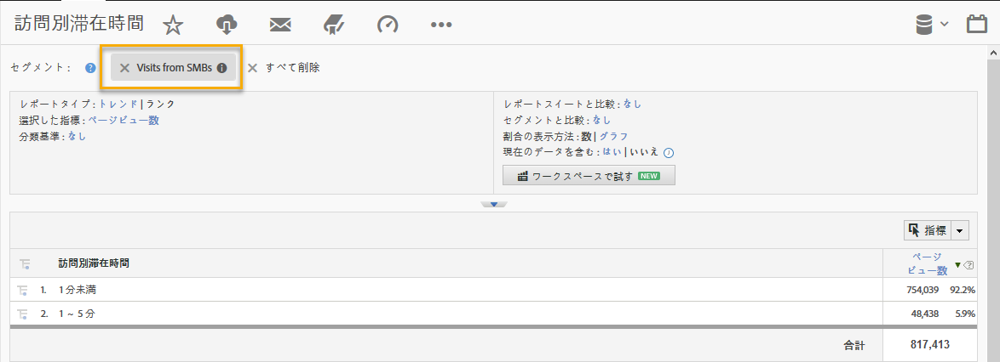

# 統合の使用{#using-the-integration}

統合が導入されたら、提供される追加機能の使用を開始できます。

>[!NOTE]
>
>Adobe Analyticsレポート内でDemandbaseデータの一部が表示され始めるまでに24 ～ 48時間かかる場合があります。

Adobe Analytics内からこの統合から価値を得るために実行できるアクションをいくつか示します。

## Demandbaseディメンション別のトラフィック指標とコンバージョン指標の表示{#viewing-traffic-and-conversion-metrics-by-demandbase-dimension}

この統合により、Adobe Analyticsレポートとして使用できる新しいディメンションが提供されます。

以下のレポートは、訪問回数とコンバージョン指標（ウェビナー登録）の両方を、オーディエンスタイプと業種の両方で分類した分析の例です。

## Demandbaseディメンションによるセグメント化{#segmenting-by-demandbase-dimensions}

この統合の主な機能は、Demandbaseディメンションに基づいてAdobe Analyticsセグメントを作成できる点です。

例えば、SMB組織からの訪問のみを含むセグメントを作成できます。 この訪問は、SMBからの訪問と呼ぶことができます。 定義は次のようになります。

オーディエンスはSMBに等しい。

セグメントの作成方法について詳しくは、 [Analyticsセグメントガイドを参照してください](https://marketing.adobe.com/resources/help/en_US/analytics/segment/)。

このセグメントは、実際にはどのレポートにも適用できます。例えば、次に示す訪問別滞在時間レポートを使用できます。 
