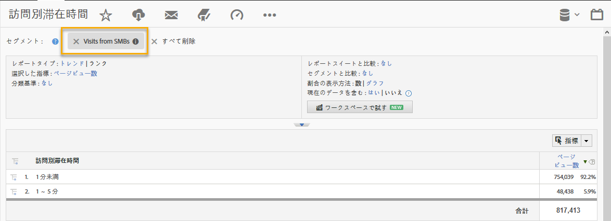

# Demandbase Dimensionsによるセグメント化{#segmenting-by-demandbase-dimensions}

この統合の主な機能は、Demandbaseのディメンションに基づいてAdobe Analyticsセグメントを作成する機能です。

例えば、SMB組織からの訪問のみを含めるセグメントを作成できます。この訪問はSMbsから呼び出すことができます。定義は次のようになります。

オーディエンスがSMBに等しい。

セグメントの作成方法について詳しくは [、Analyticsセグメントガイド](https://marketing.adobe.com/resources/help/en_US/analytics/segment/)を参照してください。

このセグメントは、実質的に任意のレポートに適用できます。1つの例として、訪問別滞在時間レポートの例を示します。 

