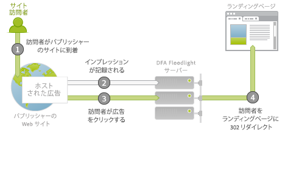
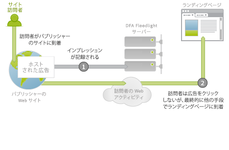

# 広告配信統合の概要{#ad-serving-integration-overview}

この統合では、いくつかの方法で広告による訪問者のデータを取得できます。第 1 の方法は、広告をクリックしてタグ付きランディングページにアクセスするもので、クリックスルーと呼ばれます。

訪問者は、（広告をホストする）パブリッシャーのサイトに到達します。各広告は、広告 ID と呼ばれる一意の識別子を持ちます。広告は、パブリッシャーのサイトのどこにあるかと、どのコンテンツが訪問者に表示されるかを示す、プレースメントとクリエイティブから成ります。訪問者が DFA サーバーからこの広告、プレースメントまたはクリエイティブを取得すると、この訪問者の DFA Floodlight サーバーに対するインプレッションがトラッキングされます（1）。

訪問者が広告をクリックすると（2）、Floodlight サーバーがクエリされ、これによりクリックがカウントされて、302 がランディングページに訪問者をリダイレクト（3）します。訪問者がランディングページに到達した場合、これはクリックスルーと呼ばれます。このページには、DFA Floodlight サーバーからデータをクエリする Adobe トラッキングコードが含まれています。

Floodlight サーバーがクリックをトラッキングした後で訪問者が実際にランディングページに到達しない場合、これはクリックスルーとは呼ばれません。広告およびインプレッションによっては、実際には訪問者のブラウザーが 302 リダイレクトに従わないことがあります。このトピックについて詳しくは [指標の不一致の調整](../dfa-data-connector-analytics/dfa-reconciling-metric-discrepancies/dfa-reconciling-metric-discrepancies.md#concept-8c31ebe761ca4b3fab1e3a18ef5d098f).

この統合でキャプチャされた次の指標は、訪問者が広告インプレッションを受け取り、クリックはせず、しかし近い将来に別の手段でランディングページに到達する場合に発生します。

このシナリオは、ビュースルーと呼ばれます。このシナリオとクリックスルーシナリオとの違いは、訪問者が広告をクリックせず、代わりにランディングページを訪問する前に引き続き別のアクティビティをおこなうことです（2）。最も単純なケースでは、訪問者はランディングページの URL をブラウザーに入力します。他のケースでは、訪問者は引き続きブラウジングし、後で検索エンジンを使用してランディングページに到達します。いずれにせよ、ユーザーはランディングページに到達します。
