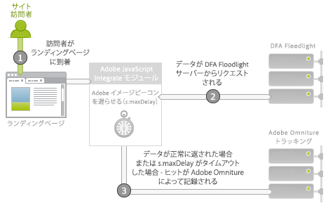
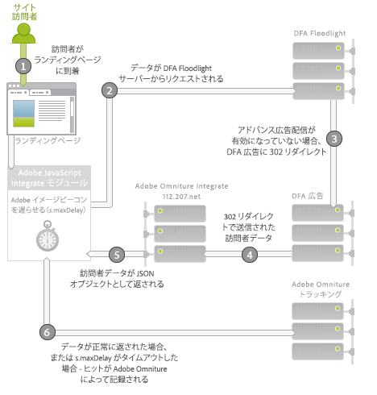

# Adobe Analytics 用 DFA Data Connector{#dfa-data-connector-for-adobe-analytics}

ますます複雑になり、競争の激しくなる今日のオンラインマーケットプレイスにおいて、オンライン広告主や代理店は、オンラインマーケティング環境の理解と広告費用対効果を向上させ続ける必要があります。広告主、代理店、パブリッシャーのそれぞれが、目標達成に役立つツールを個別に所有していますが、異なるデータシステムやプロセスからのデータを手動で集計するようでは、オンラインマーケティングキャンペーンの有効性が大幅に阻害され、最適なキャンペーンの効果を得られなかったり、データの相違や混乱を招く原因となります。

Adobe® Data Connectors™ を使用して DoubleClick DFA から Reports &amp; Analytics にデータを自動的に渡すことができる DoubleClick for Advertisers（DFA）統合を活用すれば、この問題を解決できます。

**[!UICONTROL Analytics]** /管 **[!UICONTROL 理者]** / **[!UICONTROL Data Connectors]**

## 主要なメリット{#key-benefits}

Data Connector の主要なメリット - DFA 統合に含まれる機能について説明します。

* **コンバージョンの向上**：クリック後の訪問者の行動とパフォーマンスに基づいて、広告キャンペーンのプレースメントとオンサイトコンバージョンを最適化するためのインサイトを得ます。
* **データの共有場所**：DoubleClick DFA クリックスルーおよびビュースルーデータを Reports &amp; Analytics と組み合わせて、組織間でのコラボレーションを行いやすくし、より客観的な意思決定を行えるようにします。
* **付加価値のある分析**：DFA と Adobe Reports &amp; Analytics の自動化された統合により、広告主や代理店は、データ処理にかかる時間を節約し、レポートの分析と行動の実践により多くの時間を費やすことができます。
* **より詳細な顧客データの把握**：訪問者がどこから来て、サイトで何をするかに関して、より優れたインサイトを得ます。
* **ライフタイム成功指標**：全訪問者のライフサイクルにわたる獲得キャンペーンの有効性を測定します。
* **統合レポート**：ビジネスプロセスとレポートを合理化するために、DFA と Reports &amp; Analytics の間でデータを自動的に同期します。
* **ライフタイム訪問者分析**：複数のユーザー定義成功イベントおよびライフタイムバリューによって、キャンペーンの有効性を測定します。
* **コスト指標**：DFA コスト数値と単一のシステムでそれらのコストから生成された売上高を比較することで、投資利益率を最適化します。

## 広告配信統合の概要{#ad-serving-integration-overview}

この統合では、いくつかの方法で広告による訪問者のデータを取得できます。第 1 の方法は、広告をクリックしてタグ付きランディングページにアクセスするもので、クリックスルーと呼ばれます。

訪問者は、（広告をホストする）パブリッシャーのサイトに到達します。各広告は、広告 ID と呼ばれる一意の識別子を持ちます。広告は、パブリッシャーのサイトのどこにあるかと、どのコンテンツが訪問者に表示されるかを示す、プレースメントとクリエイティブから成ります。訪問者が DFA サーバーからこの広告、プレースメントまたはクリエイティブを取得すると、この訪問者の DFA Floodlight サーバーに対するインプレッションがトラッキングされます（1）。

訪問者が広告をクリックすると（2）、Floodlight サーバーがクエリされ、これによりクリックがカウントされて、302 がランディングページに訪問者をリダイレクト（3）します。訪問者がランディングページに到達した場合、これはクリックスルーと呼ばれます。このページには、DFA Floodlight サーバーからデータをクエリする Adobe トラッキングコードが含まれています。

Floodlight サーバーがクリックをトラッキングした後で訪問者が実際にランディングページに到達しない場合、これはクリックスルーとは呼ばれません。広告およびインプレッションによっては、実際には訪問者のブラウザーが 302 リダイレクトに従わないことがあります。このトピックについて詳しくは [指標の不一致の調整](../dfa-data-connector-analytics/dfa-reconciling-metric-discrepancies.md).

この統合でキャプチャされた次の指標は、訪問者が広告インプレッションを受け取り、クリックはせず、しかし近い将来に別の手段でランディングページに到達する場合に発生します。

このシナリオは、ビュースルーと呼ばれます。このシナリオとクリックスルーシナリオとの違いは、訪問者が広告をクリックせず、代わりにランディングページを訪問する前に引き続き別のアクティビティをおこなうことです（2）。最も単純なケースでは、訪問者はランディングページの URL をブラウザーに入力します。他のケースでは、訪問者は引き続きブラウジングし、後で検索エンジンを使用してランディングページに到達します。いずれにせよ、ユーザーはランディングページに到達します。

## Adobe 統合：リアルタイムデータ収集{#adobe-integration-real-time-data-collection}

データ収集のしくみを図で示します。

Adobe 統合では、データ収集は、訪問者がランディングページに到達すると開始されます（1）。ランディングページで実行されている Adobe データコレクションコードは、訪問者が提示された広告で得た履歴の情報を持ちません。Google DFA チームは、DFA Floodlight サーバーで実行しているサービスを調整して、現在サイトにいる訪問者に関する広告情報を Adobe コードでクエリできるようにします（2）。このデータを取得するには、Adobe イメージビーコンを一時的に遅らせて、Floodlight サーバーからデータをリクエストします。

データが到達した場合、または時間がかかりすぎる場合、Adobe トラッキングサーバーに対してヒットを実行します（3）。

Integrate モジュールは、Adobe イメージビーコンを遅らせて、一定時間（`s.maxDelay` を参照してください）。`s.maxDelay` は、イメージタグが訪問者のブラウザーで実行されるまで、Integrate モジュールが DFA Floodlight サーバーからのデータを待機する時間を定義します。この動作は、DFA Floodlight サーバーがダウンしたり負荷が高い場合でも基本的な訪問者データが収集されるので、重要です。Floodlight データが `s.maxDelay` の有効期限前に到達する場合、Adobe トラッキングデータは即座に実行され、追加の DFA データが含められます。

タイムアウトが発生した場合、ページコードは、タイムアウトイベントとして使用される Adobe Reports &amp; Analytics イベントを指定できます。このイベントは、統合で診断の問題が発生した場合、または  `s.maxDelay`. In cases where there are excessive timeouts, increase `s.maxDelay`. `s.maxDelay` を高く設定しすぎると、訪問者がタイマーの有効期限が切れる前にサイトを離れる可能性があ `s.maxDelay` ります。.

Floodlight サーバーは、訪問者に関するエラーを返すことがあります。これは、通常、訪問者が広告を見ていないか、DFA 訪問者 cookie を持っていないために、Floodlight サーバーが訪問者に関する情報を持たない場合に発生します。ページコードは、これらのエラーを収集し、実装の問題のトラブルシューティングを支援したり、Google トランザクションの問題を指摘できる、カスタムコンバージョン変数（eVar）を指定できます。最も一般的なエラーは、次の表に示す、履歴なし、Cookie なし、クエリエラーおよびオプトアウトです。

| エラー | 名前 | 説明 |
|---|---|---|
| nh | 履歴なし（No History） | 訪問者は広告を表示していないか、クリックしていません。 |
| nc | Cookie なし（No Cookie） | 訪問者は、DFA 訪問者 cookie を持っていません。 |
| qe | クエリエラー（Query Error） | Floodlight サーバーへのデータのクエリ中にエラーが発生しました。 |
| oo | オプトアウト（Opted Out） | 訪問者は、Google インプレッション／クリックトラッキングをオプトアウトしました。 |

## Adobe 統合：夜間データインポート{#adobe-integration-nightly-data-import}

統合のデータ収集部分では、サイト訪問者に関するクリックスルーおよびビュースルーデータが収集されます。DFA クリック、インプレッションおよびコスト指標を取得するために、Google と Adobe が連携してこの追加データを統合レポートスイートにインポートする夜間処理があります。これらの指標は、データソースを使用してインポートされるので、集計にのみ利用できます。訪問レベルではありません。

## バージョンの違い{#version-differences}

現在、DFA 統合には、バージョン 1.0、1.5 および 2.0 の 3 つのバージョンがあります。

次の表に、統合の各バージョンの機能の概要を示します。

| 機能 | バージョン 1.0 | バージョン 1.5 | バージョン 2.0 |
|---|---|---|---|
| DFA クリックおよびインプレッションの夜間指標 | ○ | ○ | ○ |
| クリックスルーおよびビュースルートラッキング | ○ | ○ | ○ |
| 統合によるデータの受信（広告主レベル） | × | ○ | ○ |
| 統合によるデータの受信（Floodlight 設定レベル） | × | × | ○ |
| コスト指標 | × | × | ○ |
| クリエイティブ指標 | × | × | ○ |
| 2k バイトを超えるクエリ文字列 | × | ○ | ○ |
| 最適なサードパーティデータコレクションのための Integrate モジュールの使用 | × | ○ | ○ |
| タイムアウトおよびエラートラッキング | × | ○ | ○ |
| ネゴシエートされたクライアント側 ID は不要 | × | × | ○ |

### バージョン 1.5 について {#section-b5a3e967cfa141ea8f740612336181be}

統合のバージョン 1.5 では、ランディングページ JavaScript に Integrate モジュールが導入されています。Integrate モジュールは、DFA 広告サーバー（ad.doubleclick.net）への固定サイズのリクエストを可能にし、これにより、以前の統合の 2K のリクエスト制限の問題に対応します。また、設定可能なタイムアウトである、 *`s.maxDelay`*, to continue collecting Adobe visitor data when network outages occur. エラーやタイムアウトは、Analytics 変数にキャプチャすることもできます。

次の図に、バージョン 1.5 におけるランディングページのネットワークでのやり取りを示します。

バージョン 1.5 では、Integrate モジュール（2）は、Floodlight サーバーからのデータをリクエストします（3）。Floodlight サーバーは DFA 広告サーバーにリダイレクトし、バージョン 1.0 と同じ方法で訪問者に関するデータが返されます。integrate.112.2o7.net にある特別な変換サービスに 302 リダイレクト（4）し、これによって応答構造が JSON オブジェクトに変換されます。Integrate モジュールは、この JSON オブジェクトを使用して Adobe トラッキングに情報を渡します（5）。

統合のバージョン 1.0 から 1.5 への移行には、JavaScript の変更を伴います。この JavaScript を取得するには、Adobe Marketing Cloud アカウントにログインし、Genesis 製品を選択して、DFA 統合にある「編集」をクリックし、ウィザードの手順に従います。以前に顧客サイト ID が割り当てられている場合は、統合を保存すれば、即座に新しい JavaScript コードを電子メールで受け取ります。このコードを入手したら、Integrate モジュールが含まれる core s_code の新しいバージョンも必要になります。このコードは、アカウントマネージャーまたは導入コンサルタントからリクエストできます。

新しい JavaScript コードの重要な特徴は、バージョン 1.5 とバージョン 2.0 の間で実装の変更が不要であるということです。

### バージョン 2.0 について {#section-afd56de0c56c4489bb5ddc5798d6709a}

DFA 統合の最新バージョンでは、Floodlight 設定全体のデータを統合できます。バージョン 2.0 以前は、個々の統合が単一の DFA 広告主に結び付けられていました。この変更により、Floodlight 設定全体のクリック数、インプレッション数およびコスト指標が、統合されたレポートスイートに含まれるようになります。また、2 つのサイトが同じ Floodlight 設定内にある場合、これらのサイト間のビュースルーもトラッキングできます。

メディアコスト指標も、統合のバージョン 2.0 以降で利用できます。統合のメディアコスト指標を有効にするには、Genesis ウィザードでメディアコスト用の Reports &amp; Analytics イベントを選択し、DFA インターフェイスで指標に適用される通貨を指定する必要があります。

タイムアウトは、2.0 統合で 302 リダイレクトが排除されたので、減少することが予想されます。これらのホップを排除すると、タイムアウトは減少し、統合できる DFA データの量は増加します。

Floodlight 設定が DFA の共有設定の場合、バージョン 1.5 から 2.0 へのアップグレードにより、Floodlight 設定内のすべての共有広告主のコンバージョンデータがレポートスイートに含まれるようになります。

### バージョン 2.0 へのアップグレード {#section-f0bf90b9a7a1434ab1540b6c0999f4c7}

次の表に、統合の新バージョンへの移行のタスク所有者の概要を示します。

| 移行 | 所有者 | タスク |
|---|---|---|
| バージョン 1.0 から 1.5 | クライアント | バージョン 1.5 JavaScript と Integrate モジュールの実装 |
| バージョン 1.5 から 2.0 | クライアント | クライアントは、アップグレードの期間について Google との話し合いを開始します。承認後、Google はアドバンス広告配信を有効にします。 |
