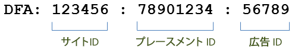
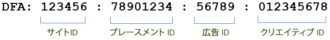

# 統合の機能 {#integration-features}

アクティブ化すると、Data Connectors DFA 統合によって、Adobe Analytics レポート用の次の指標が提供されます。

* ビュースルー数
* DFA クリック数
* インプレッション
* （オプション）DFA コストデータ
* （オプション）DFA クエリエラー、タイムアウト

>[!NOTE]
>
>この統合では、クリックトラッカー（以前のクリックコマンド）はサポートされません。クリックトラッカーは、テキストリンク、電子メールメッセージのリンク、または Web サイト上でハードコードされた他の要素のクリック数を記録するために使用されます。

Data Connectors DFA 統合は、DFA によって返されたデータから DFA トラッキングコードを自動的に構成します。これらのトラッキングコードは、広告とそれに関連付けられたプレースメントおよびクリエイティブを個別に識別するために構成されます。統合の各バージョンのトラッキングコードの概要を次に示します。バージョン 1.5 では、次のようになります。

バージョン 2.0 では、次のようになります。

これらの ID は、Genesis と DFA の共有キーとして機能し、正しい分類と指標を関連付けます。

| サイト ID | 広告がホストされたサードパーティサイト。サイト名分類は、このサイト ID の説明的な名前です。 |
|---|---|
| 広告 ID | ユーザーに配信されるコマーシャルの ID。広告名分類には、DFA システムで組織によって定義された広告の名前が含まれています。例：`Hybrid Coup Textlink - Build`。 |
| プレースメント ID | 広告スペースを購入した Web サイト、Web サイトの部分、または Web サイトのグループの DFA アカウントを示します。 |
| クリエイティブ ID | 訪問者に表示することを意図した画像、Flash SWF またはその他のリソース。クリエイティブ名分類には、DFA インターフェイスでこのクリエイティブに指定した名前が含まれます。 |

他の 2 つの分類、配信ツール（DoubleClick for Advertisers）とチャネル（バナー広告）は、DFA キャンペーンに関する同じ値を持つので、DFA インポート済みデータを区別するのに役立ちます。

## SearchCenter の重複除外  {#section-f809b3bb5e5142aa8ff89bcd5f0d0e49}

DFA 統合は、Adobe SearchCenter に対応しています。Data Connectors ウィザードで SearchCenter 重複除外を有効にすると、検索による訪問者は DFA の Floodlight サーバーからデータを取得しなくなります。DFA によって *`s.campaign`* が入力されないので、SearchCenter によってデータを生成できるようになります。また、DFA および SearchCenter は、各製品の変数に重複除外の値を設定します。

次に、SearchCenter の重複除外が有効な場合に有効になるロジックの概要を説明します。

ウィザードで **[!UICONTROL DFA]**／**[!UICONTROL SearchCenter 重複除外]**&#x200B;が選択されている場合：

* DFA クリックスルーの場合、統合は、設定した SCM eVar に文字列「DFA Clickthrough」を設定します。
* DFA ビュースルーの場合、統合は、SCM eVar に文字列「DFA Viewthrough」を設定します。

ウィザードで **[!UICONTROL SearchCenter]**／**[!UICONTROL DFA 重複除外]**&#x200B;が選択されている場合：

* DFA ビュースルーの場合、統合は、SCM eVar に文字列「DFA Viewthrough」を設定します。

>[!NOTE]
>
>SearchCenter／DFA 重複除外が有効になっており、SearchCenter クエリー文字列パラメーターが設定されている場合、DFA 処理では訪問は考慮されません。つまり、SearchCenter クエリー文字列パラメーターは、DFA クリックスルーパラメーターとは異なる必要があり、表示広告に SearchCenter クエリー文字列パラメーターが設定されないようにする必要があります。

