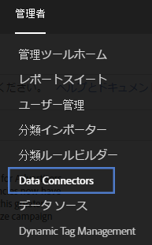
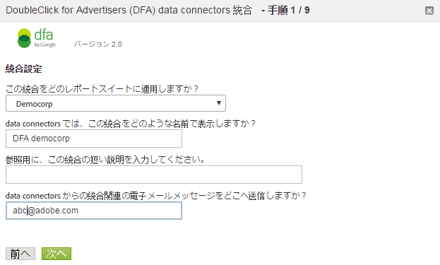

# DFA 統合{#dfa-integration}

DFA 統合の設定には、次のタスクが含まれます。

## DFA 統合の設定{#configure-the-dfa-integration}

DFA Data Connectors 統合を順を追って説明します。

設定ページには、統合の概要とその他の情報に関する便利なリンクがあります。この統合に関連して、Adobe と DoubleClick の両方で料金が発生します。両方の組織の営業担当者に問い合わせて、料金体系を把握するようにしてください。

1. にログインします [!DNL Adobe Analytics]。
1. Click **[!UICONTROL Admin]** &gt; **[!UICONTROL Data Connectors]**.

   

1. Locate **[!UICONTROL DoubleClick DFA]**, then click **[!UICONTROL Add New]**.

   

   On each page of the Integration Wizard, provide the required information, then click **[!UICONTROL Next]**. 次の表に、ウィザードを使用して統合を完了するために必要な情報を示します。

<table id="table_8F6F7F304C36431DA5FD6E5D54F60FC0"> 
 <thead> 
  <tr> 
   <th colname="col1" class="entry"> ウィザードのページ # </th> 
   <th colname="col2" class="entry"> フィールド </th> 
   <th colname="col3" class="entry"> 説明 </th> 
  </tr> 
 </thead>
 <tbody> 
  <tr> 
   <td colname="col1"> 1 </td> 
   <td colname="col2"> 統合名 </td> 
   <td colname="col3"> Genesis で、レポートスイートの有効な統合リストに表示される統合名。 </td> 
  </tr> 
  <tr> 
   <td colname="col1"> 1 </td> 
   <td colname="col2"> 統合電子メールアドレス </td> 
   <td colname="col3"> この統合に関連するすべての通知を受信する電子メールアドレス。 </td> 
  </tr> 
  <tr> 
   <td colname="col1"> 2 </td> 
   <td colname="col2"> ユーザー名 </td> 
   <td colname="col3"> この統合で使用する DFA API ユーザー名。API ログインのユーザーを有効にするには、DFA インターフェイスの API 属性をチェックします。API ログインを有効にすると、パスワードフィールドが表示されるので、ユーザーのパスワードを入力します。このパスワードは、認証のためにウィザードでユーザー名と共に入力します。 </td> 
  </tr> 
  <tr> 
   <td colname="col1"> 2 </td> 
   <td colname="col2"> パスワード </td> 
   <td colname="col3"> DFA API パスワード。 </td> 
  </tr> 
  <tr> 
   <td colname="col1"> 2 </td> 
   <td colname="col2"> 広告主 ID </td> 
   <td colname="col3"> <p>DFA 広告主 ID または親の Floodlight 設定 ID。Data Connectors は、この ID を使用して、トラッキングする DFA 広告主を識別します（統合のバージョン 1.5）。この広告主IDは、統合のバージョン2.0では使用されません。親のFloodlight設定IDが検索されて使用されます。 画面上の指示を参照してください。 </p> </td> 
  </tr> 
  <tr> 
   <td colname="col1"> 3 </td> 
   <td colname="col2"> DFA 広告変数 </td> 
   <td colname="col3"> DFA キャンペーン属性、インプレッション数およびクリック数データを受け取る Analytics eVar。通常、これはトラッキングコード eVar（ <span class="varname"> s.campaign </span>), but you can choose any available eVar. また、Data Connectors は、選択した eVar に次の DFA 関連の分類を追加します。 <p><b>キャンペーン</b>：共通のメッセージングを届ける複数のサイトに提供される広告のコレクション。 </p> <p><b>サイト名</b>：広告が提供されたサイト。 </p> <p><b>広告名</b>：DFA アカウントで定義された広告名。 </p> <p><b>サイトプレースメント名</b>：広告が提供された Web サイトおよびページ。 </p> <p><b>配信ツール</b>：DoubleClick for Advertisers。 </p> <p><b>チャネル</b>：バナー広告。 </p> <p><b>コスト構造</b>：CPM、CPC または固定。広告のコスト構造に基づきます。 </p> <p><b>クリエイティブ名</b>：広告／プレースメント／クリエイティブ ID に関連付けられたクリエイティブの名前。 </p> <p><b>DFA／SearchCenter 重複除外</b>：DFA クリックスルーまたはビュースルーが発生した場合に、DFA によって SearchCenter 変数の値が配置されるように指定します。</a>を参照してください。 </p> </td> 
  </tr> 
  <tr> 
   <td colname="col1"> 4 </td> 
   <td colname="col2"> インプレッション数 </td> 
   <td colname="col3"> DFA インプレッション数指標データを受け取るカスタムイベント。インプレッション数は、広告が提供された回数を示します。 </td> 
  </tr> 
  <tr> 
   <td colname="col1"> 4 </td> 
   <td colname="col2"> クリック数 </td> 
   <td colname="col3"> DFA クリック数指標データを受け取るカスタムイベントを選択します。クリック数は、訪問者が DFA のリダイレクトによって測定された広告をクリックした回数を示します。クリック数指標は、Analytics クリックスルー指標と相関関係があります。 <p>Note:  DFA Clicks and Analytics Click-throughs might not match exactly due to differences in the way data is collected.  </a>. </p> </td> 
  </tr> 
  <tr> 
   <td colname="col1"> 5 </td> 
   <td colname="col2"> ビュースルー変数 </td> 
   <td colname="col3"> <p>DFA ビュースルーデータを受け取る Analytics eVar。ビュースルー変数は、ビュースルーがサイトのコンバージョン率にどれくらい影響するかを確認するのに役立ちます。 </p> <p>Data Connectors は、DFA 広告変数に追加するのと同じ DFA 関連の分類をこの eVar に追加します（上述を参照）。 </p> </td> 
  </tr> 
  <tr> 
   <td colname="col1"> 5 </td> 
   <td colname="col2"> 前回の表示からの時間（ビュースルー時間グループ変数） </td> 
   <td colname="col3"> DFA の前回の表示からの時間データを受け取る Analytics eVar。前回の表示からの時間は、最後の広告ビュースルーから経過した時間を示します。 </td> 
  </tr> 
  <tr> 
   <td colname="col1"> 5 </td> 
   <td colname="col2"> ビュースルー数 </td> 
   <td colname="col3"> DFA ビュースルー数指標データを受け取るカスタムイベント。ビュースルーイベントをビュースルー変数と共に使用して、直接クリックスルーに影響しないが、その後の時間にサイトへのトラフィック上昇に一役買った可能性のあるキャンペーンはどれかを確認します。 <p>Data Connectors は、選択したカスタムイベントの名前を「ビュースルー数」に変更します。 </p> </td> 
  </tr> 
  <tr> 
   <td colname="col1"> 6 </td> 
   <td colname="col2"> DFA クエリ失敗 </td> 
   <td colname="col3"> （オプション）レポートされた DFA クエリ失敗メッセージコードを受け取る Analytics eVar。可能性のある DFA メッセージコードを次に示します。 
    <ul id="ul_85FC7FB19F7F4ADF83ABCA6DDB44CE19"> 
     <li id="li_0A3181DED5A149588A0D3F1584E2FE8B"><b>nc</b>：DoubleClick cookie がありません。 </li> 
     <li id="li_D397AA73AD5E4086A18B87F271E4EC14"><b>oo</b>：ユーザーはオプトアウトしました。 </li> 
     <li id="li_5AC1D0C8049340B4AD857D88E275CBD6"><b>nh</b>：キャンペーン履歴がありません。 </li> 
     <li id="li_73A8C5E905C54E2BB531A1FCDBC6AA1A"><b>qe</b>：クエリエラー（タイムアウト、サーバーダウン、その他）。 </li> 
    </ul> </td> 
  </tr> 
  <tr> 
   <td colname="col1"> 6 </td> 
   <td colname="col2"> タイムアウトイベント </td> 
   <td colname="col3"> <p>Analyticsカウンターイベントは、 <span class="varname"> s.maxDelay </span> timer expires, and no response was received from the DFA servers. Use this event to configure the <span class="varname"> s.maxDelay </span> variable Tuning s.maxDelay </a>.) </p> </td> 
  </tr> 
 </tbody> 
</table>

## DFA 統合のための Web サイトの更新{#web-site-updates-for-the-dfa-integration}

Genesis で DFA 統合用に Analytics レポートスイートを設定したら、統合をサポートするために、記載された手順に従って Web サイトおよび DFA 環境を設定する必要があります。

### ドメインの cookie 領域の検証{#verify-cookie-space-on-the-domain}

DFA 用の Data Connectors 統合では、ページのドメインに cookie を設定する必要があります。

ドメインが、一部の Web ブラウザーに対する cookie 対応数の最大値に達している場合が稀にあります。訪問者の Web サイトでの閲覧に影響を与えないよう、ネットワーク運用チーム、開発チーム、またはエンジニアリンググループに相談して、DFA 統合に使用されるページのドメインに別の cookie を追加してもユーザーエクスペリエンスに影響がでないかを検証します。また、cookie の名前を選択する必要があります。

### DFA クエリ文字列パラメーターの更新{#update-your-dfa-query-string-parameter}

DFA 統合の前に既に Adobe Analytics で広告キャンペーンをトラッキングしている場合、すべてのキャンペーン（電子メール、検索またはバナー）で同じクエリ文字列パラメーターを使用して、ランディングページ上の参照するキャンペーン ID を識別できます。

DFA 広告キャンペーン用に DFA データからビュースルーおよびクリックスルーデータをいつリクエストするかを理解するには、Data Connectors は、訪問者がいつ DFA キャンペーンバナー広告をクリックしたかを識別する必要があります。これを可能にするために、異なるクエリ文字列パラメーターを DFA 広告キャンペーンのランディングページ URL に追加して、Data Connectors が Web サイトで実施する DFA 広告キャンペーンページと他の広告キャンペーンページを区別できるようにする必要があります。DFAに `dfa_overrideParam` 使用されるJavaScriptプラグインのを参照してください。

>[!CAUTION]
>
>キャンペーン変数は他のキャンペーンに使用できますが、DFAキャンペーンには使用しないでください。 キャンペーン変数を DFA キャンペーンのランディングページに設定すると、アドビはインプレッション数とクリック数を DFA キャンペーンのクリックスルーに結び付けることができなくなります。訪問ごとに 1 度、Adobe コレクションサーバーは、以前のクリックスルーまたはビュースルーについて DFA サーバーをチェックします。このため、特に低速のインターネット接続を使用するユーザーにとって、ページ読み込み時間を遅くする不要なリダイレクトを避けるために、一般的なランディングページにのみDFAプラグインコードを含めます。

## Web サイトのデータコレクションコードの更新{#update-your-web-site-s-data-collection-code}

DFA 用の Genesis 統合は、DFA Floodlight 設定 ID（dfa_SPOTID）を利用します。これにより、DFA と Adobe データ収集システム間のレポートの一貫性が向上します。

>[!NOTE]
>
>Spotlightという用語は、Google DFAの最近のリリースでFloodlightに変更されました。 JavaScript パラメーター `dfa_SPOTID` は、Spotlight の用語に基づいて命名されましたが、両方のバージョンで使用されます。

Web サイトで DFA 統合を有効にするには、次を追加して JavaScript データコレクションコードを更新する必要があります。

* DFA 用 Integrate モジュール
* コレクションコードへの追加

### DFA 用 Integrate モジュール {#section-fa00e42a732a4e27a4ab3dfcfeae1a5b}

The DFA integration leverages the Adobe Experience Cloud Integrate Module, which adds functionality to your core JavaScript data collection code ( `s_code.js`). Integrateモジュールは、コードマネージャーからJavaScript版AppMeasurementコードをダウンロードする際に、.zipファイルの一部として提供されます。 アドビコンサルタントにお問い合わせください。

Insert the Integrate Module code in the `Modules` section of your website's `s_code.js` file.

### コレクションコードへの追加 {#section-8f98c727f1ba414fb8b4f02d696b8791}

統合ウィザードでの DFA 統合のアクティブ化の際の選択に基づいて、Data Connectors は、カスタマイズした追加を JavaScript データコレクションコードに生成して電子メールで送付します。`s_code.js` ファイルの（`doPlugins` 関数またはその他の関数ではなく）メインセクションにこのコードを挿入します。

以下に示すサンプルコードは、説明用です。Data Connectors 統合ウィザードを完了後に電子メールで送信されるコードを使用してください。

コレクションコードは、次のコンポーネントで構成されています。

* DFA Integrate 設定
* 統合が必要なプラグイン

**DFA Integrate 設定**

```
/************************** DFA VARIABLES **************************/ 
var dfaConfig = { 
   CSID:              "1234567", 
   SPOTID:            "29876543", 
   tEvar:             "eVar17", 
   errorEvar:         "eVar59", 
   timeoutEvent:      "event76", 
   requestURL:         "http://fls.doubleclick.net/ 
json?spot=[SPOTID]&src=[CSID]&var=[VAR]&host=integrate.112.2o7.net%2 
Fdfa_echo%3Fvar%3D[VAR]%26AQE%3D1%26A2S%3D1&ord=[RAND]", 
 
   maxDelay:          "1500", 
   visitCookie:       "s_dfa", 
   clickThroughParam: "CID", 
   searchCenterParam: "s_kwcid", 
   newRsidsProp:      undefined 
}; 
/************************ END DFA Variables ************************/ 
```

DFA Integrate 設定ブロックは、DFA 統合で必要な変数を設定します。これらの各変数の値は、次のソースから取得されます。

**CSID**：クライアント側 ID。統合ウィザードを完了すると、DFA によって生成されます。Data Connectors は、DFA CS ID でこの変数を事前設定します。また、統合ウィザードを完了した後、この値がセットアップ電子メールで送信されます。アカウントでアドバンス広告配信が有効になっている場合、この変数は不要です。

**SPOTID**：Floodlight 設定（以前の Spotlight ID）。Data Connectors は、統合ウィザードで指定した DFA アカウント情報に基づいて、DFA Floodlight 設定 ID でこの変数を事前設定します。

**tEvar**：転送変数。Data Connectors は、統合ウィザードでビュースルー変数用に指定した Analytics 変数名でこの変数を事前設定します。アドビエンジニアリングまたはエンジニアリングサービスとの入念な調整なしに、この変数を変更しないでください。

**errorEvar**：エラー変数。Data Connectors は、統合ウィザードで DFA クエリ失敗変数用に指定した Analytics 変数名でこの変数を事前設定します。

**timeoutEvent**：タイムアウトイベント。Data Connectors は、統合ウィザードでタイムアウトイベント変数用に指定した Analytics 変数名でこの変数を事前設定します。

**requestURL**：広告情報をクエリするためのリモート DFA ホスト。アドビによる指示のない限り、この値を変更しないでください。

**maxDelay**：JavaScript データコレクションコードが DFA Floodlight サーバーからの応答を待機する時間を指定します（ミリ秒）。サイトのトラフィックに基づく最適な値を見つけるために、この値をテストしてみることをお勧めします。例えば、この値を増やすと、一般に、より多くの DFA データを収集しますが、遅延の間に訪問者がサイトを離れると、ベースの訪問者データを失うリスクが増加します。この値を減少させると、ヒットデータを失うリスクは低くなりますが、Adobe ヒットデータと一緒に送信される DFA データの量は少なくなります。

**visitCookie**：DFA 呼び出しを訪問あたり 1 回に制限するために使用される cookie の名前。

**clickThroughParam**：Integrate モジュールにクリックが発生したことを知らせるクエリ文字列。通常、すべての広告に含まれます。クエリ文字列にこのパラメーターがあると、訪問者が過去 30 分間に既にクエリされていても、DFA Floodlight サーバーにリクエストが発生します。

**newRsidsProp**：（オプション）未使用のトラフィックプロパティ変数にマッピングされます。DFA 統合は、訪問 cookie にこの値を収集および格納して、特定の訪問者のデータを収集したレポートスイートを特定します。このプロパティは、アドビエンジニアリングサービスによるカスタム実装でのみ必要です。

**統合が必要なプラグイン**

コレクションコードの追加は、DFA 統合の操作を向上させる追加のプラグインを組み込みます。

* DFA クエリを訪問あたり 1 回に制限する
* cookie 名に柔軟性を提供する。ほとんどの組織は s_dfa を使用しますが、DFA 統合に任意の有効な cookie 名を使用できます。
* 不要なリダイレクトの排除。ビュースルーデータはリアルタイムに収集されるので、Adobe コレクションサーバーと DFA は、ページビューのたびにデータを交換する可能性があります。このプラグインは、情報が不要な場合にこれらのデータの交換をブロックします。

>[!CAUTION]
>
>不要なDFAクエリを排除するためにプラグインが使用するメカニズムの1つは、ドメインベースの訪問cookieです。 複数のドメインにわたる統合レポートスイートは、DFA が影響を受けるビュースルーまたはクリックスルーの後で訪問者がドメインを横断すると、クリックスルーおよびビュースルーデータを水増しします。

## DFA 統合の成功の確認{#confirming-a-successful-dfa-integration}

必要なすべての Web サイトの更新をおこなったら、Charles*、Chrome Developer Tools または Firebug* などのネットワークトラフィックビューアを使用して、DFA が Adobe コレクションサーバーと通信していることを確認できます。

DFA 対応 `s_code.js` ファイルをデプロイしたら、ネットワークトラフィックビューアを使用して、DFA と Adobe データコレクションサーバーの間のリクエストを表示します。以下を確認します。

* A request to DFA's `fls.doubleclick.net/json` service. このサービスは、使用している DFA のバージョンに応じて応答が異なる可能性があります。DFA 統合バージョン 1.5 の場合：

   * [!DNL ad.doubleclick.net] への HTTP 302 リダイレクト。これは、広告訪問者に関する情報を含む応答に Location: タグを送信します。
   * This Location tag causes a redirect to [!DNL integrate.112.2o7.net/dfa_echo]. このサービスは、広告訪問者に関する情報を JSON（JavaScript Object Notation）エンコードされた文字列に変換します。このデータは、200 OK HTTP 応答で返されます。

* DFA 統合バージョン 2.0（アドバンス広告配信が有効）の場合：

   * [!DNL fls.doubleclick.net] が 200 OK で直接返されます。

どちらの場合も、成功リクエストは、パラメーター vX（X はビュースルー eVar 番号）を含む Adobe データコレクションサーバーへのリクエストになります。このパラメーターの値は、DFA-XXXX-XXXX- XXXX-XXXX-XXXX-XXXX-XXXX-XXXX-XXXX という形式を取ります。この文字列には、現在の訪問者の最後のクリックおよび最後のインプレッションに関するデータが含まれています。

## s.maxDelay の調整{#tuning-s-maxdelay}

DFA を正しく導入することが、特定のサイトの s.maxDelay の最適化に影響します。

一般に、増減の決定には、より多くのDFA訪問者データを取得す *`s.maxDelay`* るか、アドビ訪問者データの収集を危険にさらすかの間のトレードオフが含まれます。 Increasing *`s.maxDelay`* obtains more DFA visitor data, but (placed excessively high) could endanger the collection of Adobe visitor data. s.maxDelay を減らすと、Adobe 訪問者データのコレクションは守られますが、DFA 訪問者データを失う可能性があります。

*`s.maxDelay`* は、単なる DFA に接続するためのネットワーク通信の時間以上のものをカプセル化します。また、これらの通信が基にする JavaScript を実行および評価するためのブラウザー遅延を表します。これは、Integrateモジュールが、DFA Floodlightサーバーからデータを取り込むDOMにHTML要素を挿入した後で、タイマーを開始するからです。 *`s.maxDelay`* この新しい HTML エレメントに基づいてブラウザーが実際に HTTP リクエストを開始するまでにかかる時間は、同時に読み込まれる他のイメージまたは JavaScript ファイル、訪問者のコンピューターの速度、特定のブラウザー実装に基づいて変化します。さらに、JSON データが DFA Floodlight サーバーから取得される際に、JavaScript はブラウザーによって評価される必要があります。これもまた、ブラウザーによって完全に制御され、同時に実行する大量の JavaScript コードがある場合や多くの非同期 JavaScript リクエストがある場合は、遅延する可能性があります。

このことを考慮して、*`s.maxDelay`* は、ランディングページの複雑さに加えて、DFA のネットワーク遅延の量に応じて設定する必要があります。一部のサイトで複雑さを軽減する 1 つの方法は、ページ読み込みの早い段階で Adobe コレクションコードを実行することです。これにより、Floodlight サーバーがリクエストされるときのブラウザーでの負荷が軽減されます。

タイムアウト変数は、s.maxDelay タイムアウトに達するたびに増えるので、 *`s.maxDelay`*, because it is incremented every time the s.maxDelay timeout is reached. 増減を決定する場合は、次の手順を実行す *`s.maxDelay`* ることをお勧めします。

1. 特定の値に設定した数日間のデ *`s.maxDelay`* ータを収集します。
1. 時間範 [!DNL Daily Unique Visitors Report] 囲に対してを実行
1. Run the [!DNL Timeout Event Report] to check the number of timeouts that are coming through. タイムアウトは、訪問者ごとに 1 回のみ収集されることに注意してください。

数字を入手したら、次を計算します。

```
Timeout Percentage = [Step 3] / [Step 2] * 100
```

タイムアウトの割合では、実際はサイトへのすべての訪問者が考慮されます。一部の訪問者は、DFA にまったく結び付けられず、タイムアウトは誤った結果になる可能性があります。To improve this computation, another analysis could consider only unique visitors to pages with the `clickThroughParam` set (for example, `?CID=1`). これは、より正確に表示します。

タイムアウトの割合が非常に低い場合、*`s.maxDelay`* と呼ばれる iFrame を読み込みます。If it is very high, increase *`s.maxDelay`*. When decreasing *`s.maxDelay`*, you will want to rerun the [!DNL Timeout Report] to ensure that timeouts have not dramatically increased. When increasing *`s.maxDelay`*, you will want to run a [!DNL Page Views Report] to make sure page views aren’t falling out due to lost data. Each time *`s.maxDelay`* is changed observe the data for several days in order to ensure that the data represents a trend, and not just a day-to-day fluctuation.

The optimal setting for *`s.maxDelay`* is the point at which the timeout percentage is minimized while Page Views do not drop off.

タイムアウトは、統合のバー-ジョン 2.0 に移行すると、302 リダイレクトが排除されるので、減少することが予想されます。ベータクライアントでの初期のテストでは、タイムアウトに一貫した減少が見られました。従って、より多くの DFA データが収集されます。
