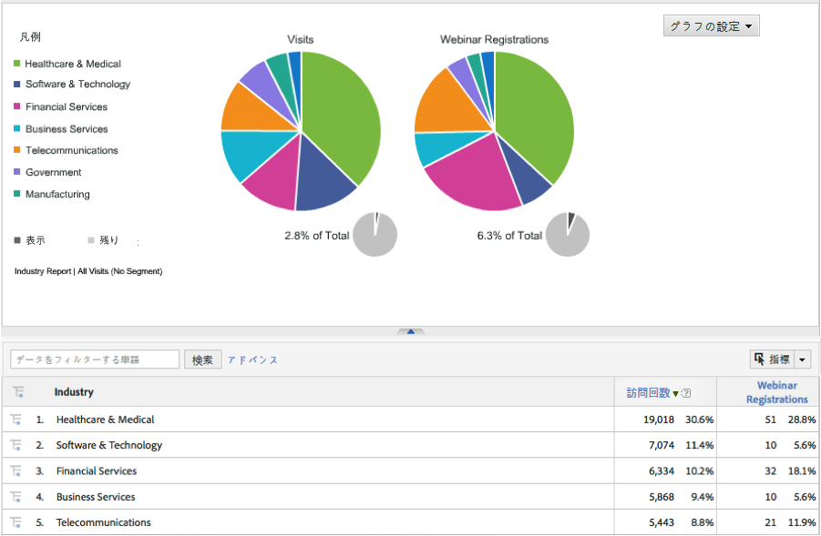

# 統合のデプロイ{#deploying-the-integration}

この統合の展開は、Adobe統合ウィザードの完了と統合の検証から成る簡単なプロセスです。

## Adobe統合ウィザードの完了{#completing-the-adobe-integration-wizard}

Data Connectorsインターフェイスで統合ウィザードを完了する手順です。

1. Adobe Experience cloud内のData Connectors（旧称Genesis）領域に移動します。
1. ダイナミックシグナル統合ウィザードを起動します。
1. 目的のレポートスイートを選択し、統合の名前を指定します。
1. 次の項目を設定します。

   | 項目 | 説明 |
   |---|---|
   | 電子メールアドレス | 主連絡先の電子メールアドレス。 |
   | 説明 | （オプション）この統合設定の説明。 |
   | コミュニティID | このIDは、動的シグナルの担当者から取得できます。 |

1. 次の「 **[!UICONTROL Variable Mappings]** 」項目を設定します。

   | 項目 | 説明 |
   |---|---|
   | トラッキングコード | 使用可能なeVar変数をレポートスイートから選択します。 |

1. この統合用に作成される分類を確認します。
1. ダイナミックシグナル統合ダッシュボードを作成する場合は、このチェックボックスをオンにします（オプションですが、強くお勧めします）。
1. すべての設定項目を確認し、「今すぐアクティブ化」 **[!UICONTROL をクリックしま]**&#x200B;す。
1. **重要**:ウィザードが完了したら、ダイナミックシグナルの担当者に、VoiceStormプラットフォームで統合をアクティブにできるように通知する必要があります。

## 統合の確認{#verifying-the-integration}

Adobe Experience cloud内でDynamic Signal voiceStorm統合の設定を表示する手順

1. 統合アクティビティログで動的シグナル統合の設定を確認します。
   1. Adobe Experience cloudで、サポート/統合アクティビティ **[!UICONTROL ログ]** に **[!UICONTROL 移動します]** 。

      

   1. 「分類データが正常にインポ **[!UICONTROL ートされた」などのエントリを探します]**。 これらのエントリは、展開が成功してから24時間以内に表示されます。
1. Adobe Analytics内で、Adobe Integrationウィザードを使用して自動的に作成されたダッシュボードを使用して動的シグナルレポートを確認します（手順7）。 または、Adobe Analyticsメニュー構造内の動的シグナルレポートに移動して、以下のスクリーンショットを参照します。

   **注意**:このデータは、導入が成功してから24 ～ 48時間以内に表示されます。

   

   
