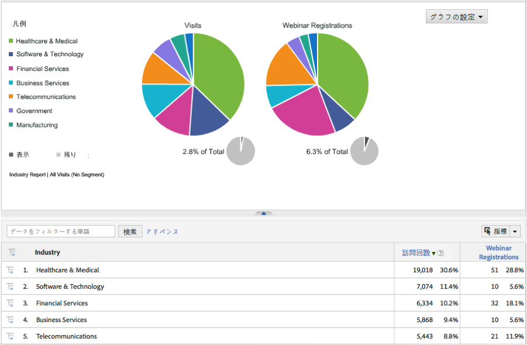

# 統合の確認{#verifying-the-integration}

Adobe Experience cloud内でDynamic Signal voiceStorm統合の設定を表示する手順

1. 統合アクティビティログで動的シグナル統合の設定を確認します。
   1. Adobe Experience cloudで、サポート/統合アクティビティ **[!UICONTROL ログ]** に **[!UICONTROL 移動します]** 。

      

   1. 「分類データが正常にインポ **[!UICONTROL ートされた」などのエントリを探します]**。 これらのエントリは、展開が成功してから24時間以内に表示されます。
1. Adobe Analytics内で、Adobe Integrationウィザードを使用して自動的に作成されたダッシュボードを使用して動的シグナルレポートを確認します（手順7）。 または、Adobe Analyticsメニュー構造内の動的シグナルレポートに移動して、以下のスクリーンショットを参照します。

   **注意**:このデータは、導入が成功してから24 ～ 48時間以内に表示されます。

   

   

