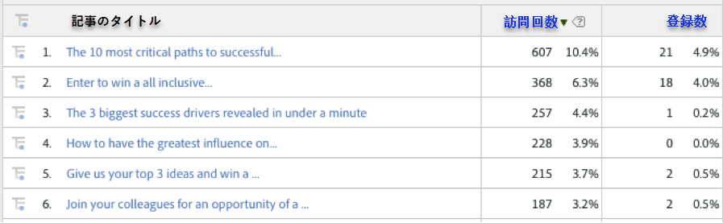
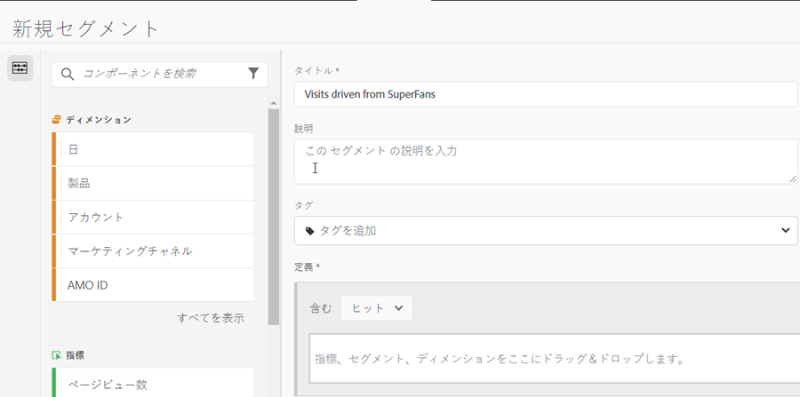
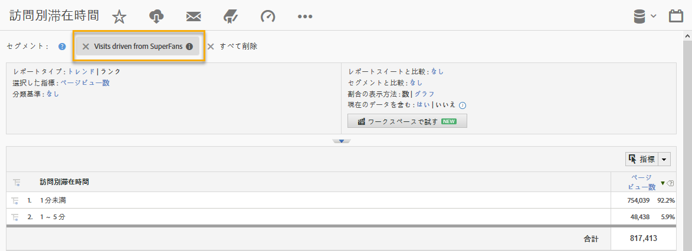

# 統合の使用{#using-the-integration}

導入後は、この統合で提供される追加機能の使用を開始できます。

**注意**:Adobe Analyticsレポート内で動的シグナルデータの一部が表示され始めるまでに、24 ～ 48時間かかる場合があります。

次のアクションは、Adobe Analytics内でのこの統合から付加価値を生み出します。

## 動的シグナルディメンション別のトラフィック指標とコンバージョン指標の表示{#viewing-traffic-and-conversion-metrics-by-dynamic-signal-dimensions}

Adobe Analyticsのレポートの例を示します。

この統合により、Adobe Analyticsレポートとして使用できる新しいディメンションが提供されます。 以下のレポートは、記事のタイトル別に分類された訪問回数とコンバージョン指標（登録数）の両方を分析する例です。

## 動的信号の寸法によるセグメント化{#segmenting-by-dynamic-signal-dimensions}

ダイナミックシグナルの寸法に基づくセグメントの例。

この統合の主な機能は、統合されたレポートディメンションに基づいてAdobe Analyticsセグメントを作成できる点です。 例えば、特定のVoiceStormコミュニティからの訪問のみを含むセグメントを作成できます。 これを「SuperFanからの訪問」と呼ぶこともできます。 このセグメント定義は次のようになります。

## 統合レポートディメンション{#integrated-reporting-dimensions}

この統合に含まれる動的シグナルレポートディメンションを表示します。

| ディメンション | 説明 |
|---|---|
| チャネルのタイプ | ユーザーがコミュニティ投稿を共有したソーシャルネットワーク（またはブログプラットフォーム）。 ユーザーは複数のチャネルで投稿を共有できます。 クリック数やその他のアクティビティは、チャネルごとにセグメント化されます。 このフィールドには、Facebook、Twitterなどが表示されます。 どのチャネルタイプがアクティビティを引き起こしているかを確認できます。 |
| 記事ID | 記事IDは、動的シグナルコミュニティの各コンテンツを一意に識別します。 |
| ソースタイプ | このフィールドは、投稿が「メンバー」または「ブランド」のどちらによって作成されたかを示します。 どちらの場合も、コンテンツがアプリケーションで手動で作成される場合と、外部フィードから読み込まれる場合があります。 |
| ユーザー名 | ソーシャルネットワーク上で投稿を共有し、サイトへのクリックスルーを生成したユーザー。 |
| ソースID | ソースIDは、共有投稿の作成者（または発言者）を一意に識別します。 これは、特定のメンバーまたは外部フィードのいずれかである場合が多くあります。 |
| User ID | ユーザIDは、Dynamic Signalコミュニティ内のユーザ（メンバ）を一意に識別します。 この場合、ユーザーは、自分のソーシャルネットワーク上の投稿を共有した共有者です。 |
| ソース名 | ソースは、共有投稿の作成者（または発言者）です。 ほとんどの場合、これはコミュニティのメンバーまたは外部フィードです。 |
| 記事のタイトル | サイトにクリックバックするのを生成した共有投稿のタイトル。 |
| コミュニティ名 | ダイナミックシグナルコミュニティの名前。 |

