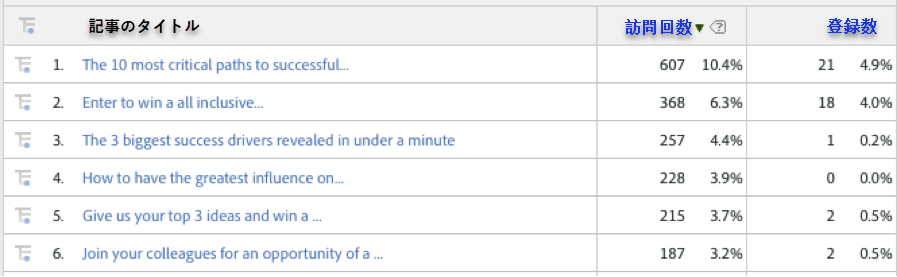

# 動的シグナルディメンションによるトラフィック指標とコンバージョン指標の表示{#viewing-traffic-and-conversion-metrics-by-dynamic-signal-dimensions}

Adobe Analyticsのレポートの例です。

統合には、Adobe Analyticsレポートとして利用できる新しいディメンションが用意されています。詳しくは [、統合レポートディメンション](../../dynamic-signal-for-analytics/dynamic-signal-use-integration/dynamic-signal-reporting-dimensions.md#concept-19c4c9a55d7747698701e771541144be) を参照してください。以下のレポートは、記事のタイトルによって分類された訪問回数指標とコンバージョン指標（登録）の分析例です。

