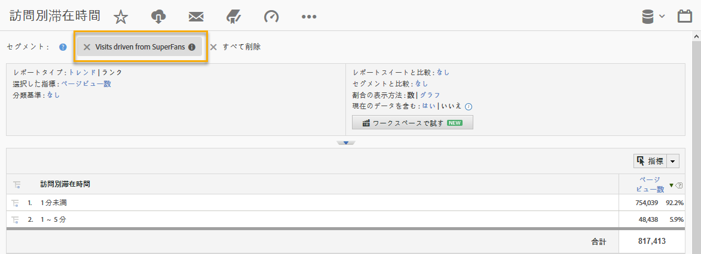

# 動的シグナルディメンションによるセグメント化{#segmenting-by-dynamic-signal-dimensions}

動的シグナルディメンションに基づくセグメントの例です。

統合の主な機能は、統合レポートディメンションに基づいてAdobe Analyticsセグメントを作成する機能です。例えば、特定のVoiceStormコミュニティからの訪問のみを含むセグメントを作成できます。この"Superファンからの訪問件数」を呼び出すことができます。このセグメント定義は次のようになります。

