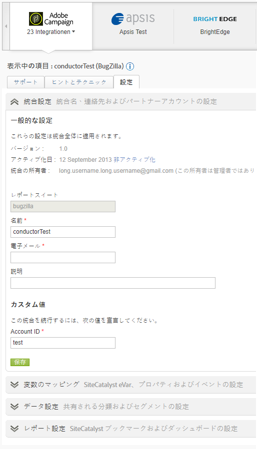

# Data Connectorsの概要

アドビは、企業のデジタル戦略やマーケティング戦略に関する実用的なリアルタイムの情報を提供します。data connectors によって、サードパーティのアプリケーションからの追跡データを Analytics にインポートできるので、データを 1 か所で収集して使用することができます。パートナー製品のいずれかを使用する場合、アプリケーションのデータをマーケティングレポートにインポートし、統合することができます。統合が完了すると、アプリケーションのデータを含むレポートを生成できます。

例えば、電子メールの統合の場合には、電子メールパートナーを使用して電子メールキャンペーンを配布します。これにより、訪問者が Web サイトを訪問したときに、電子メールキャンペーンを通じてきた訪問者かどうかを確認できます。data connectors では、電子メールパートナーからのデータをマーケティングレポートに統合するので、この情報を使用して電子メールキャンペーンの効果を評価できます。

**システム要件**

data connectors は、多くの一般的なブラウザーで正しく統合されます。ただし、レポートの最適な表示および機能性を実現するには、以下の推奨構成を満たすシステムを使用します。

* ブラウザー：Microsoft Internet Explorer バージョン 6 以降
* cookie：必要
* JavaScript：有効
* オペレーティングシステム：Windows ベース
* Macromedia Flash Player：バージョン 6 以降
* 画面の解像度：1024x768（最低 800x600）
* 画面の色：16 ビット以上

また、ユーザーの Web ブラウザーで JavaScript が有効になっていると、データ収集のパフォーマンスが向上します。

**前提条件**

製品の data connectors 統合を設定する前に、以下を実行します。

* マーケティングレポートに統合するすべてのデータへのアクセス権限など、パートナー製品アカウントについて必要なアクセス資格情報を取得します。レポートの配布者用または統合操作に関する通知用に、特別の電子メールアカウントを作成することもできます。
* キャンペーン情報を保持するカスタム変数を特定します。これは一般的にキャンペーントラッキングコードと呼ばれていますが、組織内で別の呼称が使用されている場合もあります。
* インプレッションを取得するイベントを特定して、データをクリックします。イベント名は適宜変更できます。
* ランディングページに適切なコードを配置して、Analytics がパートナー製品から取得されたデータを使用して適切なモデリングを実行できるようにします。各製品に関する特定の手順は、リソースタブの data connectors ショーケースから確認できます。

## 統合の追加

Data Connectorsランディングページ（コンソール）にアクセスするには [!UICONTROL 、現在のアカウントが] 1つ必要です。 また、Adobe Analyticsに詳しいことをお勧めします。

1. Adobe Experience cloudにログインします。
1. **[!UICONTROL Analytics]** /管理者 **[!UICONTROL /]** Data Connectors **[!UICONTROL をクリックします]**。
1. 「**[!UICONTROL 新規追加]**」をクリックします。
1. 「統合を追加」インターフ **[!UICONTROL ェイスに従って]** 、手順を進めます。

   個々の製品統合に応じて、特定の設定情報を統合プロセスの一部として提供することもできます。

   統合が完了すると、パートナー製品のアイコンがData Connectorsネットワークページに表示され、メニューで使用できます。

## data connectors コンソール

統合をアクティブ化すると、 [!UICONTROL Data Connectorsページに表示されます] 。 詳細を表示し、コンソールで設定を変更できます。 アクティブな統合および会社内のすべてのレポートスイート間での統合を表示することができます。また、アクティビティログの表示、ダッシュボードとしての統合の表示、統合の設定およびヘルプの検索を実行できます。



## Data Connectorsの再マーケティングセグメント

再マーケティングセグメントは、Data Connectors 統合で使用された変数に基づいて作成されたデータファイルです。

Adobe Analyticsは、Data Warehouseを介して、これらを毎日別々のファイルで、サードパーティ用にアドビが作成したFTPに送信します。 次に、サードパーティは、これらのファイルをクライアントに配布します。会社は、通常、これらを使用して、サイトに訪問して商品を検討したが購入しなかった可能性のあるユーザーに対して再マーケティングをおこないます。（例えば、表示したが購入に至らなかった商品に対する割引を提供してクライアントに接触します）。

**セグメント**

* [!UICONTROL 買い物かごの放棄]：買い物かごに品目を追加したが購入しなかった訪問者の割合。これは、技術的には、注文を買い物かごへの追加数で割る計算指標です。
* [!UICONTROL 購入]：特定の商品のメッセージ ID に基づいて購入した受信者 ID（または訪問者 ID）。
* [!UICONTROL 商品閲覧]:買い物かご [!UICONTROL の放棄と同様]、これは計算指標でもあります。 It reports [!UICONTROL Product Views] divided by Orders, because customers' viewing the product shows some interest.

**実装例**

再マーケティングセグメントを適切に導入するために、次の条件を満たす必要があります：

* Data Connectors 契約が確立され、組織がアドビのコンサルタントと共に導入段階を完了している。
* 対応するイベントが発生し、同時に製品変数が次のようになっている。
   * 買い物かごの放棄： `scAdd` 事件
   * 購入： `purchase` 事件
   * Product Views: `prodView` event

**** 注意：製品がイベントを関連付けずに定義されている場合、prodViewイベントが自動的に発生します。
上記の要件が満たされない場合、対応する再マーケティングセグメントは適切にレポートされません。

[!UICONTROL 買い物かごの放棄]：ユーザーが商品を買い物かごに追加した後に発生します。

```
s.products=";cat";
s.events="scAdd";
```

[!UICONTROL 購入]：購入確認ページで発生します。

```
s.products=";
cat;1;50";
s.events="purchase";
//Note: Though optional, adding the purchaseID variable increases accuracy by preventing duplicate purchases
```

**一般的な問題**

| 問題 | 説明 |
| -----------| ---------- |  
| 製品 ID 情報が再マーケティングセグメントファイルに表示されません。 | 同じイメージ要求で正しいイベントが発生したが、製品変数が存在しない場合に発生します。 これを修正するために、前述の実装例で見たように、製品変数と対応するイベントが同じページで発生することを確認します。 |
| 再マーケティングセグメントファイルを受け取りません。 | ファイルを受け取っていない場合、組織のサポートされたユーザーが ClientCare に問い合わせて、レポートが正しく受け取れない原因を調査します。 |

> [!IMPORTANT]
>
> コンサルタントは、標準的なData Connectors統合リマーケティングセグメントファイルに加えて、Data Warehouseリクエストを日次スケジュールレポートとして設定することも一般的です。 この Data Warehouse リクエストは、Data Connectors 変数および非 Data Connectors 変数を含むことがあり、このリクエストは、組織の特定のリクエストにのみ基づいてスケジュールできます。トラブルシューティング時に混乱を避けるために、問題になっているファイルが実際の再マーケティングセグメントファイルか、または非 Genesis 変数を含む Data Warehouse リクエストかを指定します。
