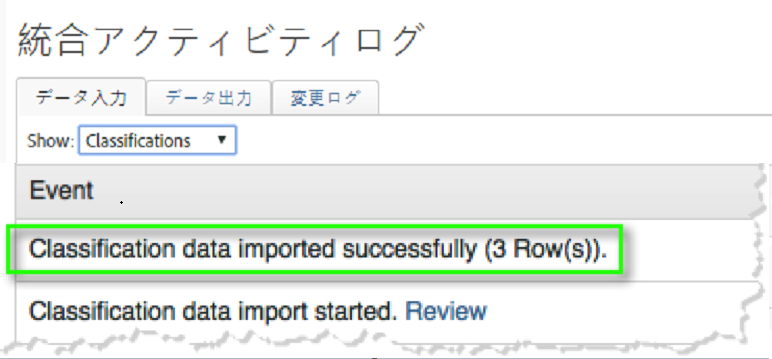
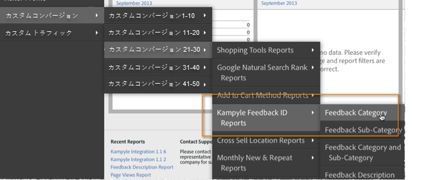

# 統合のデプロイ{#deploying-the-integration}

この統合の展開は、Adobe統合ウィザードの完了、プラグインコード(javascript)の展開、統合の検証を行う簡単なプロセスです。

## Adobe統合ウィザードの完了{#complete-the-adobe-integration-wizard}

統合をアクティブ化するには、Data Connectorsインターフェイス内の設定ウィザードを完了する必要があります。

1. Adobe Experience cloudにログインします。
1. Data Connectors **** （旧称Genesis）に移動します。
1. Kampyle統合ウィザードを起動します。
1. 目的のレポートスイートを選択し、統合の名前を指定します。
1. 次の項目を設定します。

   1. **[!UICONTROL 電子メールアドレス]** — 主連絡先の電子メールアドレス。
   1. **[!UICONTROL 説明]** — （オプション）この統合設定の説明。
   1. **[!UICONTROL Kampyle Key]** — このキーは、Kampyleアプリケーションの「 **[!UICONTROL Feedback Form]** / **[!UICONTROL Feedback Form Customization]**」で確認できます。
   1. **[!UICONTROL トラッキングサーバー]** - Adobe Analyticsデータの追跡に使用するトラッキングサーバー（ドメイン）設定。
   1. **[!UICONTROL トラッキングサーバーのセキュリティ]** — セキュリティで保護された/httpsトラフィックに対してトラッキングサーバーが異なる場合は、ここでその設定を指定します。
1. 次の「 **[!UICONTROL Variable Mappings]** 」項目を設定します。

   1. **[!UICONTROL KampyleフィードバックID]** — レポートスイートから使用可能なeVar変数を選択します。
   1. **[!UICONTROL フィードバックのグレード]** — レポートスイートから利用可能な成功イベント（「カウンター」と入力）を選択します。
   1. **[!UICONTROL フィードバック項目]** — レポートスイートから利用可能な成功イベント（「カウンター」と入力）を選択します。
   1. **[!UICONTROL グレード付きのフィードバック]** — レポートスイートから利用可能な成功イベント（「カウンター」と入力）を選択します。
1. Kampyle統合ダッシュボードを自動的に作成する場合は、このチェックボックスをオンにします（推奨）。
1. すべての設定項目を確認し、「今すぐアクティブ化」 **[!UICONTROL をクリックしま]**&#x200B;す。

## 統合設定オブジェクトのデプロイ{#deploy-the-integration-configuration-object}

統合ウィザードを完了したら、統合設定オブジェクトをWebプロパティにデプロイする必要があります。

多くの場合、統合設定オブジェクトをデプロイする最も簡単な方法は、統合オブジェクトをAdobe Analyticsデプロイメントコードに含めることです。

>[!NOTE]
>
>Adobe tagManagerまたはDynamic Tag Managementを使用してAdobe Analyticsを導入する場合は、このツールを使用して統合設定オブジェクトを簡単に追加できます。

1. 統合の **[!UICONTROL Resources]** / **[!UICONTROL Support]** （サポート）タブに移動します。
1. Kampyle統合コード(JS) **[!UICONTROL リソースをダウンロードして保存し]** ます。 コードは次のようになります。

   ```
   /* Kampyle:  Integration configuration settings */
     window.k_sc_param = { "version":1.1 }
   ```

1. 次のいずれかの方法を使用してコードをデプロイします。

   | **Adobe tagManagerまたはDynamic Tag Managementを使用します。** | tag managementインターフェイスを使用してコードを追加します。 |
   |---|---|
   | **その他の場合は** | Adobe Analytics導入コードの更新を担当する組織のリソースにコードを配信します。 |

## 統合の検証{#verify-the-integration}

いくつかのチェックを完了して、統合がデータを正常に転送していることを検証します。

### 統合アクティビティログ {#section-0472df9180db4f218db5f6040cab07af}

Adobe Experience cloud内でKampyle統合の設定を表示するには、サポート/統合アクティビティ **[!UICONTROL ログ]** に **[!UICONTROL 移動します]**。 「データの **[!UICONTROL 場所]** 」タブに、分類データが正常にインポートされたことを示すエントリが表示されます。

>[!NOTE]
>
>ログエントリは、展開が正常に完了してから24時間以内に表示されます。



### アドビのレポートデータ {#section-1ae9f0a5e6bc40988478ff55aefd56ac}

KampyleフィードバックレポートをAdobe Analyticsで表示するには、適切なメニュー構造内でKampyleレポートに移動します。

>[!NOTE]
>
>統合フィードバックフォームが積極的に送信を受け取っていると仮定して、レポートデータは、導入が成功してから24 ～ 48時間以内に表示されます。



