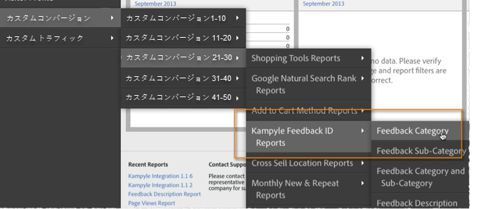

# 統合の検証{#verify-the-integration}

いくつかのチェックを完了して、統合がデータを正常に転送していることを検証します。

## 統合アクティビティログ {#section-0472df9180db4f218db5f6040cab07af}

Adobe Experience cloud内でKampyle統合の設定を表示するには、サポート/統合アクティビティ **[!UICONTROL ログ]** に **[!UICONTROL 移動します]**。 「データの **[!UICONTROL 場所]** 」タブに、分類データが正常にインポートされたことを示すエントリが表示されます。

>[!NOTE]
>
>ログエントリは、展開が正常に完了してから24時間以内に表示されます。

## アドビのレポートデータ {#section-1ae9f0a5e6bc40988478ff55aefd56ac}

KampyleフィードバックレポートをAdobe Analyticsで表示するには、適切なメニュー構造内でKampyleレポートに移動します。

>[!NOTE]
>
>統合フィードバックフォームが積極的に送信を受け取っていると仮定して、レポートデータは、導入が成功してから24 ～ 48時間以内に表示されます。

