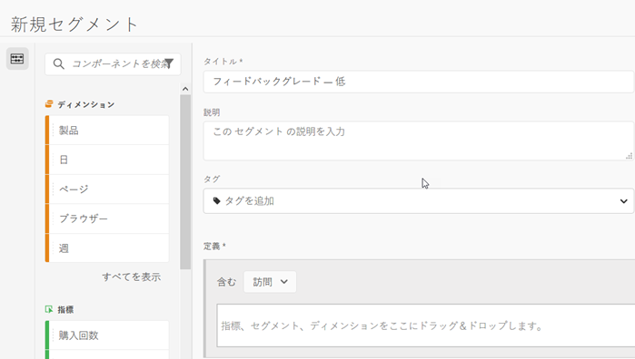
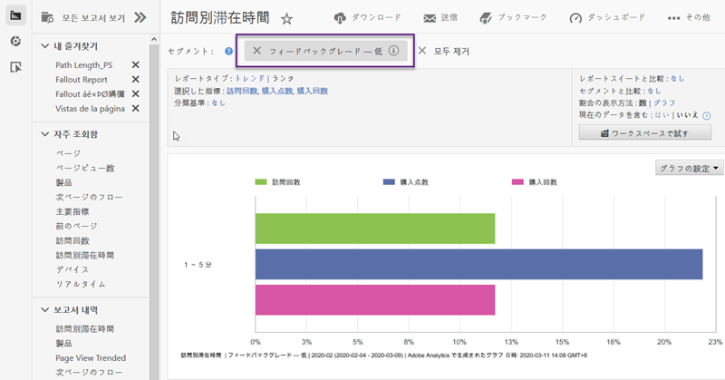

# 統合の使用{#using-the-integration}

導入後は、この統合で提供される追加機能の使用を開始できます。 以下は、Adobe Analytics内からこの統合から価値を得るために実行するアクションです。

>[!NOTE]
>
>Adobe Analyticsレポート内でKampyle応答データが表示され始めるまでに24 ～ 48時間かかる場合があります。

## フィードバックとオンサイトの行動データの混在{#mix-feedback-and-onsite-behavior-data}

Reports &amp; Analyticsレポートをフィードバックディメンションで分類できます。

Adobe Reports &amp; Analyticsを使用すると、レポートで使用できる多数のフィードバックディメンションを掘り下げて調べることができます。 以下のレポートは、特定のフィードバックカテゴリにドリルし、フィードバックの説明で分類した例です。 Reports &amp; Analytics（訪問回数および顧客サービスの問い合わせ）とKampyle（平均フィードバックグレード）の両方の指標が並べて表示され、分析が容易になります。

## フィードバックディメンション別のセグメント{#segment-by-feedback-dimension}

フィードバックのディメンションに基づいてセグメントを作成できます。

この統合の主な機能は、Kampyleフィードバックディメンションに基づいてAdobe Analyticsセグメントを作成できることです。 例えば、1または2のグレードが与えられた訪問のみを含むセグメントを作成できます。 これを「フィードバックグレード — 低」と呼ぶこともできます。 このセグメント定義は次のようになります。

このセグメントは、実際にはどのレポートにも適用できます。例えば、ここに示す訪問別滞在時間レポートなどです。

