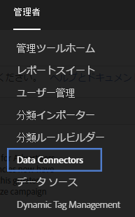
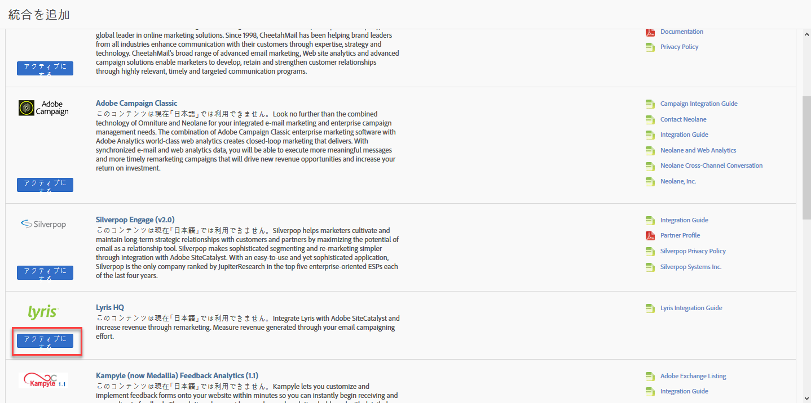
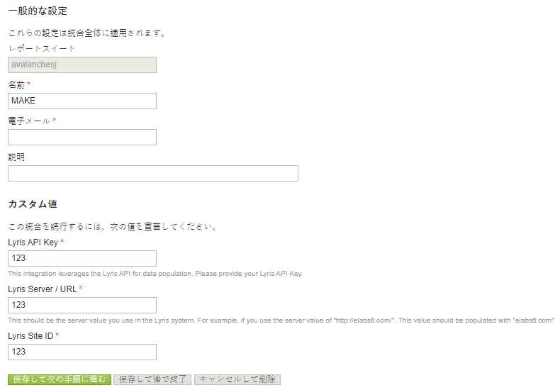
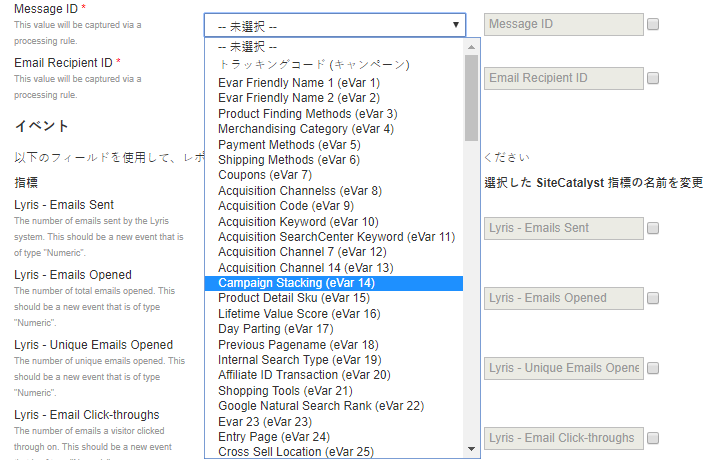
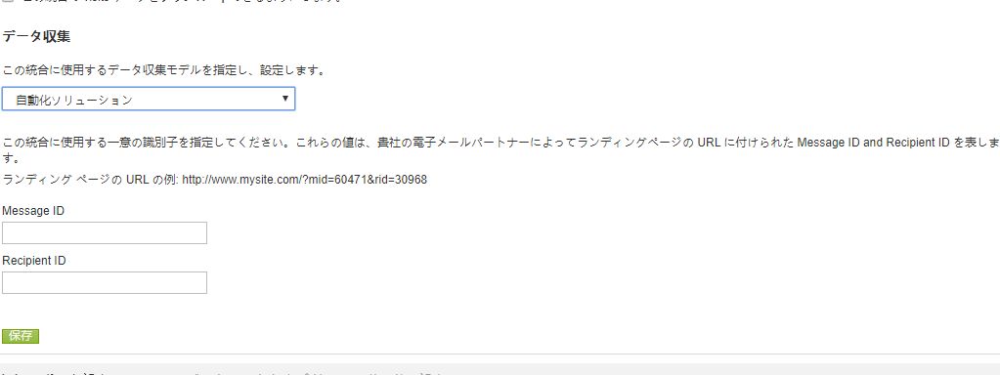
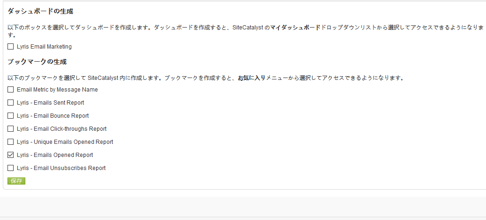
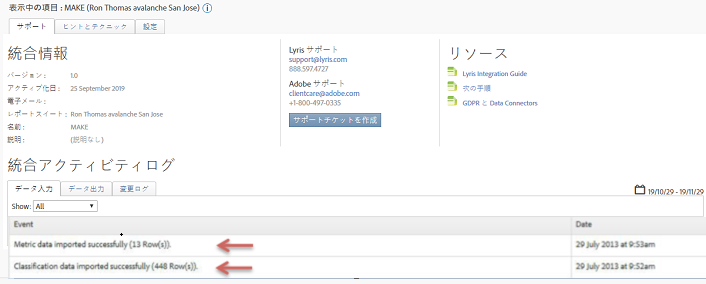

# 統合のデプロイ{#deploying-the-integration}

3段階の導入プロセスについて説明します。

この統合の展開は、以下の操作を必要とする簡単なプロセスです。

## 統合ウィザードの完了{#completing-the-integration-wizard}

統合ウィザードを使用する手順です。

統合をアクティブ化するには、Data Connectorsインターフェイス内でLyris統合ウィザードを完了する必要があります。

1. Adobe Experience cloud内のData Connectors（旧称Genesis）領域に移動します。

   

1. 「統 **[!UICONTROL 合を追加]**」で、LyrisプラグインをAdobe Experience cloudにドラッグ&amp;ドロップします。 Lyris Data Connectors統合が開きます。

   

1. 「一般 **[!UICONTROL 設定]**」で、必要なレポートスイートを選択し、統合の名前を指定します。
1. 「カスタム値」で、Lyrisアカウント関連の情報をすべて **[!UICONTROL 入力します]**。

   

1. ドロップダウンメニューから適切な予約済みeVarおよびイベントを選択します。

   

1. 自動化された3つのパートナーセグメントの他に **** 、「自分のセグメント」で自分のセグメントを選択できます。
1. この統合では、Lyrisアカウントへのデータポイントのダウンロードが必要になる場合があります。 「アクセス要求」で、このアクセス権を付与するこ **[!UICONTROL とができます]**。
1. 「デー **[!UICONTROL タ収集]**」では、自動化ソリューションまたは手動ソリューション（JavaScriptプラグイン）を選択して、ランディングページのURLからクエリ文字列パラメーターを収集できます。 自動ソリューションを選択する場合は、「メッセージID」と「受信者ID」にクエリ文字列パラメーターを入力します。 JavaScriptプラグインについては、アドビコンサルタントにお問い合わせください。

   

1. Lyris Dashboardとブックマークを自動的に生成するように選択できます。

   

1. 統合の概要を確認し、「アクティブ化」をクリ **[!UICONTROL ックしま]**&#x200B;す。

## Lyris emailLabs内の設定{#configuration-within-the-lyris-emaillabs}

ウィザードの完了後にLyris内で設定する内容を説明する手順。

1. 統合ウィザードを完了したら、Lyris Professionalチームと協力して、Lyris HQアカウントとの統合を完了し、テストを容易に行う必要があります。
1. URLクエリ文字列パラメーターの追加：URL付加文字列がユーザーインターフェイスの「組織設定」領域に正しく入力されていることを確認します。 キャンペーンレベルID(hq_m)と受信者レベルID(hq_v)を含める必要があります。

   文字列IDの例を次に示します。

   ```
   hq_lid=149&hq_m=96843&hq_l=23&hq_v=7703a51905
   ```

   >[!NOTE]
   >
   >Lyrisのネイティブ解析ツールを適用する場合は、「 *Tracks* 」をクリックして、追加する必要なすべての変数をタグ付けします。

## 統合の確認{#verifying-the-integration}

Lyris/Adobe Analyticsの統合が成功したことを確認する手順です。

すべての導入手順が完了したら、統合が正常にデータを転送していることを検証できます。

>[!NOTE]
>
>データ交換が始まるまでに数日かかります。 統合をアクティブ化した後は、Lyrisにお問い合わせください。

1. Data Connectors内のLyris統合に移動します。 「 **[!UICONTROL Support]** 」タブ/ **[!UICONTROL Integration Activity Logで、「]** Data imported successfully **[!UICONTROL /or Classification data imported]****** successfully」などのイベントが表示されます。

   

1. Lyrisのメッセージレポートを適切な指標で表示します。 Adobe Experience cloudで、「 **[!UICONTROL Reports &amp; Analytics」を選択します]**。
1. 適切なレポートスイートを選択します。
1. 「カスタ **[!UICONTROL ムコンバージョン]**」で、「 **[!UICONTROL Message ID Reports]** 」を選択し、「 **[!UICONTROL Message ID/Message Name」を選択します]**。

## クエリ文字列パラメータープラグインコード{#query-string-param-plug-in-code}

Adobe Analyticsで使用するLyrisプラグインコードを表示します。

>[!NOTE]
>
>以下のコードを使用する前に、必要なeVarをAdobe Analyticsの管理ツールで予約していることを確認してください。 予約したeVarを特定したら、eVarNを関連するeVarに置き換えます。 例：eVar10

```
/* 
  * Plugin: getQueryParam 2.3 
  */ 
s.getQueryParam=new Function("p","d","u","" 
+"var s=this,v='',i,t;d=d?d:'';u=u?u:(s.pageURL?s.pageURL:s.wd.locati" 
+"on);if(u=='f')u=s.gtfs().location;while(p){i=p.indexOf(',');i=i<0?p" 
+".length:i;t=s.p_gpv(p.substring(0,i),u+'');if(t){t=t.indexOf('#')>-" 
+"1?t.substring(0,t.indexOf('#')):t;}if(t)v+=v?d+t:t;p=p.substring(i=" 
+"=p.length?i:i+1)}return v"); 
s.p_gpv=new Function("k","u","" 
+"var s=this,v='',i=u.indexOf('?'),q;if(k&&i>-1){q=u.substring(i+1);v" 
+"=s.pt(q,'&','p_gvf',k)}return v"); 
s.p_gvf=new Function("t","k","" 
+"if(t){var s=this,i=t.indexOf('='),p=i<0?t:t.substring(0,i),v=i<0?'T" 
+"rue':t.substring(i+1);if(p.toLowerCase()==k.toLowerCase())return s." 
+"epa(v)}return ''"); 
 
/*in the s_doPlugins function - Replace N with actual eVar number*/ 
s.eVarN=s.getQueryParam("<insert Lyris QS Param>");  
//places query param value from Message ID in eVarN variable s.eVarN=s.getQueryParam("<insert Lyris QS Param>");  
//places query param value from Recepient ID in eVarN variable 
```
