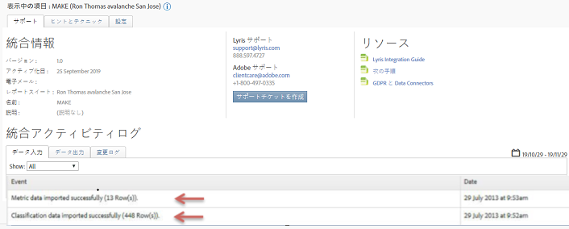

# 統合の確認{#verifying-the-integration}

Lyris/Adobe Analyticsの統合が成功したことを確認する手順です。

すべてのデプロイメント手順が完了したら、統合のデータ転送が正常に完了したことを確認できます。

>[!NOTE]
>
>データ交換が開始されるまで数日かかります。統合をアクティベートした後、Lirisにお問い合わせください。

1. Data Connectors内のLulris統合に移動します。**[!UICONTROL 「サポート]** 」タブ/ **[!UICONTROL 統合アクティビティログ]**&#x200B;で、インポートされた **[!UICONTROL 指標データ]** や **[!UICONTROL 分類データが正常]**&#x200B;にインポートされたようなイベントを確認します。

   

1. Lyrisメッセージレポートを適切な指標で表示できるようになりました。Adobe Marketing Cloudで、 **[!UICONTROL "Reports&amp; Analytics]**」を選択します。
1. 適切なレポートスイートを選択します。
1. **[!UICONTROL 「カスタムコンバージョン]**»で??、メッセージIDレポートを選択??し、??«メッセージID/メッセージ名??********
