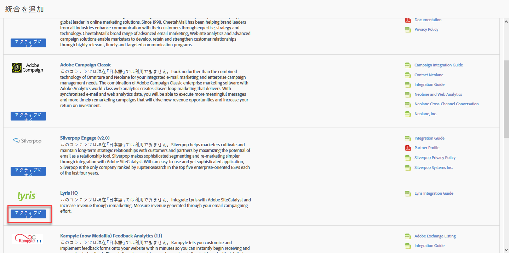
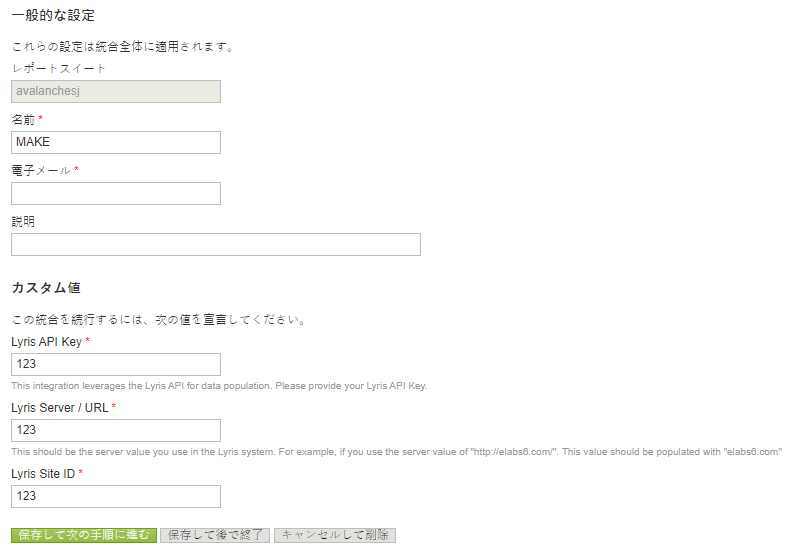
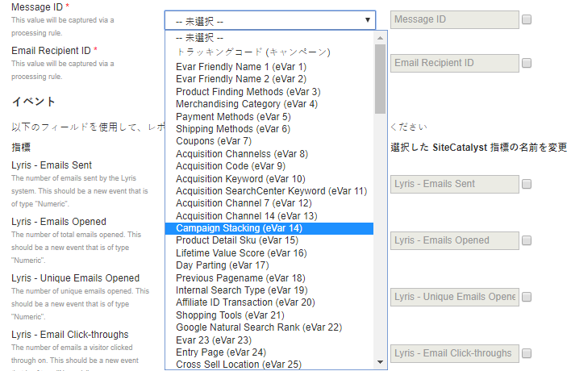
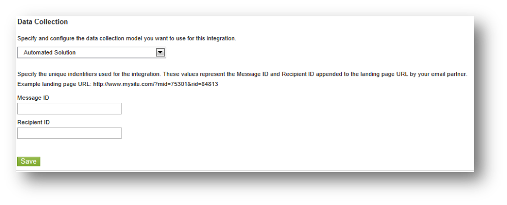

# 統合ウィザードの完了{#completing-the-integration-wizard}

統合ウィザードを使用する手順です。

統合をアクティブ化するには、Data Connectorsインターフェイス内のLyris統合ウィザードを完了する必要があります。

1. Adobe Marketing Cloud内のData Connectors（以前のGenesis）領域に移動します。

   

1. 「統合 **[!UICONTROL を追加]**」で、LyrisプラグインをAdobe Marketing Cloudにドラッグ&amp;ドロップします。これにより、Lyris Data Connector統合が開きます。

   

1. **[!UICONTROL 「一般設定]**」で、目的のレポートスイートを選択し、統合の名前を指定します。
1. **[!UICONTROL 「カスタム値]**」にあるLilrisアカウント関連の情報をすべて入力します。

   

1. ドロップダウンメニューから適切な予約済みeVarおよびイベントを選択します。

   

1. 自動化されたパートナーセグメントとは **[!UICONTROL 別に、セグメント]** の下に独自のセグメントを選択できます。
1. この統合では、Livrisアカウントにいくつかのデータポイントをダウンロードする必要があります。アクセス要求の下 **[!UICONTROL で、このアクセス権を与えること]**&#x200B;ができます。
1. **[!UICONTROL 「データ収集]**」では、自動または手動ソリューション（JavaScriptプラグイン）を使用して、ランディングページのURLからクエリ文字列パラメーターを収集できます。自動ソリューションを使用する場合は、メッセージIDと受信者IDのクエリ文字列パラメータを入力します。JavaScriptプラグインについては、アドビコンサルタントにお問い合わせください。

   

1. Lilrisダッシュボードとブックマークを自動的に生成するように選択できます。

   

1. 統合の概要を確認し、 **[!UICONTROL 「アクティブ化]**」をクリックします。
