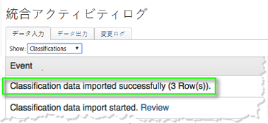
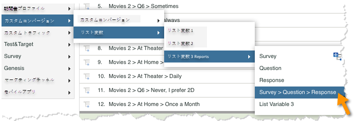
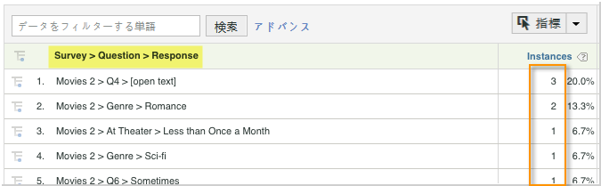

# 統合のデプロイ{#deploying-the-integration}

この統合の展開は、以下の操作を必要とする簡単なプロセスです。

## Adobe統合ウィザードの完了{#completing-the-adobe-integration-wizard}

統合をアクティブ化するには、Data Connectorsインターフェイス内でQualtrics統合ウィザードを完了する必要があります

1. data connectorsに移動し、Qualtrics統合ウィザードを起動します。
1. この統合に使用するレポートスイートを選択し、名前を指定します。

   次の手順に従って、統合ウィザードを完了します。 1.ウィザ **ードの手順1**

   | Email Address | 主連絡先の電子メールアドレス。 |
   |---|---|
   | 説明 | （オプション）この統合設定の説明。 |
   | Qualtrics組織ID | [Qualtrics組織IDの検索](../qualtrics-overview/qualtrics-org-id.md) |
   | Adobe siteCatalystトークン | [Qualtrics Adobe Analyticsトークンの生成](../qualtrics-overview/qualtrics-token.md) |

1. **ウィザードの手順2 — 変数のマッピング**

   | Qualtrics応答リスト | 使用可能なリスト変数をレポートスイートから選択します。 （場合によっては、Report Suite Manager内で新しいlistVarを有効にする必要があります）。 |
   |---|---|
   | Qualtrics応答ID | 使用可能なeVarまたはpropをレポートスイートから選択します。 （場合によっては、Report Suite Manager内で新しいlistVarを有効にする必要があります）。 |
   | トラッキングサーバー | Adobe Analyticsデータの追跡に使用するトラッキングサーバー（ドメイン）設定を指定します。 標準のトラッキ `trackingServerSecure` ングサーバー設定と異なる場合は、トラッキングサーバーを使用します。 |
   | Qualtrics surveyの提出 | 使用可能なイベントをレポートスイートから選択します（Report Suite Manager内で新しいイベントを有効にする必要がある場合があります）。 |

1. **ウィザード：手順3**:必要ない、情報のみ。

   ステップ結果1 **ウィザードの手順4 — 設定のエクスポート**

   | eVar | Qualtricsに書き出すeVarを5つまで選択できます。 |
   |---|---|
   | イベント | Qualtricsに書き出すために公開するカスタムイベントを5つまで選択します |
   | prop | Qualtricsに書き出すために公開するpropを5つまで選択します |
   | Access Requests | Qualtricsにエクスポートする標準指標および標準ディメンションのチェックボックスをオンにします。 は、エ `visitor_id` クスポートが正しく機能するようにするために必要です。 |

1. **ウィザード：手順5**:設定を確認し、「今すぐアクティブ化」を **[!UICONTROL クリックしま]**&#x200B;す。

## Qualtrics Research Suiteでの統合の有効化{#enabling-the-integration-in-qualtrics-research-suite}

統合ウィザードを完了したら、接続する各Qualtrics調査の統合をアクティブ化する必要があります。

1. Qualtrics Research suiteにログインします。
1. 「マイ **[!UICONTROL 調査]** 」タブで、統合する **[!UICONTROL 調査の「編集]** 」ボタンをクリックします。
1. アドバンスオ **[!UICONTROL プション]** メニューをクリックし **[!UICONTROL 、「Adobe Analytics]**」を選択します。 （このオプションが表示されない場合は、必要な権限の取得について管理者に問い合わせてください）。

   

1. 「Adobe Analytics設定」を選択し、「保存」をクリッ **[!UICONTROL クします]**。 使用できる設定がない場合は、Adobe Integration wizardを完了していない可能性があります。
   1. 「部分 **[!UICONTROL 的な回答を含む]** 」チェックボックスを使用して、各部分的な調査画面が完了した後にAdobe Analyticsにデータを取り込むことを示すことができます。 選択しない場合、完全に完了した調査のデータのみが転送されます。
   1. 「Send Timestamp With Beacon **** 」チェックボックスは、タイムスタンプ付きのデータ（共通ではない）を受け取るように設定されたレポートスイートとの統合時にのみ使用します。
   

## 統合の確認{#verifying-the-integration}

すべての導入手順が完了したら、統合が正常にデータを転送していることを検証できます。

1. **統合アクティビティログ**:Data Connectors UIで、Qualtrics統合の「 **[!UICONTROL Support]** 」タブを表示します。 「統合アクティビティログ **** 」の見出しの下に、分類データのインポートが成功したことを示すエントリが表示されます。

   >[!NOTE]
   >
   >これらのエントリは、展開が成功してから1時間以内に表示されます。

   

1. **レポートデータ**:Qualtrics調査レポートをReports &amp; Analytics UIで表示するには、Qualtrics調査レポート(「リスト変数」の下 ****)に移動します。

   >[!NOTE]
   >
   >このデータは、統合調査が積極的に回答を受け取っていると仮定して、導入が成功してから24 ～ 48時間以内に表示されます。

    

