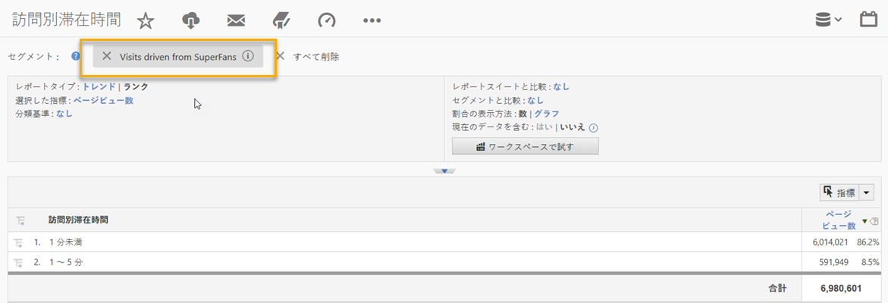
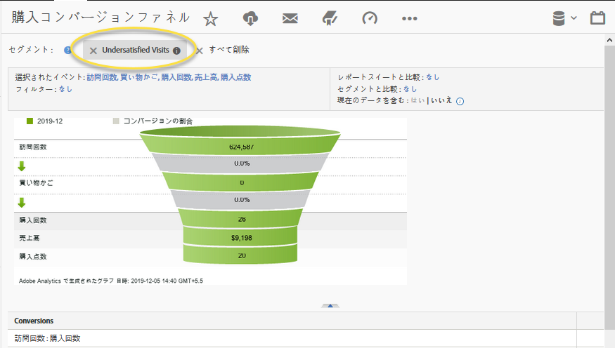

# 統合の使用{#using-the-integration}

デプロイメントが完了したら、この統合によって提供される追加機能の使用を開始できます。

>[!NOTE]
>
>Adobe Analyticsレポート内でQualtricsの応答データを表示するには、24~48時間かかることがあります。

Adobe Analytics内からこの統合から値を取得するために実行するアクションを次に示します。

1. 調査回答データを使用してセグメントを作成します（セグメント の作成を参照）。
1. セグメントを主要レポートに適用します。

## 例 {#section-07051d0d60a44408a4e108034586c42f}

次に、アナリストが調査回答データを使用してAdobe Analyticsセグメントを定義する方法を示します。この場合、「今日の訪問ではどのくらい満足していますか」というアンケート質問が表示されます。この質問を使用して、「アンダースコア」訪問者を識別するセグメントを作成できます。このようなセグメントは、以下に示すように、購入コンバージョンファネルなどのAdobe Analyticsレポートにドリルダウンするために使用できます。

 

